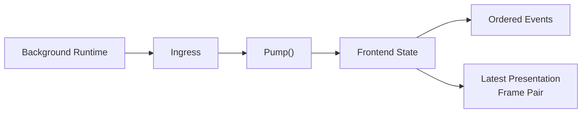
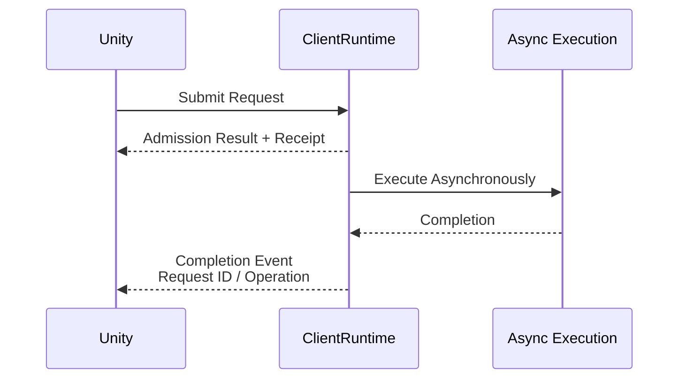

## Client State Boundary

네트워크 결과를 Unity 콜백으로 즉시 전달하면 구현은 단순해 보이지만, 두 실행 환경의 차이가 그대로 노출된다. 네트워크 이벤트가 발생하는 스레드와 Unity가 객체를 변경할 수 있는 스레드가 다르고, 월드 전환 도중에는 이전 월드의 데이터가 늦게 도착할 수도 있다. 고빈도 상태까지 이벤트로 누적하면 화면이 오래된 데이터를 순서대로 따라가는 문제도 생긴다.

Jam은 이 문제를 `ClientRuntime`에 상태 경계를 두는 방식으로 풀었다. 백그라운드 결과는 먼저 Ingress에 들어오고, 프런트엔드 스레드가 `Pump()`를 호출할 때만 조회 가능한 상태로 반영된다.

## Pump Visibility Boundary

`Pump()`는 단순한 이벤트 전달 함수가 아니라 한 프레임의 가시성을 결정하는 지점이다. 이 호출은 수집된 제어 이벤트를 제한된 개수만큼 처리하고, 다음 순서를 지킨다.

1. 접속 상태, 사용자 ID, 참가 월드와 같은 내부 상태를 먼저 갱신한다.
2. 요청 완료와 Actor 생명주기 같은 연관 상태를 정리한다.
3. 갱신 결과를 프런트엔드 이벤트 큐에 공개한다.
4. 도착한 Presentation Frame 중 현재 월드에 유효한 최신 Pair를 반영한다.

상태를 이벤트보다 먼저 반영한 이유는 이벤트 처리 코드가 별도의 동기화 없이 새 상태를 조회할 수 있게 하기 위해서다. 예를 들어 `WorldParticipantChanged`를 Poll한 시점에는 `GetMainWorld()`가 이미 같은 전환을 반영한다.

모든 공개 API는 프런트엔드 스레드에서만 호출하도록 제한된다. 덕분에 외부 소비 경로에는 추가 잠금이 필요하지 않고, 스레드 간 동기화는 Ingress 경계 안으로 모인다.

## Events and Presentation Frames

클라이언트로 들어오는 데이터를 하나의 큐로 처리하지 않았다. 데이터가 요구하는 보존 방식이 다르기 때문이다.

| 데이터 | 중요한 성질 | 전달 방식 |
| --- | --- | --- |
| 접속·월드 참가 상태 | 전환 순서와 원인 | Ordered Event |
| Actor 생성·제거 | 생명주기의 누락 없는 전달 | Ordered Event |
| 요청 완료·소셜 메시지 | 요청과 결과의 상관관계 | Ordered Event |
| 위치·회전 | 최신 상태와 프레임 간 연속성 | Previous / Current Frame Pair |

Presentation 데이터는 매번 큐에 쌓으면 지연 상황에서 과거 프레임을 재생하게 된다. Jam은 최신 Pair만 유지하여 밀린 상태를 폐기하고, 이전 프레임과 현재 프레임의 Sequence를 함께 제공한다. Unity는 두 프레임 사이를 보간하면서도 최신 서버 상태를 기준으로 따라갈 수 있다.

Pair를 반영할 때는 현재 참가 중인 World ID와 일치하는지, Previous Sequence가 Current보다 앞서는지를 확인한다. 월드가 바뀌면 기존 Pair를 제거하여 이전 월드의 Actor가 새 월드 화면에 남지 않게 한다.

반환된 Frame View는 다음 `Pump()`, 연결 해제 또는 Runtime 파괴 전까지만 유효하다. 이 제한은 내부 버퍼를 재사용해 매 조회마다 할당하지 않기 위한 선택이며, 장기 보관이 필요한 계층은 자신의 메모리로 복사해야 한다.

## Ownership and Request Completion

한 프로세스에 여러 ClientRuntime이 존재할 수 있으므로 Global Event를 그대로 공개하면 다른 클라이언트의 결과가 섞일 수 있다. 각 Runtime은 Account ID를 기준으로 자신이 소유한 이벤트만 받아들인다. 월드 상태뿐 아니라 실행 결과에도 명시적인 클라이언트 소유권이 필요하다는 판단이다.

Unity에서 Native로 보내는 비동기 요청도 제출과 완료를 분리한다.

요청이 Accepted되었다는 것은 결과가 성공했다는 뜻이 아니라, `ClientRuntime`이 해당 요청의 추적 책임을 넘겨받았다는 뜻이다. World Action, Actor Action, Social 및 Content 요청은 이후 완료 이벤트로 결과를 전달한다. 반면 Character Control처럼 매 프레임 발생하는 입력은 완료 이벤트를 만들지 않아 hot path의 큐 증가를 피한다.

## Lifecycle and Failure Handling

연결 해제 시에는 사용자와 월드 식별자, 네트워크 상태, Presentation Frame, 대기 중인 이벤트와 요청을 함께 정리한다. 일부만 남겨 두면 재접속 후 이전 세션의 완료 이벤트나 Actor 상태가 새 세션에 섞일 수 있기 때문이다.

이 설계의 비용은 명시적인 Pump 호출과 최대 한 프레임의 가시성 지연이다. 또한 호출자가 Frame View의 수명을 지켜야 한다. 대신 네트워크 실행 스레드와 Unity 프레임을 분리하고, 상태 변경과 이벤트 관찰 순서를 예측 가능하게 만들며, 고빈도 데이터가 큐를 무한히 늘리지 않도록 통제할 수 있다.

다음 문서에서는 이 프런트엔드 상태를 C#에서 안전하게 소비하기 위해 Native ABI가 어떤 계약을 제공하는지 설명한다.
