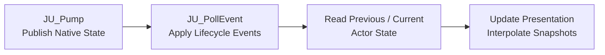

## Explicit ABI Boundary

`ClientRuntime`의 C++ 객체를 C#에 직접 노출하면 STL 레이아웃, 예외, 문자열과 컨테이너의 수명까지 Managed 계층이 알아야 한다. 특히 Presentation Frame의 내부 버퍼는 다음 `Pump()`에서 교체될 수 있어 Native 포인터를 장기간 보관하기 어렵다.

JamUnityBridge는 C++ 객체 대신 작은 C ABI를 제공한다. 이 경계에서 중요한 목표는 호출 편의성보다 다음 계약을 명확히 하는 것이다.

- Runtime의 생성과 종료 주체
- 양쪽이 공유하는 구조체의 버전과 크기
- 배열, 문자열 및 Payload 메모리의 소유자
- 요청이 거부되거나 버퍼가 부족할 때의 실패 방식

## Runtime and ABI Lifecycle

Unity 측 진입점은 `JU_Initialize`, `JU_Shutdown`, `JU_Connect`, `JU_Disconnect`, `JU_Pump`와 같은 `extern "C"` 함수로 구성된다. Bridge 내부의 `UnityClientCore`가 `NetRuntime`과 `ClientRuntime`을 소유하고, ABI 호출을 실제 Runtime 연산으로 변환한다.

현재 Bridge는 프로세스 내 단일 Core를 사용한다. Unity Plugin의 초기화 경로는 단순해지지만, 동시에 여러 독립 클라이언트를 구동하려면 Handle 기반 API로 확장해야 한다는 제약이 있다.

초기화 구조체는 `abiVersion`과 `structSize`를 포함한다. Bridge는 이를 현재 `JAM_ABI_VERSION`과 비교하고 일치하지 않으면 `VersionMismatch`를 반환한다. 요청 구조체도 자신의 크기를 전달하므로 C# 선언과 Native 선언이 어긋난 상태에서 잘못된 필드를 읽는 문제를 조기에 차단한다.

## Data and Memory Ownership

ABI에는 STL 타입 대신 고정 폭 정수, Enum, POD 구조체를 사용한다. 내부 도메인 타입은 Bridge에서 명시적으로 변환하며, C++ 객체의 주소나 컨테이너 레이아웃은 경계를 넘지 않는다.

Presentation Frame은 호출자 소유 버퍼 방식으로 전달한다.

```text
allocate previous/current buffers

result = JU_GetActorPresentationFramePair(capacity)

if result == BufferTooSmall:
    resize buffers to required count
    retry JU_GetActorPresentationFramePair(...)

consume copied JAM_ActorState arrays
```

`ClientRuntime`의 Frame Span을 그대로 반환하지 않고 `JAM_ActorState` 배열로 복사하기 때문에, C#은 다음 Native Pump 이후에도 자신이 복사한 배열을 안전하게 사용할 수 있다. 복사 비용이 추가되지만 두 Garbage Collector와 Native Runtime 사이의 소유권을 단순하게 유지하는 쪽을 선택했다.

이벤트 문자열과 Payload는 Poll 시 Bridge 소유 임시 저장소로 복사된다. 반환된 포인터는 다음 `JU_PollEvent` 또는 종료 전까지만 유효하므로 C# Driver는 Poll 직후 Managed 메모리로 복사해야 한다. 이 수명 규칙을 짧게 둔 대신 이벤트마다 별도 Native 할당과 해제 API를 만들지 않았다.

## Unity Frame Integration

Unity Driver의 한 프레임은 다음 순서로 구성할 수 있다.



Actor 생성 이벤트는 Unity 객체의 생명주기를 만들고, Presentation Frame은 이미 존재하는 객체의 Transform을 지속적으로 갱신한다. 이 둘을 구분했기 때문에 고빈도 Transform 변경이 GameObject 생성·제거 로직과 같은 이벤트 경로를 경쟁하지 않는다.

Data Pipeline에서 생성한 콘텐츠 ID와 Registry는 수신한 Archetype 또는 Asset 식별자를 실제 Unity Prefab과 데이터로 연결한다. Bridge는 Unity Asset 자체를 알지 않으며, 식별 가능한 런타임 데이터까지만 전달한다. 이 경계는 Native 네트워크 계층과 Unity Presentation 구성을 독립적으로 변경할 수 있게 한다.

## Native Command Flow

연동은 수신 전용이 아니다. Unity의 입력과 UI 요청은 C ABI 구조체로 변환되어 `ClientRuntime`으로 돌아간다.

- Character Control은 값의 유효 범위와 유한성을 검사한 뒤 지연에 민감한 입력 경로로 전송한다.
- World 및 Actor Action은 즉시 Admission Result와 Receipt를 반환하고, 실제 결과는 후속 Completion Event로 전달한다.
- Social 및 Content 요청의 문자열과 Payload는 호출 시 Native 소유 데이터로 복사하여 Managed 버퍼 수명과 분리한다.

모든 함수는 예외 대신 `Ok`, `NoEvent`, `InvalidArgument`, `NotConnected`, `BufferTooSmall`, `VersionMismatch`와 같은 결과 코드를 반환한다. P/Invoke 경계에서는 C++ 예외나 암묵적인 실패보다 호출자가 복구 방식을 선택할 수 있는 명시적 결과가 더 안전하기 때문이다.

## Trade-offs and Current Scope

명시적인 C ABI는 Unity와 Native Runtime의 결합을 줄이지만 구조체가 바뀔 때 양쪽 선언과 버전을 함께 관리해야 한다. Frame 복사는 안전한 소유권을 제공하는 대신 Actor 수에 비례한 메모리 대역폭을 사용한다. 현재 Presentation 구조체도 Transform 중심이므로 더 많은 시각 상태가 필요해지면 ABI를 무작정 넓히기보다 갱신 빈도와 수명을 기준으로 별도 데이터 경로가 필요한지 판단해야 한다.

이 Bridge의 역할은 게임 기능을 구현하는 것이 아니라 실행 환경 사이의 계약을 지키는 것이다. 클라이언트 상태의 의미와 순서는 `ClientRuntime`이, Unity 객체의 표현 방식은 Managed Presentation 계층이 소유하고, Bridge는 두 계층 사이의 데이터와 수명만 번역한다.
