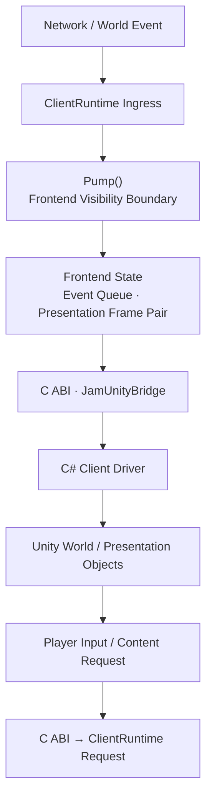

## Core Idea

Jam의 클라이언트는 네트워크 스레드가 만든 상태를 Unity 객체에 곧바로 반영하지 않는다. 네트워크 처리와 화면 갱신은 실행 주기와 소유권이 다르기 때문이다. 백그라운드에서 도착한 결과를 `ClientRuntime`이 먼저 소유하고, 프런트엔드 스레드가 `Pump()`를 호출하는 시점에만 외부에 공개한다.

이 경계의 목적은 단순히 C++과 C#을 연결하는 데 있지 않다. Unity가 한 프레임 동안 일관된 상태를 읽도록 만들고, 네트워크 콜백이 Unity 객체의 생명주기를 직접 침범하지 않게 하는 것이 핵심이다.

따라서 Client Integration은 다음 두 방향을 연결한다.

- 서버에서 온 상태와 이벤트를 Unity가 소비할 수 있는 형태로 전달한다.
- Unity에서 발생한 입력과 요청을 Native Runtime의 명령으로 변환한다.

## End-to-End Client Flow

흐름의 중심은 `Pump()`다. `ClientRuntime`은 먼저 네트워크·월드 상태를 갱신한 뒤 그 변화에 대응하는 이벤트를 공개한다. Unity는 이벤트를 받았을 때 이미 갱신된 상태를 조회할 수 있다.

위치와 회전처럼 매 프레임 바뀌는 데이터는 모든 중간 값을 이벤트로 쌓지 않는다. 대신 이전·현재 Presentation Frame을 한 쌍으로 전달하여 Unity가 보간할 수 있게 한다. 반대로 접속 상태, 월드 참가, Actor 생명주기처럼 순서와 의미가 중요한 변화는 이벤트 큐로 보존한다.

## Integration Boundaries

| 경계 | 책임 | 선택한 전달 방식 |
| --- | --- | --- |
| Network → `ClientRuntime` | 백그라운드 결과를 클라이언트별 상태로 수집 | Ingress와 소유권 필터 |
| `ClientRuntime` → Frontend | 한 프레임에서 관찰 가능한 상태를 확정 | 명시적 `Pump()` |
| State → Presentation | 고빈도 Actor 상태를 보간 가능한 형태로 공개 | Previous / Current Frame Pair |
| Native → Managed | C++ 객체와 메모리 소유권을 노출하지 않고 데이터 전달 | 버전이 지정된 C ABI와 호출자 소유 버퍼 |
| Unity → Native | 입력과 비동기 요청을 Runtime 명령으로 변환 | 명시적 Request / Control API |

이 구분 덕분에 각 계층은 상대 계층의 내부 구현보다 데이터 계약에 의존한다. Native Runtime은 Unity 객체를 모르고, Unity는 네트워크 실행기나 C++ 객체의 수명을 직접 관리하지 않는다.

## Component Relationships

`ClientRuntime`은 네트워크 도메인과 프런트엔드 사이의 상태 경계다. 이벤트의 순서, 현재 접속 상태, 참가 중인 월드, Presentation Frame의 수명을 책임진다.

`JamUnityBridge`는 이 상태를 C ABI로 번역한다. 고정 크기 구조체, 명시적인 결과 코드, 버전 및 구조체 크기 검사를 사용해 C++과 C#의 ABI 차이를 통제한다. Native 메모리 뷰를 그대로 넘기지 않고 호출자가 제공한 버퍼로 복사하여 양쪽 런타임의 소유권을 분리한다.

Unity 측 Driver는 매 프레임 Native Runtime을 Pump하고 이벤트와 Frame Pair를 읽는다. 수신한 데이터는 월드 객체의 생성·제거와 Presentation 갱신에 사용된다. 반대 방향에서는 입력과 게임 요청을 ABI 구조체로 변환해 `ClientRuntime`에 제출한다.

Data Pipeline에서 생성한 ID와 DTO는 이 경계를 지나온 런타임 데이터를 Unity Asset 및 Prefab과 연결한다. 즉 Client Integration이 전송과 생명주기를 담당한다면, Data Pipeline은 양쪽에서 같은 콘텐츠를 가리키는 식별 계약을 담당한다.

## Document Map

- [[01. Client State and Event Flow|Client State and Event Flow]] — 백그라운드 결과가 프런트엔드 상태, 이벤트, Presentation Frame으로 공개되는 과정
- [[02. Native Unity Bridge|Native Unity Bridge]] — Native Runtime과 Unity 사이의 ABI, 메모리 소유권, 요청·응답 계약
