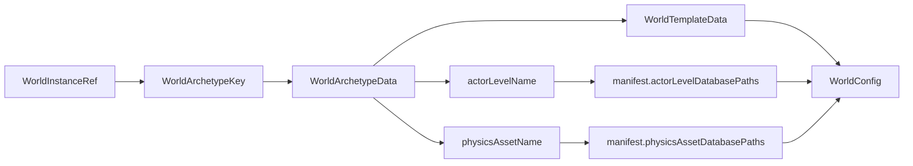
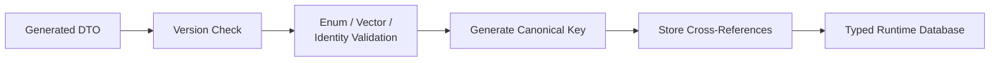

## Shared Game Data Rationale

networked simulation에서는 server와 client가 같은 actor를 서로 다른 방식으로 해석하면 안 됩니다. server가 어떤 이름을 physics archetype으로 해석했는데 client가 다른 prefab이나 body type을 선택하면 packet format이 올바르더라도 결과는 일치하지 않습니다.

Jam은 다음 데이터를 shared document로 분리합니다.

- 어떤 종류의 world가 존재하고 어떤 simulation template을 사용하는가
- world가 어떤 actor level과 physics asset set을 참조하는가
- actor archetype이 어떤 physics archetype과 spawn policy를 가지는가
- level에 배치된 actor의 stable ID, archetype과 spawn pose는 무엇인가

목표는 server와 client가 모든 runtime state를 공유하는 것이 아닙니다. **동일한 runtime state를 구성하기 위한 정의와 identity contract를 공유하는 것**입니다.

## Shared Data Manifest

여러 JSON 파일을 config에 개별적으로 나열하면 파일 추가와 경로 변경이 application bootstrap 코드로 번집니다. Jam은 하나의 `SharedDataManifest`를 진입점으로 사용합니다.

```text
shared_data_manifest.json
├─ bootstrap
│  ├─ world_templates
│  ├─ world_archetypes
│  ├─ world_instances
│  └─ actor_archetypes
└─ content
   ├─ physics_asset_set[name]
   └─ actor_level_set[name]
```

manifest path를 기준으로 모든 entry를 상대 경로로 해석합니다. absolute path와 `..`를 거부하고 `.json` document만 허용해 content root 밖으로 resolution이 새는 것을 막습니다.

manifest에 version을 둔 이유는 구조가 바뀌었을 때 오래된 data를 묵시적으로 해석하지 않기 위해서입니다. 현재 runtime은 version 1만 허용하며 지원하지 않는 version은 초기화 단계에서 실패합니다.

## Bootstrap Data

bootstrap document는 world를 선택하고 나머지 content를 찾기 전에 필요합니다.

### World Template

world의 tick과 runtime 동작처럼 여러 world archetype이 공유할 수 있는 simulation configuration을 표현합니다. archetype과 template을 분리해 content 조합과 실행 정책을 같은 정의에 묶지 않습니다.

### World Archetype

world template, actor level name과 physics asset name을 하나의 world 종류로 조합합니다.

`WorldArchetypeData`는 다음 세 reference를 묶습니다.

- `templateName / templateKey` — simulation template
- `actorLevelName` — world에 배치될 actor content
- `physicsAssetName` — world에서 사용할 physics asset set

### World Instance

실제로 진입 가능한 논리적 world instance와 archetype의 관계를 표현합니다. 같은 archetype으로 여러 instance를 만들 수 있으므로 “world의 종류”와 “실행 중인 world의 identity”를 분리합니다.

### Actor Archetype

logical actor와 physics representation을 연결합니다.

| `Actor Archetype` 구성 | 의미 |
|---|---|
| Physics archetype reference | logical actor가 사용할 physical representation |
| Spawn policy | `level` / `runtime` / `both` 생성 허용 범위 |
| Replication permission | actor의 replication 허용 정책 |

actor definition을 physics asset과 직접 동일시하지 않은 이유는 gameplay identity와 physical representation의 변경 주기가 다르기 때문입니다. 하나의 logical actor는 spawn·replication 정책을 가지면서 별도의 physics archetype을 참조합니다.

## Archetype-Scoped Content

world archetype이 선택되면 `WorldConfigResolver`가 manifest의 name map에서 actor level과 physics asset path를 찾습니다.



이 간접 참조를 둔 이유는 archetype document에 physical file path를 박아 넣지 않기 위해서입니다. logical name은 유지하면서 배포 layout이나 content variant에 따라 manifest mapping만 바꿀 수 있습니다.

lookup 단계가 하나 늘어나고 이름 불일치 가능성이 생기므로 resolver는 entry가 없으면 불완전한 config를 반환하지 않습니다. world assembly 전에 실패시켜 partially initialized world가 생기지 않게 합니다.

## Stable Identity

world template, world archetype, actor archetype과 physics archetype은 canonical name에서 key를 유도합니다. 별도의 수동 numeric ID registry를 유지하지 않으면서 C++ runtime에서 compact key lookup을 사용하기 위한 선택입니다.

loader는 다음 조건을 다시 확인합니다.

- 이름이 비어 있지 않은가
- 이름에서 유도된 key가 유효한가
- 같은 key 또는 name이 중복되지 않았는가
- 참조하는 template과 content name을 해석할 수 있는가

hash 기반 key는 authoring 이름의 안정성에 의존합니다. 이름 변경은 단순 label 변경이 아니라 identity migration이 될 수 있으므로, 배포된 content에서는 rename 정책과 collision 검증이 필요합니다.

## Level Actor Identity

actor level document는 배치된 actor마다 canonical generation-1 `ActorId`, actor archetype과 spawn pose를 저장합니다.

| Level actor field | 역할 |
|---|---|
| Stable `ActorId` | server/client가 공유하는 authored actor identity |
| `ActorArchetype` name → key | actor definition lookup |
| Authored position / rotation | level에 저장된 spawn pose |

server와 client가 같은 level actor를 같은 ID로 생성하면 replication packet에서 별도의 scene-object matching protocol이 필요하지 않습니다. 대신 exporter가 ID를 안정적으로 보존해야 하고, loader는 ID 범위와 중복을 엄격하게 검사합니다.

runtime spawn으로 생성되는 actor와 authored actor의 ID 영역을 구분하는 것도 중요합니다. level loader는 authored entry가 초기 generation의 canonical ID인지 확인해 runtime allocation과 충돌하는 data를 거부합니다.

## Runtime Database Conversion

generated DTO는 JSON 구조를 그대로 표현하지만 simulation에 필요한 lookup과 invariant까지 제공하지는 않습니다. 각 loader는 DTO를 runtime database로 변환합니다.



이 경계를 통해 generated file은 재생성 가능한 transport code로 남고, engine-specific 판단은 hand-written builder에 유지됩니다. schema가 바뀌어도 simulation code가 JSON field naming에 직접 의존하지 않는 장점이 있습니다.

반면 schema validation만으로 모든 semantic error를 잡을 수 없으므로 builder validation도 함께 유지해야 합니다. 두 검증 계층의 책임을 구분하지 않으면 같은 규칙이 중복될 수 있습니다.

schema와 DTO 생성 방식은 [[02. Schema and Code generation|Schema and Code Generation]]에서 이어집니다.
