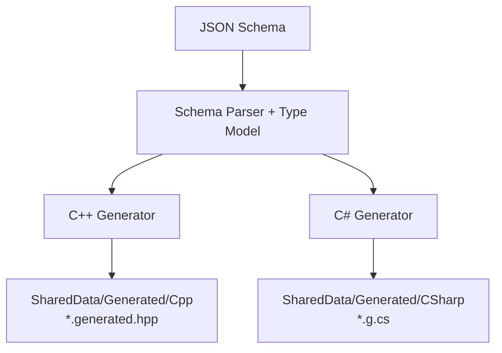
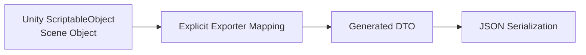
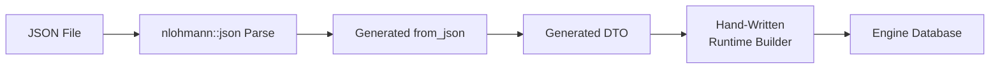

## Type Generation Rationale

같은 JSON document를 C++과 C#에서 사용하더라도 양쪽 DTO를 수동으로 작성하면 그것은 하나의 계약이 아닙니다. 두 구현이 우연히 같은 상태에 머물러 있는 것입니다.

필드 추가, optional 여부, enum 이름이나 numeric width가 달라지면 exporter는 성공하지만 runtime loader가 실패하거나 더 나쁘게는 다른 값으로 해석할 수 있습니다. Jam은 JSON Schema를 source of truth로 두고 `jam_shared_data_tool`이 두 언어의 DTO와 serialization code를 생성합니다.



generated code는 직접 수정하지 않습니다. 계약을 바꾸려면 schema를 수정하고 다시 생성해야 합니다.

## Schema Model

각 schema는 JSON Schema Draft 2020-12 형태로 document contract를 정의합니다.

- object, array와 scalar type
- required와 optional property
- enum과 constant
- minimum, maximum과 array length
- `additionalProperties`를 통한 map 또는 폐쇄된 object
- `$defs`와 `$ref`를 통한 재사용 type
- description과 version field

Jam은 언어 간 numeric type을 정확히 맞추기 위해 `x-jam-scalar` 확장을 사용합니다.

| Schema annotation | C++ 예 | C# 예 |
| --- | --- | --- |
| `f32` | `float` | `float` |
| `i32` | `int32_t` | `int` |
| `u32` | `uint32_t` | `uint` |
| `u64` | `uint64_t` | `ulong` |

표준 JSON의 `number`와 `integer`만으로는 runtime에 필요한 width와 signedness가 부족하기 때문에 추가한 authoring metadata입니다. generator가 이해하는 schema subset과 custom keyword 자체도 `schema-authoring.schema.json`에 정의해 schema 작성 규칙을 명시합니다.

polymorphic data에는 `x-jam-polymorphic`, base name과 discriminator 같은 확장을 사용할 수 있습니다. physics archetype처럼 여러 concrete body/behavior 형태를 하나의 document에서 표현하기 위한 장치입니다.

## Generated C# Boundary

C# output은 Unity authoring/export 측에서 사용하는 DTO를 제공합니다.



generated property에는 JSON field name과 required 여부가 포함됩니다. Unity-specific object reference, editor state와 presentation component를 DTO에 직접 넣지 않고 exporter가 primitive data와 canonical name으로 변환합니다.

authoring model과 DTO를 분리한 이유는 editor 편의 구조를 runtime file format으로 그대로 굳히지 않기 위해서입니다. mapping code는 추가되지만 scene object의 serialization detail이 server contract로 새는 것을 막습니다.

## Generated C++ Boundary

C++ output은 DTO type, `from_json`/`to_json`, file load/save helper를 제공합니다.



required property는 `at()` 기반으로 읽어 누락을 실패시키고, optional property는 존재할 때만 적용합니다. generated loader는 syntax와 structural mapping을 담당하지만 engine semantic은 판단하지 않습니다.

예를 들어 actor level의 pose가 정확한 component 수를 갖는지, actor ID가 canonical range인지, archetype key가 중복되는지는 runtime builder가 확인합니다. generated DTO와 engine database 사이에 이 변환 계층을 둬 code generation이 runtime architecture를 지배하지 않도록 했습니다.

## Validation Layers

Data Pipeline의 검증은 한 지점에 몰려 있지 않습니다.

| 단계 | 확인하는 것 | 예시 |
| --- | --- | --- |
| Schema | 문서의 구조적 계약 | required field, enum, scalar, array 길이 |
| Exporter | authoring context의 유효성 | scene reference, stable ID, export 가능한 asset |
| Generated deserializer | JSON과 DTO mapping | 누락된 required property, type mismatch |
| Runtime builder | engine semantic | version, duplicate key, canonical ID, enum 변환 |
| Resolver | document 간 참조 | world template, actor level, physics asset name |

모든 검증을 runtime에 두면 feedback이 늦고, exporter만 신뢰하면 외부에서 수정되거나 오래된 data를 안전하게 거부할 수 없습니다. Jam은 가능한 오류는 authoring 시점에 가깝게 찾되 runtime boundary에서도 핵심 invariant를 다시 확인합니다.

중복 검증의 유지 비용은 있지만 content data는 application 시작과 world assembly를 결정하므로 잘못된 상태로 계속 실행하는 것보다 명시적으로 실패하는 편을 선택했습니다.

## Versioning and Schema Evolution

각 root document는 version을 가집니다. loader는 지원하는 version을 명시적으로 검사하고, 현재 해석할 수 없는 document를 거부합니다.

호환 가능한 변경은 optional field와 default를 추가하는 방식으로 진행할 수 있습니다. required field 제거, enum 의미 변경, canonical name 변경은 data migration이 필요한 breaking change로 봐야 합니다.

```text
on schema change:
    regenerate C++ / C# DTOs
    update exporter mapping

    if existing JSON is no longer compatible:
        migrate stored documents
        or add explicit compatibility handling

    update runtime builder and supported version
    verify generated output stays synchronized with schema
```

code generation은 양쪽 언어의 type drift를 막지만 기존 JSON의 의미까지 자동으로 migration하지는 않습니다. version과 migration 정책은 여전히 application 설계의 책임입니다.

## Shared Data and Wire Schema Separation

Jam에는 FlatBuffers 기반 network protocol schema도 존재하지만 shared data schema와 목적이 다릅니다.

|  | Shared Data JSON Schema | Network FlatBuffers Schema |
| --- | --- | --- |
| 대상 | authoring 및 runtime configuration | client/server packet payload |
| 우선 가치 | 가독성, diff, editor export, validation | compact wire format과 decode 비용 |
| 생성 결과 | C++/C# DTO와 JSON serializer | FlatBuffers protocol type와 builder |
| lifecycle | asset export 및 runtime loading | packet encode/decode |

둘을 하나의 schema system으로 억지로 통합하지 않은 이유는 변경 방식과 성능 요구가 다르기 때문입니다. 다만 양쪽 모두 hand-written duplicate type을 줄이고 generated boundary 뒤에 domain conversion을 둔다는 원칙은 공유합니다.

## Current Trade-offs

- generator가 지원하는 JSON Schema subset과 custom keyword를 유지해야 합니다.
- generated file을 repository에 포함하면 diff와 build 재현성은 좋아지지만 schema와 output의 동기화 검사가 필요합니다.
- JSON은 inspect와 authoring에는 유리하지만 binary asset보다 parse와 memory 비용이 큽니다.
- canonical name 기반 reference는 읽기 쉽지만 rename이 identity migration으로 이어질 수 있습니다.
- generated DTO와 runtime model의 분리는 안전하지만 mapping code가 추가됩니다.

이 비용은 C++ runtime과 Unity authoring이 독립적으로 진화하면서도 같은 data contract를 유지하기 위한 선택입니다. 생성된 데이터가 runtime database로 변환되는 과정은 [[Projects/Jam/Data Pipeline/01. Shared Game Data|Shared Game Data]]에서 설명합니다.
