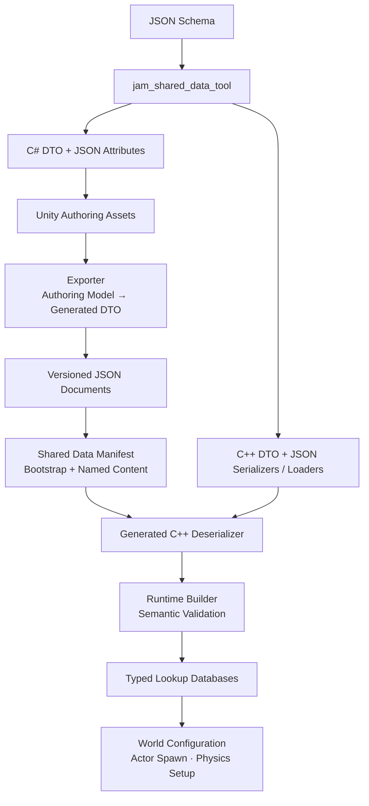
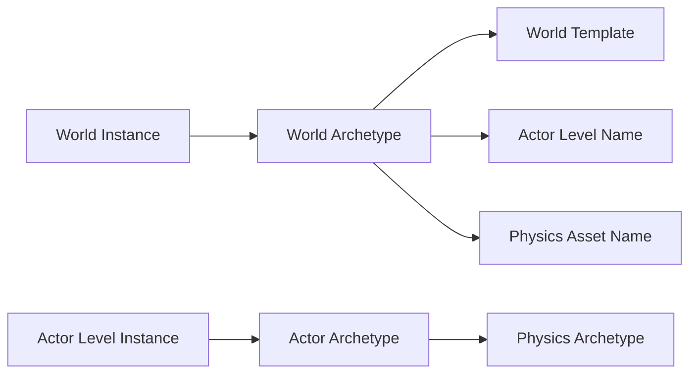

## Core Idea

Jam의 data pipeline은 **게임 데이터를 코드에 중복 선언하지 않고, 하나의 schema에서 authoring과 runtime이 공유하는 계약을 만드는 구조**입니다.

world, actor와 physics archetype은 server와 client가 같은 이름·타입·관계를 해석해야 합니다. 이를 C++ 구조체와 Unity C# class에 각각 수작업으로 정의하면 필드 추가나 이름 변경이 한쪽에만 반영되기 쉽고, 오류가 실제 world 진입 시점까지 늦게 드러납니다.

Jam은 JSON Schema를 source of truth로 두고 다음 경계를 선택했습니다.

> Schema defines the shape. Generated DTOs move the data. Runtime builders decide whether the data is meaningful.

- schema에서 C++과 C# DTO 및 serialization code를 생성합니다.
- Unity authoring data는 generated DTO를 거쳐 versioned JSON document로 export됩니다.
- manifest는 bootstrap data와 world별 content의 위치를 연결합니다.
- runtime loader는 DTO를 engine database로 변환하면서 identity와 reference를 다시 검증합니다.

## End-to-End Data Flow

아래 흐름이 Data Pipeline 전체의 중심축입니다.

이 흐름은 generated DTO를 runtime model로 직접 사용하지 않습니다. DTO는 schema와 JSON 사이의 전송 형태이고, runtime builder가 hash key, reference와 engine-specific enum을 가진 database로 변환합니다. 이 분리는 generated code의 변경이 simulation 내부 표현까지 직접 전파되는 것을 막습니다.

## Data Boundaries

### Bootstrap and Content

| 구분 | 대표 데이터 | 로딩 시점 | 목적 |
| --- | --- | --- | --- |
| Bootstrap | world templates, world archetypes, world instances, actor archetypes | client/server 초기화 | world 선택과 전역 identity 해석 |
| Named content | physics asset set, actor level set | world archetype 선택 이후 | 선택된 world에 필요한 실제 content 구성 |

모든 데이터를 시작할 때 한 번에 읽으면 lookup은 단순하지만 world 수와 asset 크기가 늘어날수록 초기화 비용과 memory가 함께 증가합니다. Jam은 world를 선택하기 위해 필요한 작은 전역 index와 선택 이후 필요한 content를 manifest에서 구분했습니다.

현재 일부 loader는 초기화 과정에서 eager하게 사용되지만, manifest의 이름 기반 content map은 archetype-scoped loading과 caching으로 확장할 수 있는 경계를 제공합니다.

### Data Identity Chain

문서 사이의 관계는 파일 경로가 아니라 canonical name으로 표현하고, runtime에서 stable hash key로 변환합니다. authoring에서는 사람이 읽을 수 있는 이름을 유지하면서 hot path에서는 문자열 비교를 피하기 위한 선택입니다.

## Component Relationships

- **JSON Schema**는 document shape, required field, enum과 scalar width를 정의합니다.
- **Generated DTOs**는 C++과 C#이 같은 JSON field를 읽고 쓰게 합니다.
- **Unity exporter**는 editor object와 scene 정보를 DTO로 변환합니다.
- **Shared Data Manifest**는 여러 document의 root와 loading scope를 정의합니다.
- **Runtime builders**는 DTO를 engine model로 변환하며 version, identity와 reference를 검증합니다.
- **Typed databases**는 world transition, actor lifecycle과 physics initialization에 read-only lookup을 제공합니다.
- [[Projects/Jam/Game World/01. World Entry and Transition|World Entry and Transition]]은 이 데이터가 실제 world 구성에 사용되는 다음 단계를 설명합니다.

## Document Map

1.  [[Projects/Jam/Data Pipeline/01. Shared Game Data|Shared Game Data]] — world, actor와 physics 데이터를 하나의 manifest와 identity chain으로 연결하는 방법
2.  [[Projects/Jam/Data Pipeline/02. Schema and Code generation|Schema and Code Generation]] — JSON Schema에서 C++/C# DTO와 loader contract를 생성하는 과정
