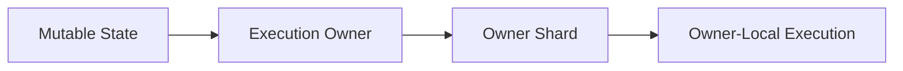
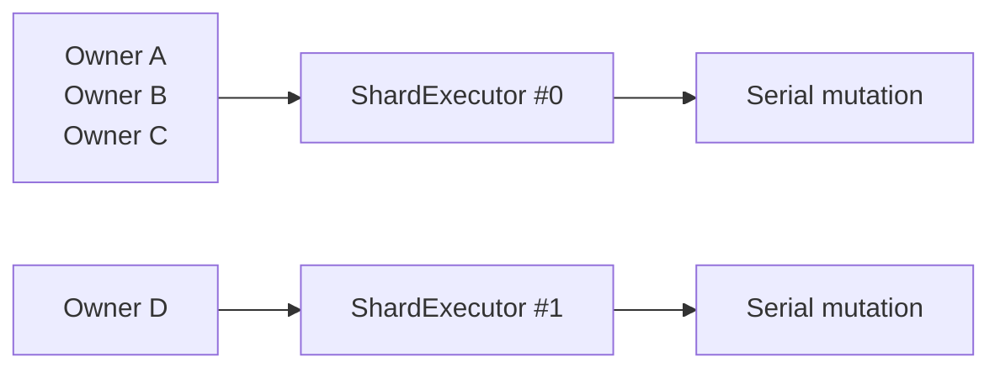
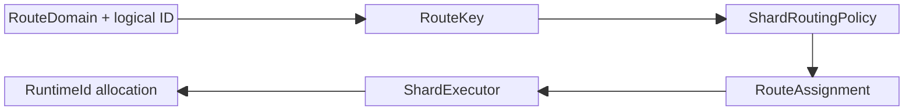
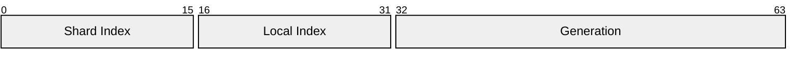
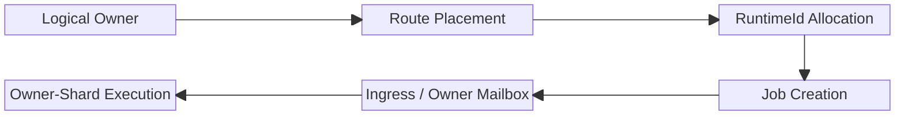

Jam은 mutable runtime state에 **명확한 execution owner를 부여하고, 해당 owner의 실행 경계 안에서 상태 변경을 직렬화** 합니다.

세션과 월드는 연결 상태, 사용자 수명, simulation 결과처럼 지속적으로 변경되는 state를 가집니다. 여러 thread가 이 상태를 직접 변경할 수 있다면 각 접근 지점에서 locking뿐 아니라 변경 순서와 객체 수명까지 함께 조율해야 합니다.

Jam은 이를 피하기 위해 상태마다 owner를 정하고, owner를 특정 shard의 execution context에 배치합니다. 상태를 변경하려는 작업은 직접 접근하는 대신 해당 owner가 실행되는 shard로 전달됩니다.

## Ownership Invariants

이 문서에서 말하는 ownership은 다음 세 규칙으로 요약됩니다.

- authoritative mutable state는 배치된 shard에서만 변경합니다.
- 다른 실행 위치에서 해당 상태를 바꿔야 하면 직접 접근하지 않고 shard ingress 또는 mailbox로 작업을 이동시킵니다.
- route는 논리 owner의 배치를 결정하고, `RuntimeId`는 이미 배치된 runtime object의 위치와 generation을 식별합니다.

이 구분 때문에 routing policy를 바꾸더라도 runtime object lifetime 검증 방식까지 같이 바꿀 필요가 없습니다.

## State and Ownership

세션, 사용자, 월드처럼 변경 가능한 상태는 shard에 귀속됩니다. 여기서 owner는 단순한 식별자가 아니라 상태의 변경 권한, ordering, lifetime이 모이는 논리적 경계입니다.

같은 owner를 대상으로 하는 작업을 같은 shard에서 실행하면 여러 producer가 동시에 요청하더라도 상태 변경은 한 실행 위치로 수렴합니다. Jam은 hot path마다 잠금 규칙을 추가하는 대신, 상태 접근이 가능한 위치 자체를 제한하는 쪽을 선택했습니다.

이 선택의 비용은 다른 owner의 상태를 즉시 함수 호출로 변경할 수 없다는 점입니다. domain 경계를 넘는 작업은 명시적으로 route하고 dispatch해야 합니다. 대신 코드에서 비동기 경계와 상태 변경 순서가 드러납니다.

## Execution Location

owner는 논리적인 소유 단위이고, shard는 그 owner의 상태 변경을 실제로 수행하는 execution location입니다. 여러 owner가 하나의 shard에 배치될 수 있지만, 한 owner의 authoritative mutation은 배치된 shard를 벗어나지 않습니다.

서로 다른 shard는 병렬로 실행됩니다. 따라서 모든 상태를 하나의 global lock으로 보호하지 않고도 owner별 ordering과 시스템 전체의 concurrency를 함께 확보할 수 있습니다.

## Routing

`RouteKey`는 domain과 논리 ID를 조합해 만듭니다. domain은 서로 다른 종류의 ID가 같은 값을 가질 때 route가 충돌하지 않도록 구분합니다.

현재 routing policy는 두 가지 배치 방식을 제공합니다.

- `StableSpread`는 route key를 기준으로 안정적인 shard를 선택합니다.
- `Placement`는 일부 candidate의 현재 route load를 비교해 배치합니다.

관련 owner를 같은 shard에 두기 위해 parent route나 preferred shard를 affinity hint로 전달할 수 있습니다. 이는 cross-shard dispatch를 줄이지만, hard affinity를 과도하게 사용하면 특정 shard에 부하가 몰립니다. Jam은 locality를 힌트로 활용하되, ownership과 균등 배치를 분리해 조정할 수 있게 했습니다.

## Runtime Identity

`RuntimeId`는 배치가 끝난 shard-owned object를 식별하는 64-bit 값입니다.

- `shard index`는 object의 실행 위치를 나타냅니다.
- `local index`는 shard 내부 slot을 찾습니다.
- `generation`은 slot 재사용 후 남은 stale reference를 구분합니다.

route가 **owner를 어디에 배치할지 결정하는 과정** 이라면, `RuntimeId`는 **배치된 object의 위치와 세대를 표현하는 식별자** 입니다. routing과 identity를 분리함으로써 배치 정책과 runtime lifetime 검증이 서로 얽히지 않습니다.

## Job Routing Flow

`Job`은 callback과 priority를 가진 최소 실행 요청입니다. job 자체는 thread나 owner를 결정하지 않습니다. 앞에서 정한 ownership과 route에 따라 어느 executor 또는 mailbox에 제출되는지가 실행 위치와 ordering을 결정합니다.

| Priority | 용도 |
| --- | --- |
| `Critical` | handshake와 종료처럼 즉시 처리해야 하는 작업 |
| `Control` | RPC와 제어 메시지 |
| `Normal` | 일반 packet 및 runtime 작업 |
| `Low` | 정리와 통계 집계 같은 background 작업 |

선택된 shard 안에서 상태를 변경하는 방식은 [[03. Owner-Local Serial Execution|Owner-Local Serial Execution]]에서, producer가 그 경계로 job을 넘기는 방식은 [[04. Cross-Thread Task Dispatch|Cross-Thread Task Dispatch]]에서 이어집니다.

## Implementation References

- [`ShardRoutingPolicy.h`](https://github.com/akxotjr/Jam/blob/master/JamNet/include/jamnet/core/executor/ShardRoutingPolicy.h) / [`ShardRoutingPolicy.cpp`](https://github.com/akxotjr/Jam/blob/master/JamNet/src/core/executor/ShardRoutingPolicy.cpp) — `StableSpread`, `Placement`, `RouteAffinityHint`
- [`RuntimeId.h`](https://github.com/akxotjr/Jam/blob/master/JamNet/include/jamnet/core/executor/RuntimeId.h) — `[shard:16 | local:16 | generation:32]` layout
- [`ShardOwnedObject.h`](https://github.com/akxotjr/Jam/blob/master/JamNet/include/jamnet/core/executor/ShardOwnedObject.h) — generation-aware slot table and shard-owned object reference
- [`Job.h`](https://github.com/akxotjr/Jam/blob/master/JamNet/include/jamnet/core/executor/Job.h) — job callback and priority contract
