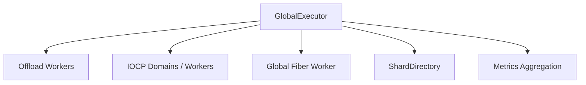
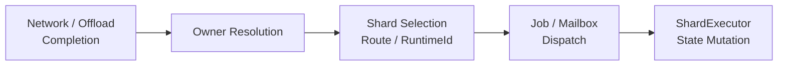

모든 작업을 owner-local shard로 보내면 ordering은 단순해지지만, 상태와 무관한 계산과 I/O completion까지 불필요하게 직렬화됩니다. 반대로 모든 작업을 일반 thread pool에서 처리하면 mutable state의 접근 규칙이 다시 각 callback의 책임이 됩니다.

Jam은 이 두 문제를 분리하기 위해 특정 세션이나 월드에 귀속되지 않은 작업을 **global concurrent domain**에서 처리합니다. `GlobalExecutor`는 이 공용 작업을 병렬화하고, owner가 확인된 시점에 owner-local domain으로 넘기는 상위 실행기입니다. 또한 shard directory와 CPU 배치 정책을 초기화합니다.

## Execution Responsibilities

### Offload Workers

`Submit()`으로 전달된 일반 job은 MPMC queue를 통해 offload worker 중 하나가 실행합니다. 특정 owner의 상태를 변경하지 않는 독립적인 계산이나 공용 작업에 적합합니다.

offload worker에서 shard-owned 상태를 직접 변경하면 ownership 규칙이 깨집니다. 그런 작업은 route를 찾은 뒤 대상 shard 또는 mailbox로 다시 dispatch해야 합니다.

이 경계를 둔 이유는 worker 수가 늘어나더라도 state synchronization의 복잡도가 함께 늘어나지 않게 하기 위해서입니다. offload는 계산의 병렬성을 제공하지만 상태의 소유권까지 가져가지는 않습니다.

### IOCP Workers

네트워크 I/O completion은 `GlobalExecutor`가 관리하는 IOCP domain worker에서 먼저 소비됩니다. I/O completion을 받은 worker와 세션 상태를 소유한 shard는 서로 다를 수 있으므로, completion thread가 shard-owned protocol state의 authoritative mutation 위치가 되지는 않습니다. owner가 확인된 stateful 작업은 해당 shard의 ingress 또는 mailbox 경계로 넘깁니다.

### Global Fiber Worker

global fiber scheduler는 단일 전용 thread에서 동작합니다. 특정 shard에 묶이지 않은 delayed job, periodic work, 비동기 RPC와 같은 제어 흐름에 사용됩니다. 이것은 global과 나란히 존재하는 별도 실행 domain이 아니라, **global domain의 continuation을 유지하는 scheduling 장치**입니다. shard-owned 상태를 기다리는 흐름은 가능하면 해당 shard scheduler에 남기는 것이 ownership을 이해하기 쉽습니다.

### Shard Directory

`GlobalExecutor`는 `ShardDirectory`를 통해 shard를 생성하고 시작하며, route key를 shard로 변환합니다. 실제 owner-local 상태는 `GlobalExecutor`가 아니라 선택된 shard가 보관합니다.

## Global and Shard Boundary

`GlobalExecutor`의 concurrency는 owner와 무관한 작업을 넓게 병렬화하기 위한 것입니다. 상태 변경의 ordering이 필요해지는 지점부터는 [[03. Owner-Local Serial Execution|Owner-Local Serial Execution]]으로 전환합니다.

thread 수와 affinity 구성은 [[06. Thread and Core Topology|Thread and Core Topology]]에서 설명합니다.

## Implementation References

- [`GlobalExecutor.h`](https://github.com/akxotjr/Jam/blob/master/JamNet/include/jamnet/core/executor/GlobalExecutor.h) — offload queue, IOCP domains, global fiber worker, shard directory
- [`GlobalExecutor.cpp`](https://github.com/akxotjr/Jam/blob/master/JamNet/src/core/executor/GlobalExecutor.cpp) — worker lifecycle and global scheduling loops
- [`ShardDirectory.h`](https://github.com/akxotjr/Jam/blob/master/JamNet/include/jamnet/core/executor/ShardDirectory.h) — shard collection and route placement integration
