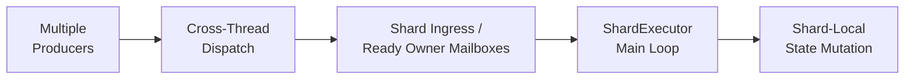
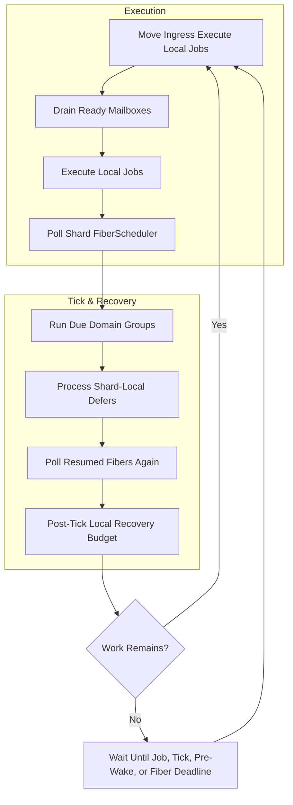

Global domain의 worker들이 shard-owned state를 직접 변경하도록 두면, owner를 정하고 route한 의미가 사라집니다. Jam에서 **owner-local serial execution**은 ownership 결정을 실제 상태 변경 규칙으로 만드는 경계이며, `ShardExecutor`가 담당합니다. 이후 문서에서는 이 실행 경계를 간단히 **shard**, 실행기를 **`ShardExecutor`**라고 부릅니다.

shard는 일반적인 thread pool worker와 다릅니다. 하나의 job을 임의의 worker가 가져가는 대신, 배치된 세션·사용자·월드 상태와 그 상태를 변경하는 순서를 함께 소유합니다.

이 구조는 한 owner마다 thread나 lock을 두는 방식 대신, 여러 owner를 소수의 shard에 배치하고 shard 내부에서 직렬화하는 선택입니다. owner 간 병렬성은 유지하면서 thread 수와 synchronization 비용을 제한할 수 있지만, 한 shard의 긴 작업은 같은 shard의 다른 owner에도 영향을 줄 수 있으므로 실행 budget과 작업 분리가 중요합니다.

## Shard-Local State

각 shard의 `ShardLocal`에는 ECS registry와 세션, 사용자, 월드 상태가 저장됩니다. [[Projects/Jam/Execution Model/01. State Ownership & Task Routing|State Ownership & Task Routing]]에서 선택한 route에 따라 같은 owner의 job이 같은 shard로 전달되며, shard main thread가 이를 직렬로 실행합니다.

서로 다른 shard는 병렬로 실행되지만 한 shard 안의 authoritative mutation은 main thread로 수렴합니다. 이를 통해 hot path의 global lock을 줄이고, 상태 변경 순서를 실행 구조 자체로 보장합니다.

## Main Loop

`ShardExecutor`의 main loop는 한 종류의 queue만 비우지 않습니다. 다음 작업을 제한된 budget으로 번갈아 처리합니다.

- 외부에서 들어온 job을 local priority queue로 이동
- 우선순위에 따른 local job 실행
- ready mailbox 처리
- 예정된 domain system 실행
- shard-local deferred 작업 처리
- fiber scheduler polling

각 단계에 budget을 두어 특정 mailbox나 대량의 normal job이 shard 전체를 독점하지 않게 합니다. 실행할 일이 없으면 다음 tick과 fiber wake-up 시간을 고려해 대기합니다.

현재 main loop의 큰 순서는 다음처럼 볼 수 있습니다.

두 번의 scheduler poll은 domain work가 비동기 작업을 제출하고 다른 thread의 completion이 fiber resume을 게시하는 경우를 같은 loop에서 빠르게 흡수하기 위한 구조입니다. post-tick recovery pass는 tick/fiber 처리 이후에도 local job이 영구적으로 밀리지 않도록 별도 실행 budget을 둡니다.

## Dispatch at the Execution Boundary

`ShardExecutor`가 설명하는 것은 **도착한 작업을 어디서 어떤 순서로 실행하는가**입니다. 작업이 producer thread에서 이 지점까지 안전하게 넘어오는 과정은 별도의 dispatch 계약입니다.

shard ingress는 shard 전체를 향한 작업을 받고, ready mailbox는 특정 owner를 향한 작업을 받습니다. 두 경우 모두 실제 callback은 shard main loop가 실행합니다. producer 측 전달, stale reference 검증, mailbox lifecycle은 [[Projects/Jam/Execution Model/04. Cross-Thread Task Dispatch|Cross-Thread Task Dispatch]]에서 이어서 설명합니다.

## Waiting Within the Execution Boundary

각 shard는 main thread에 연결된 `FiberScheduler`를 가집니다. 이는 shard와 별개의 실행 경계가 아닙니다. shard에서 시작한 흐름이 외부 완료를 기다릴 때 owner-local continuation을 보존하고, 같은 shard로 돌아와 이어서 실행하기 위한 장치입니다.

shard 내부 코드는 fiber를 생성한 뒤 await key로 suspend하고, 완료를 받은 실행 경로가 `ResumeFiber()`를 호출할 수 있습니다. fiber가 기다리는 동안 shard main loop는 다른 job과 system을 처리합니다.

fiber의 내부 scheduling과 global scheduler와의 차이는 [[Projects/Jam/Execution Model/05. Fiber-Based Async Scheduling|Fiber-Based Async Scheduling]]에서 다룹니다.

## Sibling Worker and Pre-Wake

각 shard에는 별도의 worker가 있으며, 현재는 물리처럼 main thread 밖에서 수행할 계산을 전달하는 데 사용됩니다. affinity가 활성화되면 shard main thread는 physical core의 primary logical processor에, worker는 그 SMT sibling에 배치될 수 있습니다.

두 logical processor는 같은 physical core의 execution resource를 공유하므로 항상 동시에 바쁘게 실행하면 서로 간섭할 수 있습니다. shard는 worker를 상시 spin시키지 않고 대부분 대기시키며, worker 작업이 필요한 domain tick 직전에만 pre-wake deadline을 게시합니다. worker는 짧은 구간 동안 작업 도착을 기다려 wake-up latency를 줄이되, 불필요한 SMT 경쟁 시간을 제한합니다.

이 배치와 fallback 정책은 [[Projects/Jam/Execution Model/06. Thread and Core Topology|Thread and Core Topology]]에서 설명합니다.

## Execution Boundary Constraints

shard ownership은 상태 변경을 단순하게 만들지만, 다른 shard의 결과가 필요하면 동기 함수 호출처럼 즉시 반환할 수 없습니다. 요청을 대상 shard로 보내고 completion을 받아야 합니다. Jam은 이 비용을 숨기기보다 dispatch와 async scheduling 계약으로 드러냅니다.

## Implementation References

- [`ShardExecutor.h`](https://github.com/akxotjr/Jam/blob/master/JamNet/include/jamnet/core/executor/ShardExecutor.h) — loop budgets, domain groups, mailbox/fiber/worker integration
- [`ShardExecutor.cpp`](https://github.com/akxotjr/Jam/blob/master/JamNet/src/core/executor/ShardExecutor.cpp) — main loop ordering, pre-wake publication, worker wait/spin behavior
- [`ShardDomain.h`](https://github.com/akxotjr/Jam/blob/master/JamNet/include/jamnet/core/executor/ShardDomain.h) — shard domain identifiers
