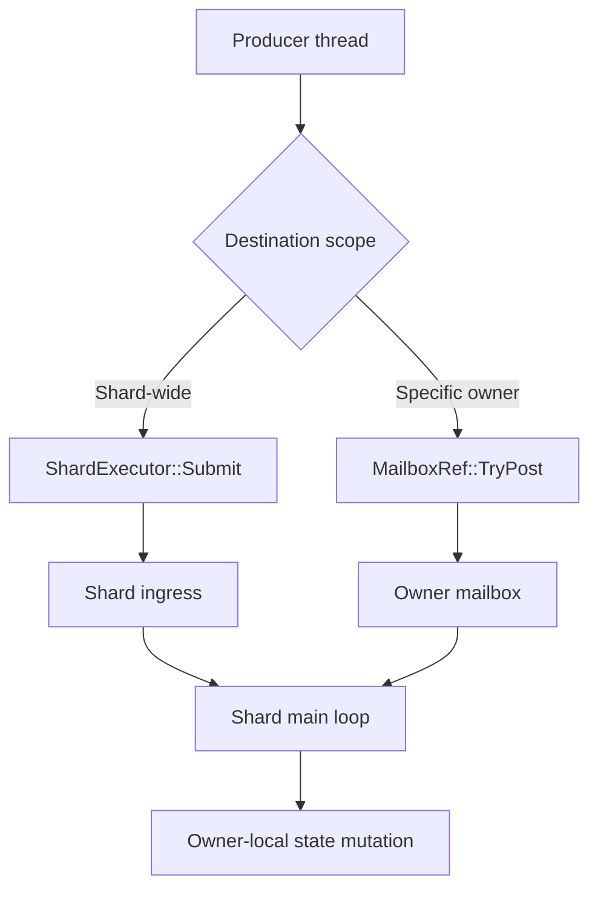
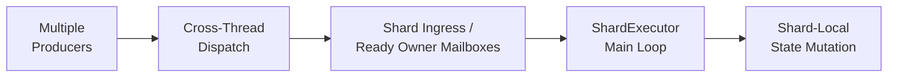

[[03. Owner-Local Serial Execution|Owner-Local Serial Execution]]은 상태를 변경할 장소와 순서를 정하지만, producer가 항상 그 shard thread에서 실행되는 것은 아닙니다. 네트워크 completion, global worker, 다른 shard처럼 경계 밖에서 만들어진 작업을 owner state에 직접 적용하면 ownership 규칙이 깨집니다.

따라서 Jam은 직접 호출 대신 **dispatch**를 domain 사이의 명시적인 handoff로 사용합니다. shard ingress가 shard 전체를 목적지로 삼는다면, mailbox는 세션이나 월드처럼 특정 shard-owned object를 목적지로 삼습니다.

이 순서에서 dispatch는 serial execution의 내부 구현이 아니라, **그 실행 경계에 들어가기 위한 전송 계약** 입니다.

## Dispatch Model

여러 producer가 동시에 post할 수 있지만 dequeue는 owner `ShardExecutor`만 수행합니다. 따라서 producer 측에서는 lock을 잡고 owner 상태에 접근할 필요가 없고, owner 측에서는 자신의 실행 위치에서 job을 순차적으로 적용할 수 있습니다.

queue와 wake-up 비용이 추가되지만 이 비용을 명시적으로 지불함으로써 cross-thread call site마다 locking과 lifetime 규칙을 반복하지 않아도 됩니다.

## MailboxRef

외부에서는 mailbox 자체보다 `MailboxRef`를 사용합니다. reference에는 mailbox pointer, owner의 `RuntimeId`, 그리고 그 `RuntimeId`에서 가져온 generation 값이 함께 저장됩니다. 현재 `TryPost()`는 pointer와 owner id가 유효한지, 저장된 generation이 `ownerId`의 generation과 일치하는지, mailbox가 새 post를 받는 `Open` 상태인지 확인한 뒤 job을 전달합니다.

즉 `MailboxRef`의 generation은 별도의 mailbox 세대 번호가 아니라 **owner runtime identity의 generation을 함께 운반하는 값**입니다. 실제 shard-owned object reference는 이 mailbox validity와 현재 object의 `RuntimeId`가 저장된 owner id와 같은지를 함께 확인해 비동기 teardown 이후의 참조를 검증합니다.

## Ready Notification and Fairness

첫 job이 빈 mailbox에 들어오면 mailbox는 자신을 ready queue에 한 번만 게시합니다. 추가 producer는 같은 mailbox를 반복해서 ready queue에 넣지 않고 내부 queue에 job을 추가합니다.

`ShardExecutor`는 한 mailbox에서 처리할 job 수와 한 loop에서 처리할 전체 mailbox 수에 budget을 둡니다. 남은 job이 있으면 mailbox를 다시 ready 상태로 게시합니다. 이를 통해 트래픽이 많은 owner 하나가 같은 shard의 다른 owner를 계속 밀어내는 상황을 완화합니다.

## Lifecycle

mailbox 종료는 shard-owned object의 비동기 수명과 연결됩니다.

| Mode | 동작 |
| --- | --- |
| `Drain` | 이미 수락한 job과 in-flight 작업을 끝낸 후 닫음 |
| `Abort` | 대기 중인 job을 폐기하고 닫음 |

종료가 시작되면 새로운 post를 거부하고, 선택한 정책에 따라 pending job을 처리한 뒤 close callback을 실행합니다. object table은 mailbox가 닫힌 이후 object 파괴를 완료할 수 있어, queue 안에 남은 job이 파괴된 object를 호출하는 문제를 줄입니다.

## Usage Criteria

- shard만 알면 되고 특정 owner ordering이 필요 없다면 `ShardExecutor::Submit()`을 사용합니다.
- 세션이나 월드처럼 대상의 수명과 직렬화 경계가 중요하면 `MailboxRef::TryPost()`를 사용합니다.
- 다른 실행 위치의 응답을 기다려야 한다면 mailbox dispatch와 [[05. Fiber-Based Async Scheduling|Fiber-Based Async Scheduling]]을 함께 사용할 수 있습니다.

owner와 shard가 결정되는 과정은 [[01. State Ownership & Task Routing|State Ownership & Task Routing]]에서 설명합니다.

## Implementation References

- [`Mailbox.h`](https://github.com/akxotjr/Jam/blob/master/JamNet/include/jamnet/core/executor/Mailbox.h) — MPSC mailbox, close state, in-flight accounting
- [`MailboxRef.h`](https://github.com/akxotjr/Jam/blob/master/JamNet/include/jamnet/core/executor/MailboxRef.h) / [`MailboxRef.cpp`](https://github.com/akxotjr/Jam/blob/master/JamNet/src/core/executor/MailboxRef.cpp) — owner id/generation carrying reference and `TryPost()` validation
- [`ShardOwnedObject.h`](https://github.com/akxotjr/Jam/blob/master/JamNet/include/jamnet/core/executor/ShardOwnedObject.h) — mailbox-outlives-object teardown contract and runtime-id validation
- [`ShardExecutor.cpp`](https://github.com/akxotjr/Jam/blob/master/JamNet/src/core/executor/ShardExecutor.cpp) — ready mailbox queue and service budgets
