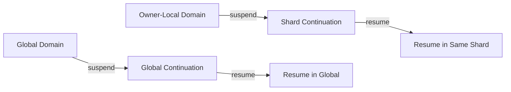
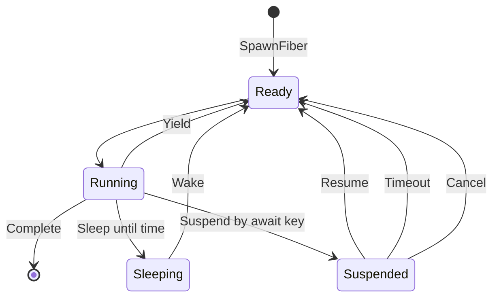
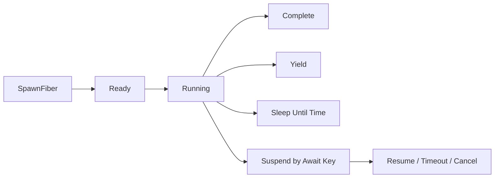
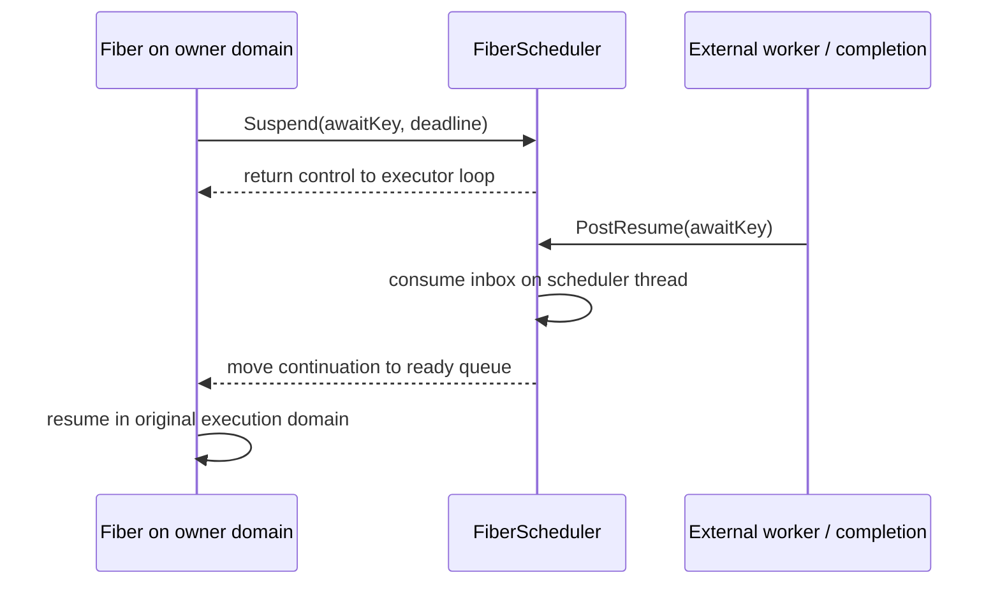

## Fiber Execution Role

Jam의 실행 domain은 **global concurrent execution**과 **owner-local serial execution** 두 가지입니다. Fiber는 여기에 추가되는 세 번째 domain이 아닙니다.

Fiber는 이미 선택된 domain에서 실행하던 흐름이 결과를 기다릴 때, thread를 막지 않으면서 continuation을 유지하는 장치입니다. global에서 시작한 fiber는 global scheduler에서, shard에서 시작한 fiber는 같은 shard scheduler에서 재개됩니다. Fiber가 ownership이나 routing을 새로 결정하지는 않습니다.

이 방식을 선택한 이유는 비동기 대기를 callback chain으로 분해하지 않으면서도 executor thread 전체를 멈추지 않기 위해서입니다. 그 대가로 suspend 가능한 지점, timeout, cancellation, owner shutdown을 continuation lifetime과 함께 관리해야 합니다.

## Scheduling Model

`FiberScheduler`는 ready queue, sleep queue와 await key를 관리합니다. 실행 중인 fiber가 `Suspend()`를 호출하면 scheduler로 제어권을 돌려주고, executor는 다른 job이나 fiber를 계속 실행합니다.

다른 thread에서는 scheduler 내부 상태를 직접 변경하지 않습니다. `PostResume()`, `PostSpawn()`, `PostCancel*()`처럼 inbox를 통하는 API를 사용하고, scheduler가 자신의 thread에서 이를 반영합니다.

## Await and Completion

비동기 작업을 시작할 때 await key를 할당하고, fiber는 해당 key와 deadline으로 suspend합니다. 작업을 완료한 측이 같은 key를 resume하면 fiber가 ready queue로 돌아옵니다. deadline이 먼저 도달하거나 cancel 요청을 받으면 suspend 결과를 통해 정상 완료와 구분할 수 있습니다.

이 모델은 callback chain을 줄이지만 ownership을 바꾸지는 않습니다. fiber가 shard scheduler에서 실행 중이라면 resume 이후의 상태 변경도 같은 shard에서 계속됩니다. 다른 domain에서 completion이 발생해도 continuation 자체를 그 thread에서 직접 실행하지 않고 원래 scheduler에 resume을 post합니다.

## Global Executor Role

`GlobalExecutor`는 하나의 전용 fiber worker와 scheduler를 가집니다. 이 worker는 새로운 ownership domain을 만드는 것이 아니라, 특정 owner에 귀속되지 않은 다음 global 흐름의 continuation을 실행합니다.

- delayed job
- fixed-rate 및 fixed-delay periodic work
- global RPC wait와 timeout
- 공용 비동기 orchestration

global scheduler의 fiber는 shard-local 상태를 직접 변경하는 장소가 아닙니다. owner 상태가 필요하면 대상 shard로 dispatch합니다.

## Shard Executor Role

각 `ShardExecutor`는 자신의 main thread에 scheduler를 attach합니다. shard fiber는 owner-local 실행 흐름을 유지한 채 외부 완료를 기다릴 때 사용됩니다. resume 위치를 원래 shard로 고정하는 것이 핵심이며, fiber 자체가 shard state를 소유하는 것은 아닙니다.

현재 대표적인 사용은 다음과 같습니다.

- 월드 simulation pipeline의 대기와 재개
- physics worker 완료 대기
- shard-local delayed 및 periodic work
- shard context에서 수행되는 RPC wait

fiber가 suspend된 동안 shard main loop는 mailbox, 다른 job과 due system을 처리할 수 있습니다. 완료 이후 fiber는 동일한 shard scheduler에서 재개되므로 별도의 state handoff가 필요하지 않습니다.

## Fiber Scheduling Boundaries

fiber는 blocking thread를 줄이지만 CPU-bound 계산을 병렬화하거나 ownership 경계를 우회하지 않습니다. 긴 계산을 fiber 안에서 계속 실행하면 해당 executor thread는 여전히 점유됩니다. 그런 계산은 global offload worker나 shard worker에 제출하고, fiber는 완료를 기다리는 용도로 사용합니다.

또한 await key, deadline, cancel과 owner shutdown의 관계를 명확히 관리해야 합니다. executor 종료 시 남은 fiber를 취소하고 scheduler inbox를 정리하는 과정도 runtime lifecycle의 일부입니다.

shard에서 fiber가 사용되는 위치는 [[03. Owner-Local Serial Execution|Owner-Local Serial Execution]]을 참고합니다.

## Implementation References

- [`FiberScheduler.h`](https://github.com/akxotjr/Jam/blob/master/JamNet/include/jamnet/core/executor/FiberScheduler.h) — ready/sleep/await scheduling model and cross-thread post API
- [`ShardExecutor.cpp`](https://github.com/akxotjr/Jam/blob/master/JamNet/src/core/executor/ShardExecutor.cpp) — shard scheduler attach/poll/resume integration
- [`GlobalExecutor.h`](https://github.com/akxotjr/Jam/blob/master/JamNet/include/jamnet/core/executor/GlobalExecutor.h) — dedicated global fiber worker and scheduling API
