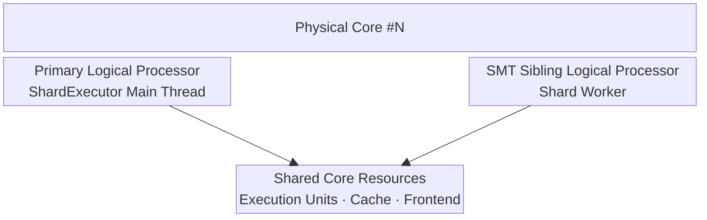

앞선 문서의 ownership과 execution domain은 논리적인 구조지만, 실제 latency와 처리량은 그 역할들을 어떤 CPU에 배치하는지에도 영향을 받습니다. 특히 shard main thread와 보조 worker가 무계획하게 경쟁하면 owner-local ordering은 지켜져도 frame 또는 tick latency가 불안정해질 수 있습니다.

Jam은 executor 역할의 수와 CPU 배치를 runtime 설정으로 결정합니다. 목표는 모든 thread를 무조건 고정하는 것이 아니라, server·client·다중 client처럼 서로 다른 실행 환경에서 예측 가능한 기본 배치를 제공하는 것입니다. 논리적 실행 모델과 hardware policy를 분리해 ownership 규칙을 바꾸지 않고도 배치를 조정할 수 있게 했습니다.

## Core Layout

`CoreLayout`은 실행 역할별 thread 수를 정의합니다.

| Role | 설명 |
| --- | --- |
| `shards` | owner-local 상태와 system을 실행하는 shard main threads |
| `iocp` | 네트워크 I/O completion workers |
| `fiber` | global fiber worker; 현재 1개로 고정 |
| `offload` | owner가 없는 일반 job workers |

layout은 직접 지정하거나 hardware 정보와 `AutoCoreLayoutConfig`로 계산할 수 있습니다. 자동 계산은 물리 core budget에서 예약 thread를 제외한 뒤 `IO_Heavy`, `CPU_Heavy`, `Balance` mode에 따라 offload 비중을 정하고 나머지를 shard에 할당합니다.

## Usage Profiles

- `CoreProfileServer`는 사용 가능한 core를 적극적으로 활용하며 shard, offload, fiber worker의 pinning을 기본으로 합니다.
- `CoreProfileClient`는 OS와 rendering thread를 위한 여유를 남기고 일부 worker를 고정하지 않습니다.
- `CoreProfileMultipleClient`는 같은 process 또는 host에서 여러 client가 경쟁할 수 있으므로 shard를 포함한 대부분의 pinning을 해제합니다.

프로필은 시작점일 뿐이며 실제 workload에 따라 thread 수와 affinity를 조정할 수 있습니다.

## Physical Cores and SMT Siblings

Windows topology 조회는 physical core마다 primary logical processor와 가능한 SMT sibling을 `CoreSlot`으로 구성합니다.

shard main thread와 worker를 같은 physical core의 sibling에 배치하면 locality를 유지할 수 있지만, 두 LP는 execution resource를 공유합니다. 그래서 worker는 상시 busy polling하지 않고 대기하며, 예정된 worker 작업 직전에만 pre-wake합니다. 이 정책은 wake-up latency와 SMT contention 사이의 균형을 위한 것입니다.

sibling이 없거나 pinning이 비활성화되면 worker는 특정 LP에 고정되지 않고 OS scheduler에 맡깁니다. shard 내부 동작은 [[03. Owner-Local Serial Execution|Owner-Local Serial Execution]]에서 설명합니다.

## NUMA Placement

`QueryNumaNodesWithPrimaryCoreSlots()`는 NUMA node별 physical core slot을 조회하고, `BuildRoundRobinCoreSlots()`는 node 사이에 affinity slot을 분산합니다. shard 수가 여러 NUMA node를 활용할 수 있을 만큼 충분하면 자동 layout도 shard 수를 node 수에 맞추려 시도합니다.

현재 topology 계층의 주된 역할은 thread affinity 계획을 만드는 것입니다. NUMA-aware allocation helper도 제공하지만, 모든 runtime 데이터가 자동으로 node-local memory에 배치되는 것은 아닙니다. 따라서 thread pinning만으로 완전한 NUMA locality가 보장된다고 해석해서는 안 됩니다.

## Affinity Policy

`ExecutorAffinityConfig`는 shard, IOCP, offload, fiber, main thread를 역할별로 고정할지 선택합니다. affinity를 사용하면 실행 위치와 성능 변동을 예측하기 쉬워지지만, 다른 process와 core를 공유하는 환경에서는 오히려 scheduler의 선택을 제한할 수 있습니다.

따라서 server처럼 단독으로 실행되는 workload에는 적극적인 pinning을, editor나 다중 client처럼 주변 workload가 많은 환경에는 유연한 배치를 기본값으로 사용합니다.

## Implementation References

- [`CoreTopology.h`](https://github.com/akxotjr/Jam/blob/master/JamNet/include/jamnet/core/executor/CoreTopology.h) — core layout, affinity configuration, usage profiles
- [`NumaTopology.h`](https://github.com/akxotjr/Jam/blob/master/JamNet/include/jamnet/core/executor/NumaTopology.h) — NUMA/core-slot discovery
- [`ShardExecutor.cpp`](https://github.com/akxotjr/Jam/blob/master/JamNet/src/core/executor/ShardExecutor.cpp) — primary/sibling pinning and worker pre-wake behavior
- [`GlobalExecutor.h`](https://github.com/akxotjr/Jam/blob/master/JamNet/include/jamnet/core/executor/GlobalExecutor.h) — global affinity plan and role-specific workers
