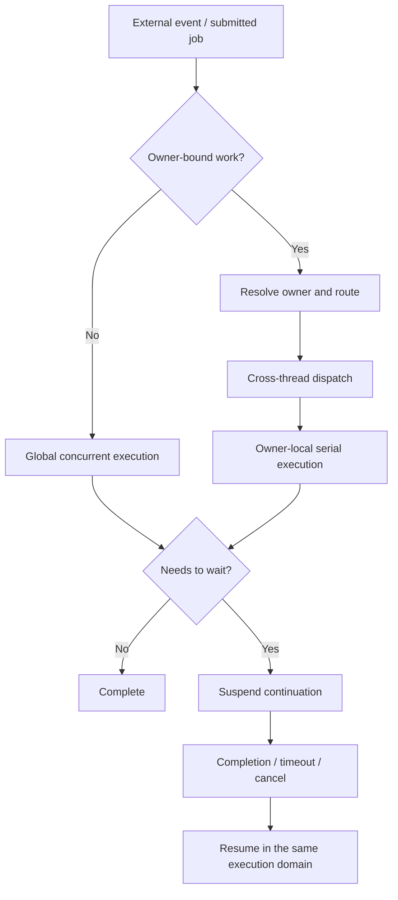

## Core Idea

Jam의 실행 모델은 **상태의 소유 위치를 먼저 정하고, 상태를 변경하는 작업을 그 위치로 이동시키는 구조**입니다.

세션과 월드처럼 계속 변하는 runtime 상태를 여러 thread가 직접 공유하면 잠금만 늘어나는 것이 아닙니다. 어떤 변경이 먼저 적용되는지, 작업이 실행될 때 객체가 여전히 유효한지, 비동기 완료가 어느 thread로 돌아와야 하는지도 함께 불명확해집니다.

Jam은 이 문제를 다음 원칙으로 단순화했습니다.

> Mutable state has one execution owner. Work moves to the owner; the state does not move to the work.

owner가 없는 작업은 global domain에서 병렬로 처리하고, owner가 있는 작업은 해당 owner가 배치된 shard로 전달해 직렬로 처리합니다. 서로 다른 shard는 동시에 실행되므로 상태별 ordering과 서버 전체의 concurrency를 함께 유지할 수 있습니다.

## End-to-End Execution Flow

아래 흐름이 Execution Model 전체 문서의 중심축입니다.



이 흐름에서 중요한 판단은 “어느 thread가 비어 있는가”가 아니라 **“이 작업이 어떤 상태를 변경하며, 그 상태의 owner는 누구인가”** 입니다. 그 답에 따라 실행 domain이 정해지고, domain 경계를 넘을 때 routing과 dispatch가 필요합니다. 기다림이 발생하더라도 fiber는 새로운 domain을 만들지 않고, 선택된 domain 안에서 continuation을 보존합니다.

## Execution Boundaries

|  | Global Concurrent Execution | Owner-Local Serial Execution |
| --- | --- | --- |
| 목적 | owner와 무관한 작업의 병렬 처리 | mutable state의 변경 순서 보장 |
| 대표 작업 | I/O completion, offload, 공용 orchestration | session, user, world의 상태 변경 |
| 실행 구조 | 여러 worker가 독립 작업을 소비 | owner가 배치된 shard main thread가 직렬 실행 |
| 상태 접근 | shard-owned state를 직접 변경하지 않음 | shard-local state를 직접 변경할 수 있음 |
| 경계 이동 | owner가 확인되면 route 후 dispatch | 외부 결과는 mailbox 또는 shard ingress로 수신 |
| 대기 | global scheduler가 continuation 유지 | shard scheduler가 owner-local continuation 유지 |

두 domain은 대체 관계가 아닙니다. Global domain은 넓은 concurrency를 확보하고, owner-local domain은 상태 변경의 일관성을 확보합니다. 하나의 요청도 I/O completion은 global에서 받고, 실제 세션 상태 변경은 owner-local에서 수행하는 식으로 두 경계를 통과할 수 있습니다.

## Component Relationships

실행 경로는 다음 인과관계로 구성됩니다.

```text
mutable state
    → ownership이 필요함
    → owner의 execution location을 고정함
    → route로 location을 찾음
    → dispatch로 domain 경계를 넘음
    → owner-local에서 순서대로 실행함
    → 기다림이 생기면 같은 domain의 continuation을 suspend/resume함
```

- **Ownership과 routing**은 상태가 어디에서 변경되어야 하는지를 결정합니다.
- **Global execution**은 아직 특정 owner의 상태 변경으로 수렴하지 않은 일을 처리합니다.
- **Dispatch**는 producer의 thread와 owner의 실행 위치를 분리합니다.
- **Owner-local execution**은 전달된 변경을 단일 실행 경계에서 적용합니다.
- **Fiber scheduling**은 global 또는 owner-local 흐름이 기다려야 할 때 thread를 점유하지 않게 합니다.
- **Core topology**는 이 논리적 역할들을 실제 CPU thread에 배치합니다.

## Document Map

1. [[Projects/Jam/Execution Model/01. State Ownership & Task Routing|State Ownership & Task Routing]] — 상태에서 출발해 owner, 실행 위치, route가 필요한 이유
2. [[Projects/Jam/Execution Model/02. Global Concurrent Execution|Global Concurrent Execution]] — owner가 없는 작업을 병렬로 처리하는 영역
3. [[Projects/Jam/Execution Model/03. Owner-Local Serial Execution|Owner-Local Serial Execution]] — owner가 있는 상태를 변경하는 실행 영역
4. [[Projects/Jam/Execution Model/04. Cross-Thread Task Dispatch|Cross-Thread Task Dispatch]] — global 또는 다른 shard에서 owner-local 경계로 작업을 전달하는 방법
5. [[Projects/Jam/Execution Model/05. Fiber-Based Async Scheduling|Fiber-Based Async Scheduling]] — 기존 실행 domain 안에서 비동기 continuation을 유지하는 방법
6. [[Projects/Jam/Execution Model/06. Thread and Core Topology|Thread and Core Topology]] — 논리적 실행 역할을 CPU와 NUMA topology에 배치하는 방법


## Implementation References

- [`GlobalExecutor.h`](https://github.com/akxotjr/Jam/blob/master/JamNet/include/jamnet/core/executor/GlobalExecutor.h) — global offload, IOCP domains, global fiber scheduler, shard directory
- [`ShardExecutor.h`](https://github.com/akxotjr/Jam/blob/master/JamNet/include/jamnet/core/executor/ShardExecutor.h) — owner-local execution, mailbox service, shard fiber scheduler, worker thread
- [`ShardRoutingPolicy.h`](https://github.com/akxotjr/Jam/blob/master/JamNet/include/jamnet/core/executor/ShardRoutingPolicy.h) — route key, placement policy, affinity hint
- [`RuntimeId.h`](https://github.com/akxotjr/Jam/blob/master/JamNet/include/jamnet/core/executor/RuntimeId.h) — shard/local/generation runtime identity
