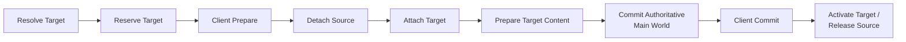
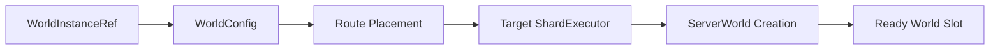
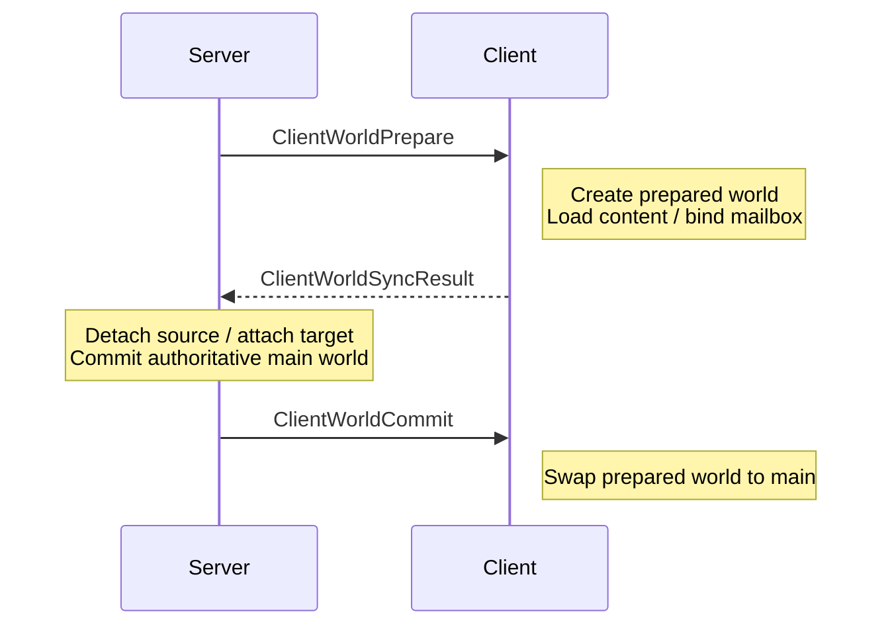
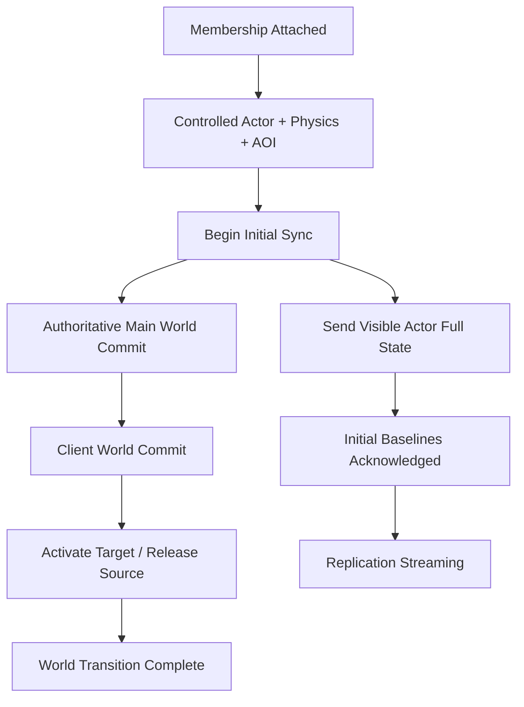

## Transactional World Transition

world 진입은 user의 `mainWorld` pointer를 바꾸는 한 번의 연산이 아닙니다. destination을 찾고, target capacity를 예약하고, source membership을 분리하고, target content를 준비하며, client도 같은 world를 생성해야 합니다. 이 중간에 하나라도 실패하면 user가 두 world에 동시에 존재하거나 어느 world에도 복구되지 못할 수 있습니다.

Jam은 world 변경을 여러 owner를 통과하는 명시적인 state machine으로 만듭니다.

분산 transaction framework를 추가하는 대신, 실제 world 전환에 필요한 단계와 보상 동작을 도메인 state machine으로 드러낸 선택입니다.

## Destination and World Creation

enter request는 default archetype instance, explicit instance 또는 authored destination을 선택할 수 있습니다. coordinator는 `WorldInstanceDatabase`에서 destination을 해석하고 `WorldConfigResolver`로 template, actor level과 physics asset을 결합합니다.

world가 아직 없으면 instance ID에서 route를 만들고 shard에 배치한 뒤 비동기로 생성합니다. 같은 instance를 동시에 요청한 caller들은 하나의 creation slot에서 결과를 기다립니다.

instance identity와 world creation을 coordinator가 중재하는 이유는 요청마다 중복 world를 만들지 않고, 아직 creating인 world와 ready world를 명확히 구분하기 위해서입니다. 대신 coordinator는 cross-shard continuation과 world slot lifecycle을 관리해야 합니다.

## Revision and Transition Token

user의 main world state에는 revision이 붙습니다. client request가 보낸 `expectedMainRevision`이 현재 revision과 다르면 오래된 UI action이나 재전송된 command로 보고 거부합니다.

`WorldTransitionToken`은 진행 중인 server transition을, `WorldSyncToken`은 client prepare/commit 응답을 식별합니다. 비동기 completion은 user ID만으로 적용하지 않고 token과 예상 phase가 일치하는지 다시 확인합니다.

이 검사는 timeout이나 reconnect 이후 늦게 도착한 completion이 새 transition을 진행시키는 것을 막습니다.

## Prepare and Commit

target world는 먼저 capacity와 membership slot을 reserve하고 enter를 prepare합니다. client에는 TCP로 `ClientWorldPrepare`를 보내 동일한 archetype과 content revision의 world를 준비하게 합니다.

prepare와 commit을 나눈 이유는 server membership을 먼저 바꾸고 client 생성이 실패하는 상황을 피하기 위해서입니다. client도 prepared world를 별도로 보관하고 token, world identity와 revision이 맞을 때만 main world로 승격합니다.

## Cross-World Execution

user state, source world와 target world는 서로 다른 shard에 있을 수 있습니다. coordinator는 각 owner로 command를 dispatch하고 결과를 다시 user shard의 transition state로 모읍니다.

source에서는 leave를 prepare하고 membership을 detach하며, target에서는 reserved member를 attach하고 content hook을 실행합니다. authoritative `UserWorldState`는 user shard에서 revision과 함께 commit됩니다.

동기 호출처럼 보이게 global lock을 잡지 않고 owner별 command로 분리했기 때문에 shard independence를 유지할 수 있습니다. 그 대가로 각 completion에 token·phase 검증과 timeout이 필요합니다.

## Failure and Rollback

실패 위치에 따라 보상 경로가 달라집니다.

- target reserve 전에 실패하면 현재 world를 그대로 유지합니다.
- target을 일부 준비했다면 `RollbackEnter`로 reservation과 attachment를 제거합니다.
- source가 이미 detach되었다면 `RestoreDetachedMain`으로 membership과 replication을 복원합니다.
- authoritative main world가 잠시 target으로 바뀌었다면 source로 되돌리고 revision을 갱신합니다.
- client prepare/apply가 timeout되거나 연결이 끊기면 진행 중 transition을 종료하고 가능한 상태를 복구합니다.

rollback도 실패할 수 있으므로 state machine은 terminal failure와 in-flight command를 구분합니다. 이 복잡성은 부분 성공을 숨기지 않고 명시적으로 복구하기 위해 지불한 비용입니다.

## Transition Completion and Initial Sync

target membership이 attach되면 content preparation 과정에서 controlled actor를 physics와 AOI에 등록하고 replication initial sync를 시작합니다. 이후 authoritative main world commit, client commit, target activation과 source release가 끝나면 world transition은 완료됩니다. 이 transition 완료 경로는 visible actor의 baseline ACK를 기다리지 않습니다.

Replication은 별도의 phase를 가집니다. `BeginInitialSync()`가 성공하면 `InitialSync`에서 full state를 전송하고, 현재 visible actor의 baseline ACK가 모두 확인된 뒤 `Streaming`으로 전환합니다. `Streaming` 진입 전에는 delta state 대신 full state를 사용합니다.

따라서 현재 코드에서 **world transition 완료**와 **replication streaming 준비 완료**는 서로 다른 완료 조건입니다. 상위 application이 gameplay-ready를 별도로 정의한다면 두 신호를 결합할 수 있지만, transition coordinator 자체는 baseline ACK를 gate로 사용하지 않습니다.

actor와 control이 준비되는 과정은 [[Projects/Jam/Game World/02. Actor Lifecycle and Control|Actor Lifecycle and Control]]에서, initial visibility는 [[Projects/Jam/Game World/04. Area of Interest Management|Area of Interest Management]]에서, baseline과 initial sync 완료 조건은 [[Projects/Jam/State Synchronization/03. Baseline and Delta State|Baseline and Delta State]]에서 이어집니다.

## Implementation References

- [Transition command 처리와 완료 조정](https://github.com/akxotjr/Jam/blob/master/JamNet/src/runtime/world/lifecycle/ServerWorldTransitionCoordinator.cpp)
- [Server world transition 계약](https://github.com/akxotjr/Jam/blob/master/JamNet/include/jamnet/runtime/world/lifecycle/ServerWorldTransitionCoordinator.h)
- [World transition 상태와 command 타입](https://github.com/akxotjr/Jam/blob/master/JamNet/include/jamnet/runtime/world/lifecycle/WorldTransitionTypes.h)
- [Client main-world transition 상태](https://github.com/akxotjr/Jam/blob/master/JamNet/include/jamnet/runtime/world/lifecycle/ClientMainWorldState.h)
- [World shard lifecycle 상태 관리](https://github.com/akxotjr/Jam/blob/master/JamNet/src/runtime/world/lifecycle/WorldShardState.cpp)
