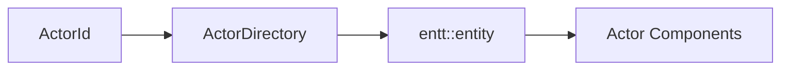
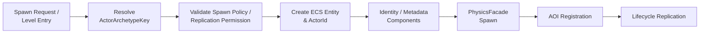
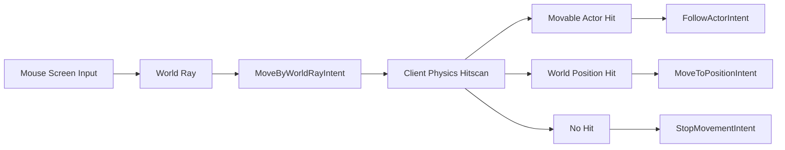
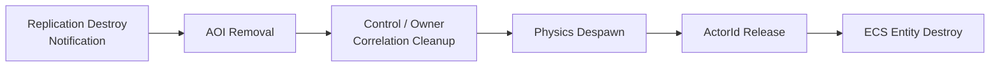

## Actor Identity

ECS entity는 world 내부 lookup에는 효율적이지만 network identity로 사용하기 어렵습니다. entity slot은 파괴 후 재사용될 수 있고 server와 client의 registry 배치도 일치하지 않습니다.

Jam은 외부 identity인 `ActorId`와 내부 storage handle인 `entt::entity`를 분리합니다.

`ActorId`는 index와 generation을 포함합니다. slot이 재사용되어도 이전 ID의 generation이 맞지 않으면 stale reference로 거부할 수 있습니다. network packet과 physics actor도 같은 logical `ActorId`를 사용합니다.

## Authored and Runtime Actors

level data에 배치된 actor는 server와 client가 같은 ID로 생성할 수 있도록 canonical generation-1 ID를 가집니다. gameplay 중 생성되는 actor는 world의 `ActorDirectory`가 별도 slot에서 할당합니다.

이 구분은 scene object matching protocol 없이 authored actor를 동일하게 식별하게 합니다. 반면 level exporter가 ID를 안정적으로 보존해야 하며 duplicate와 reserved range를 loader와 directory에서 검증해야 합니다.

## Actor Materialization

logical actor archetype과 physics archetype을 분리해 spawn/replication 정책이 physical representation에 종속되지 않게 했습니다. spawn source가 level인지 runtime인지도 archetype policy와 대조합니다.

spawn은 중간 단계에서 실패할 수 있습니다. physics actor 생성이나 identity 등록이 실패하면 이미 추가한 control mapping과 ECS component를 되돌립니다. 성공한 actor만 `PhysicsSpawnedTag`를 얻고 AOI와 replication에 노출됩니다.

## Ownership and Control

Jam은 actor를 만든 사용자와 현재 조작하는 사용자를 같은 개념으로 보지 않습니다.

| Component | 의미 |
| --- | --- |
| `OwnershipTag` | actor의 생성·제거 권한과 요청 correlation의 주체 |
| `ControlTag` | 현재 input이 적용되는 사용자 |
| `ActorArchetypeRef` | actor의 logical definition |
| `PhysicsSpawnedTag` | physics representation까지 준비됨 |
| `ReplicationDisabledTag` | network visibility에서 제외 |

ownership과 control을 분리하면 소유한 projectile, 조작권이 이전되는 character, server-owned environment actor를 같은 lifecycle 안에서 표현할 수 있습니다.

한 user가 새로운 controlled actor를 얻으면 이전 actor의 `ControlTag`를 해제하고 input component를 제거한 뒤 새 mapping을 설정합니다. control 변경은 replication metadata를 dirty로 표시하고 AOI의 관찰 기준도 갱신합니다.

## Character Control Model

Jam의 character control은 WASD와 같은 특정 입력 장치의 key state를 직접 simulation contract로 사용하지 않습니다. Frontend에서 발생한 조작을 `CharacterControlIntent`로 표현하고, 이를 tick 단위 `CharacterControlCommand`로 전달한 뒤 client prediction과 server authority가 같은 `CharacterControlResolver` 정책을 통해 `CharacterMotorInput`으로 해석합니다.

`CharacterControlIntent`는 locomotion, action, view를 분리합니다. Locomotion은 현재 다음 형태를 표현할 수 있습니다.

| Intent | 의미 | 대표 입력 방식 |
| --- | --- | --- |
| `StopMovementIntent` | 현재 이동 의도 해제 | 이동 정지 |
| `DirectionalMoveIntent` | local X/Y 방향 이동 | WASD, stick |
| `MoveByWorldRayIntent` | 화면 입력에서 만든 world ray | mouse point-and-click |
| `MoveToPositionIntent` | world-space 목표 위치로 이동 | click-to-move 결과 |
| `FollowActorIntent` | 특정 actor를 추적하며 이동 | actor click / follow |

따라서 control layer는 "어떤 키가 눌렸는가"보다 **actor가 어떤 방식으로 움직이려 하는가**를 전달합니다. Crouch, prone, jump, dash, run, sprint 같은 action은 locomotion과 별도의 flag로 유지하고, view 역시 movement-follow 또는 explicit orientation 정책으로 분리합니다. 이 구조 덕분에 keyboard directional movement와 mouse point-and-click movement가 동일한 control pipeline을 공유합니다.

### Point-and-Click Resolution

마우스 기반 이동은 frontend가 보낸 world ray 자체를 server command로 사용하지 않습니다. Client world의 `ClientCharacterControlCoordinator`가 ray를 physics hitscan으로 해석한 뒤, hit 결과를 simulation이 소비할 수 있는 intent로 정규화합니다.

`MoveToPositionIntent`는 목표 위치와 현재 authoritative/predicted character position의 수평 거리를 기준으로 진행 방향을 계산합니다. 목표가 `stopRadius` 안에 들어오면 이동을 멈추고, 멀리 떨어져 있으면 forward movement와 필요 시 run flag를 생성합니다. `FollowActorIntent`도 같은 resolver를 사용하지만 매 tick target actor의 현재 위치를 resolve하므로 움직이는 대상을 따라갈 수 있습니다.

### Control Command Pipeline

정규화된 intent는 `sequence`와 `controlRevision`을 가진 `CharacterControlCommand`가 됩니다. server world는 user membership과 controlled actor를 확인한 뒤 command를 `ServerInputSystem`에 enqueue하고, simulation tick마다 해당 user의 다음 logical input slot을 선택해 controlled actor의 `CharacterMotorInput`으로 resolve합니다.

```mermaid
flowchart LR

    Source["Frontend Control Source"] --> 
    Intent["CharacterControlIntent"] --> 
    Resolve["Client-Side<br/>Intent Resolution"] -->
    Command["CharacterControlCommand<br/>sequence + controlRevision"]

    Command --> 
    Network["Network"] --> 
    Validate["World / User<br/>Validation"] -->
    Queue["ServerInputSystem<br/>Pending Queue"] --> 
    Select["Tick Input<br/>Selection"]

    Select --> 
    Resolver["CharacterControlResolver"] --> 
    Motor["CharacterMotorInput"] --> 
    Physics["Physics Simulation"]
```

server는 packet에 임의 actor ID를 넣어 직접 조작 대상을 선택하게 하지 않고, `ControlTag`가 표현하는 `user → controlled actor` 관계를 기준으로 input을 적용합니다. `controlRevision`은 control context가 바뀌기 전에 만들어진 command를 새 control context에 적용하지 않도록 구분하고, `sequence`는 simulation이 client input의 논리적 순서를 추적하는 기준이 됩니다.

`ServerInputSystem`은 unreliable input에서 중간 sequence가 빠졌더라도 더 새로운 command가 도착해 client가 해당 slot을 지나갔음이 확인되면, 마지막 continuous state를 사용해 누락 slot을 보완합니다. 이때 jump와 같은 edge action은 반복하지 않습니다. 결과적으로 network packet 수신 시점과 simulation input 적용 시점을 분리하면서도 tick 단위 input progression을 유지합니다.

## Safe-Point Lifecycle

actor spawn/despawn은 physics, AOI와 replication의 여러 index를 동시에 변경합니다. tick 중간에 즉시 수행하면 앞 단계에서는 존재했지만 뒤 단계에서는 사라진 actor가 생길 수 있습니다.

ServerWorld는 pipeline tick 진행 중 요청을 safe point까지 defer합니다. despawn은 다음 순서로 관련 subsystem을 정리합니다.

이 순서는 파괴된 actor의 마지막 lifecycle event를 만들 수 있게 하면서 이후 snapshot 후보에서는 제외합니다. 즉 deferred lifecycle은 편의를 위한 queue가 아니라 tick consistency를 위한 계약입니다.

## State Synchronization Boundary

server-side actor lifetime은 Game World가 소유합니다. actor가 생성·변경·파괴되면 world는 `ActorId`, archetype/meta, control/ownership 변화와 authoritative state를 state synchronization 계층이 소비할 수 있는 형태로 노출합니다.

client에서 lifecycle create/meta/remove를 어떤 전송 계약으로 적용하고 snapshot과 어떻게 결합하는지는 [[Projects/Jam/State Synchronization/02. Lifecycle and Snapshot Delivery|Lifecycle and Snapshot Delivery]]에서 설명합니다.

actor가 tick 안에서 처리되는 순서는 [[Projects/Jam/Game World/03. Authoritative Simulation|Authoritative Simulation]], visibility 변화는 [[Projects/Jam/Game World/04. Area of Interest Management|Area of Interest Management]]에서 설명합니다.

## Implementation References

- [Actor identity와 generation 모델](https://github.com/akxotjr/Jam/blob/master/JamNet/include/jamnet/runtime/world/actor/ActorId.h)
- [Actor registry와 lifecycle API](https://github.com/akxotjr/Jam/blob/master/JamNet/include/jamnet/runtime/world/actor/ActorDirectory.h)
- [Actor registry lifecycle 구현](https://github.com/akxotjr/Jam/blob/master/JamNet/src/runtime/world/actor/ActorDirectory.cpp)
- [Authoritative world pipeline 통합](https://github.com/akxotjr/Jam/blob/master/JamNet/src/runtime/world/simulation/server/ServerWorld.cpp)
- [Actor ECS component 구성](https://github.com/akxotjr/Jam/blob/master/JamNet/include/jamnet/runtime/world/simulation/common/ActorComponents.h)
- [Character control 상태와 입력 타입](https://github.com/akxotjr/Jam/blob/master/JamNet/include/jamnet/runtime/world/simulation/common/CharacterControlTypes.h)
- [Character control 해석 계약](https://github.com/akxotjr/Jam/blob/master/JamNet/include/jamnet/runtime/world/simulation/common/CharacterControlResolver.h)
- [Character control 해석 구현](https://github.com/akxotjr/Jam/blob/master/JamNet/src/runtime/world/simulation/common/CharacterControlResolver.cpp)
- [Client control 전환 조정](https://github.com/akxotjr/Jam/blob/master/JamNet/src/runtime/world/simulation/client/ClientCharacterControlCoordinator.cpp)
- [Server input 소비 계약](https://github.com/akxotjr/Jam/blob/master/JamNet/include/jamnet/runtime/world/simulation/server/ServerInputSystem.h)
- [Server input 검증과 적용](https://github.com/akxotjr/Jam/blob/master/JamNet/src/runtime/world/simulation/server/ServerInputSystem.cpp)
