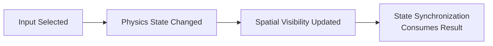
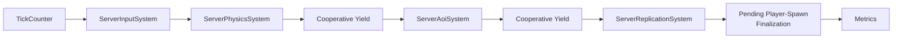
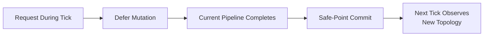

## Tick Ordering Contract

input, physics, AOI와 replication을 서로 독립적인 periodic job으로만 실행하면 각 subsystem의 평균 처리량은 높일 수 있지만 한 tick의 인과관계가 흐려집니다. replication이 이전 physics 결과를 읽거나 AOI가 이동 전 위치를 기준으로 visibility를 계산할 수 있기 때문입니다.

Jam은 `ServerWorld` 안에서 authoritative pipeline의 순서를 고정합니다.

이 순서는 단순 호출 순서가 아니라 **어떤 authoritative 결과를 다음 단계가 읽을 수 있는가**를 정의하는 world-level contract입니다.

## Server World Pipeline

현재 `ServerWorld`는 world registry에 `ServerInputSystem`, `ServerPhysicsSystem`, `ServerAoiSystem`, `ServerReplicationSystem`을 구성하고 fixed-step pipeline으로 실행합니다.

### Input

user별 input queue에서 이번 tick에 적용할 command를 선택합니다. simulation은 fixed tick을 유지하며, 실제로 적용한 input sequence는 이후 state synchronization에서 `inputAck`로 client에 돌려줄 수 있습니다.

### Physics

선택된 input을 controlled actor에 적용한 뒤 PhysX step을 수행합니다. physics가 별도 worker 작업을 기다리는 동안 world tick fiber는 suspend/yield될 수 있고, shard는 다른 runnable work를 처리할 수 있습니다. 완료된 physics 결과가 authoritative actor component와 event에 반영된 뒤 다음 phase로 넘어갑니다.

### AOI

이번 physics 결과의 위치를 기준으로 user별 spatial visibility를 갱신합니다. 여기서 만들어지는 `entered / remained / left` membership은 다음 state synchronization 단계가 사용할 입력입니다.

### State Synchronization Handoff

`ServerReplicationSystem`은 world pipeline 안에서 실행되지만 책임은 Game World와 분리해 봅니다. Game World는 authoritative state와 visibility를 만들고, State Synchronization은 이를 lifecycle/snapshot/baseline 전송 모델로 변환합니다.

자세한 과정은 [[Projects/Jam//State Synchronization/01. Replication Model|Replication Model]]에서 설명합니다.

## World-Local Pipeline and Shard Execution

각 world는 owner shard의 실행 경계 안에서 자신의 pipeline을 진행합니다. 같은 shard에 여러 world가 존재할 수 있으므로 하나의 world가 긴 작업 동안 shard를 독점하지 않도록 cooperative yield 지점을 둡니다.

이 구조의 목적은 system 순서를 깨지 않으면서 mailbox, fiber resume, 다른 world의 runnable work에 실행 기회를 주는 것입니다. 즉 world 내부에서는 serial causal order를 유지하고, shard 수준에서는 cooperative fairness를 확보합니다.

## Fixed Step and Backlog

fixed tick은 simulation 시간 단위를 예측 가능하게 하지만 처리 시간이 tick interval을 넘으면 backlog가 생깁니다. 무제한 catch-up은 지연을 회복하려다 shard 점유 시간을 더 늘릴 수 있고, tick을 무조건 버리면 simulation continuity가 깨질 수 있습니다.

Jam은 physics offload, AOI/state-sync budget과 world/executor metrics를 통해 phase 비용을 분리해 관찰할 수 있게 합니다. 병목은 전체 tick 하나의 숫자보다 input, physics, AOI, state synchronization 중 어느 phase가 budget을 소비했는지 기준으로 보는 편이 유용합니다.

## Safe Points and Deferred Mutation

pipeline 중간에 actor와 membership index를 직접 변경하면 앞 phase와 뒤 phase가 서로 다른 world topology를 볼 수 있습니다. `ServerWorld`는 pipeline 진행 중 player spawn 같은 구조 변경을 safe point까지 defer할 수 있습니다.

이 제한은 command completion이 즉시 발생하지 않을 수 있다는 비용을 만들지만 tick snapshot의 일관성을 유지합니다.

## Trade-offs

- 명시적인 phase 순서는 이해와 검증이 쉽지만 phase 간 병렬성은 제한됩니다.
- cooperative yield는 shard fairness를 높이지만 world pipeline은 continuation state를 관리해야 합니다.
- fixed step은 prediction/replay와 잘 맞지만 overload 시 backlog 정책이 필요합니다.
- safe-point mutation은 consistency를 높이지만 lifecycle command latency가 한 pipeline boundary만큼 늘어날 수 있습니다.

## Implementation References

- [Authoritative tick pipeline 구현](https://github.com/akxotjr/Jam/blob/master/JamNet/src/runtime/world/simulation/server/ServerWorld.cpp)
- [Authoritative world ownership과 pipeline 계약](https://github.com/akxotjr/Jam/blob/master/JamNet/include/jamnet/runtime/world/simulation/server/ServerWorld.h)
- [Server input 소비 계약](https://github.com/akxotjr/Jam/blob/master/JamNet/include/jamnet/runtime/world/simulation/server/ServerInputSystem.h)
- [Authoritative physics phase](https://github.com/akxotjr/Jam/blob/master/JamNet/include/jamnet/runtime/world/simulation/server/ServerPhysicsSystem.h)
- [Server AOI 갱신 계약](https://github.com/akxotjr/Jam/blob/master/JamNet/include/jamnet/runtime/world/simulation/server/ServerAoiSystem.h)
- [Server replication 상태와 전송 계약](https://github.com/akxotjr/Jam/blob/master/JamNet/include/jamnet/runtime/world/simulation/server/ServerReplicationSystem.h)
