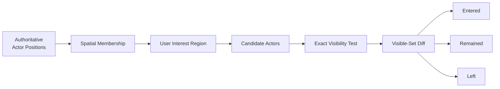
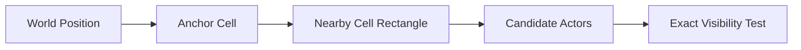
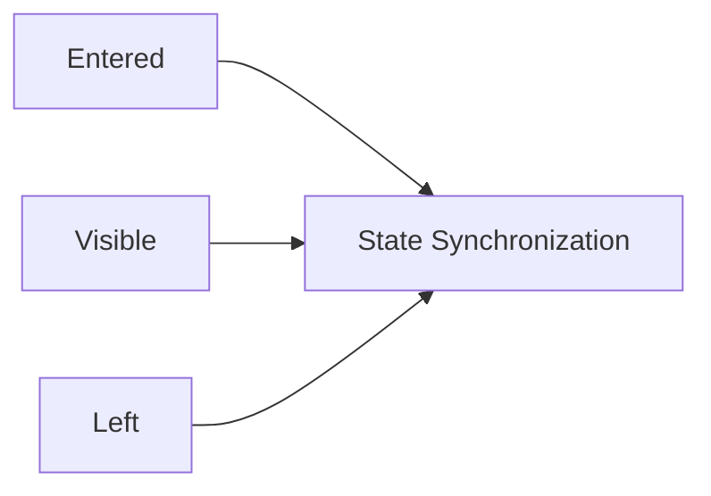

world의 모든 actor를 모든 user와 비교하면 actor 수와 user 수가 늘수록 visibility 비용이 빠르게 증가합니다. 더 중요한 점은 AOI가 단순 packet filter가 아니라 **현재 authoritative world에서 어떤 actor가 특정 user에게 의미 있는가**를 계산하는 spatial membership 문제라는 것입니다.

Jam은 AOI가 visibility membership을 결정하고, State Synchronization이 그 결과를 어떤 lifecycle/snapshot으로 전달할지 결정하도록 책임을 분리합니다.

## Spatial Grid

actor와 user의 기준 위치를 XZ grid cell에 배치하고, interest shape와 겹치는 cell만 broad-phase candidate로 조회합니다. 이후 실제 visibility 조건을 적용해 최종 membership을 결정합니다.

모든 user/actor pair를 전수 비교하지 않는 대신 grid membership과 cell 이동을 유지해야 합니다. cell이 너무 작으면 membership update가 잦아지고, 너무 크면 candidate 수가 증가하므로 actor density와 interest 범위에 맞춘 tuning이 필요합니다.

## Hysteresis and Movement Tracking

경계 근처 actor가 작은 움직임마다 enter/leave를 반복하면 downstream lifecycle과 baseline churn이 증가합니다. Jam은 이미 visible한 actor에 더 넓은 leave boundary를 적용하는 방식으로 visibility hysteresis를 둘 수 있습니다.

이 선택은 정확한 기하 경계를 매 tick 강제하는 대신 membership stability를 얻습니다. 반대로 hysteresis가 지나치게 크면 실제 관심 범위 밖 actor를 오래 유지하므로 tuning 대상입니다.

## Visibility Membership

AOI는 user별 visible membership과 이번 update의 entered/left 변화를 관리합니다. actor와 user의 spatial membership이 바뀌면 영향받는 후보만 다시 평가하고, actor destroy나 user leave 시 관련 membership을 정리합니다.

양방향 또는 보조 index를 유지하는 이유는 actor 하나가 사라졌을 때 모든 user를 전수 순회하지 않고 영향받는 membership을 찾기 위해서입니다. 그 대신 index lifetime과 stale entry 방지가 추가 책임이 됩니다.

## Experimental Line of Sight

거리나 shape 조건만으로 부족한 world에서는 physics query를 visibility 조건에 추가할 수 있습니다. 하지만 모든 candidate를 매 tick raycast하면 query 비용이 크게 증가하므로 LOS는 기본 spatial broad phase를 대체하는 것이 아니라 선택적 정밀 조건으로 보는 편이 맞습니다.

현재 구현에는 `enableLos`, `losRetestTicks`와 user-actor별 LOS cache가 있으며, 이전에 visible했던 대상은 설정된 interval 동안 cached 판정을 재사용합니다. 다만 이 경로는 아직 실제 부하와 gameplay 환경에서 충분히 검증되지 않은 **실험적 기능**입니다. 기본값도 비활성화되어 있으며, 정확도·query 비용·cache invalidation 동작을 검증하기 전에는 안정된 AOI 계약으로 간주하지 않습니다.

## State Synchronization Boundary

AOI의 출력은 packet이 아니라 visibility 변화입니다.

`entered` actor에 lifecycle create와 full baseline이 필요한지, `left`를 temporary visibility loss로 볼지 authoritative destroy로 볼지, visible actor 중 어떤 state를 budget 안에서 보낼지는 State Synchronization의 책임입니다.

이 경계를 분리하면 spatial policy를 바꾸더라도 lifecycle/baseline protocol을 다시 설계할 필요가 없습니다.

자세한 연결은 [[../State Synchronization/02. Lifecycle and Snapshot Delivery|Lifecycle and Snapshot Delivery]]와 [[../State Synchronization/03. Baseline and Delta State|Baseline and Delta State]]에서 설명합니다.

## Trade-offs

- grid는 candidate 수를 줄이지만 cell membership 유지 비용이 생깁니다.
- hysteresis는 churn을 줄이지만 관심 범위 밖 actor를 잠시 유지할 수 있습니다.
- richer visibility condition은 정확도를 높이지만 per-candidate 비용이 증가합니다.
- visibility index를 유지하면 destroy/leave 처리는 빨라지지만 memory와 lifecycle complexity가 늘어납니다.

## Implementation References

- `JamNet/include/jamnet/runtime/world/simulation/server/ServerAoiSystem.h`
- `JamNet/src/runtime/world/simulation/server/ServerAoiSystem.cpp`
- `JamNet/src/runtime/world/simulation/server/ServerWorld.cpp`
