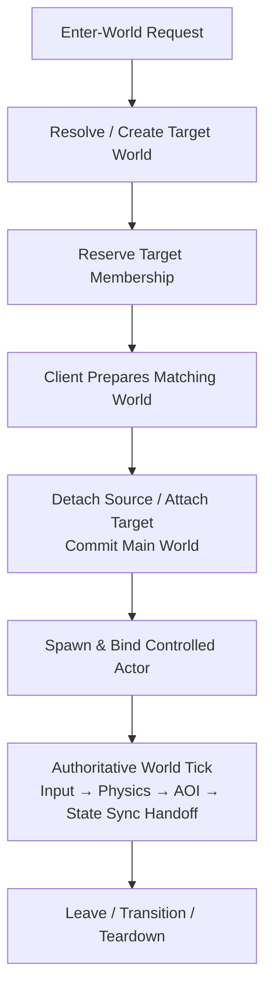

## Core Idea

Jam의 Game World는 **사용자 membership, actor lifetime, authoritative simulation, spatial visibility를 하나의 owner-local world runtime 안에서 유지하는 경계**입니다.

world를 단순한 ECS registry로만 보면 중요한 문제가 빠집니다. 사용자가 world를 이동할 때 source와 target 중 어느 쪽이 authoritative한지, actor identity가 ECS slot 재사용과 분리되어 있는지, input과 physics 결과가 어느 순서로 visibility에 반영되는지까지 함께 정의해야 합니다.

Jam은 이 문제를 다음 원칙으로 연결합니다.

> World membership is transactional, actor lifetime is explicit, and authoritative simulation advances in a fixed causal order.

- world 진입과 이동은 prepare/commit/rollback 가능한 transition으로 처리합니다.
- world와 actor state는 배치된 shard의 world runtime이 소유합니다.
- `ActorId`와 `entt::entity`를 분리해 외부 identity와 내부 storage lifetime을 분리합니다.
- server tick은 input → physics → AOI → synchronization handoff 순서를 유지합니다.
- AOI는 user별 visibility membership을 계산하지만 packet format이나 baseline policy는 소유하지 않습니다.

## End-to-End World Flow

State synchronization은 이 world runtime이 만든 authoritative state와 visibility 변화를 받아 lifecycle, snapshot, baseline, prediction/reconciliation 흐름으로 연결합니다. 자세한 내용은 [[../State Synchronization/index|State Synchronization]]에서 설명합니다.

## Responsibility Map

| 경계 | 책임 | 보호하는 것 |
| --- | --- | --- |
| Transition coordinator | source/target/client 사이의 world 전이 | 부분 진입, stale completion, rollback |
| World owner shard | membership, ECS, actor와 world pipeline | mutation ordering과 lifetime |
| Actor identity | `ActorId`와 ECS entity 연결 | stale reference와 slot reuse |
| Simulation pipeline | input/physics/AOI 실행 순서 | tick 내부 인과관계 |
| AOI | user별 visibility membership | 불필요한 state-sync 범위 |

AOI가 packet 형식이나 baseline을 결정하지 않고, state synchronization이 actor lifetime 자체를 소유하지 않는 것이 중요한 경계입니다.

## Document Map

1. [[01. World Entry and Transition|World Entry and Transition]] — world membership을 prepare, commit, rollback하는 과정
2. [[02. Actor Lifecycle and Control|Actor Lifecycle and Control]] — stable actor identity와 ownership/control 분리
3. [[03. Authoritative Simulation|Authoritative Simulation]] — server world tick의 인과 순서와 safe point
4. [[04. Area of Interest Management|Area of Interest Management]] — spatial membership과 visible-set diff 계산

## Implementation References

- `JamNet/src/runtime/world/lifecycle/ServerWorldTransitionCoordinator.cpp`
- `JamNet/include/jamnet/runtime/world/lifecycle/WorldTransitionTypes.h`
- `JamNet/src/runtime/world/simulation/server/ServerWorld.cpp`
- `JamNet/include/jamnet/runtime/world/actor/ActorDirectory.h`
- `JamNet/include/jamnet/runtime/world/actor/ActorId.h`
