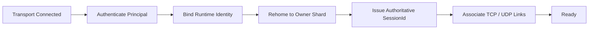
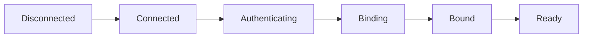
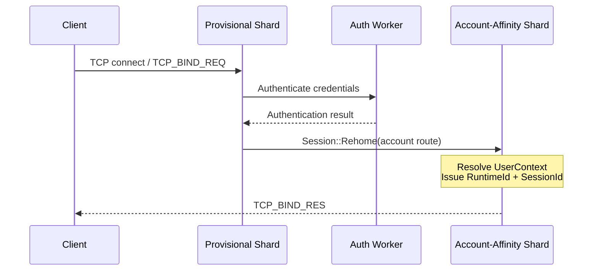
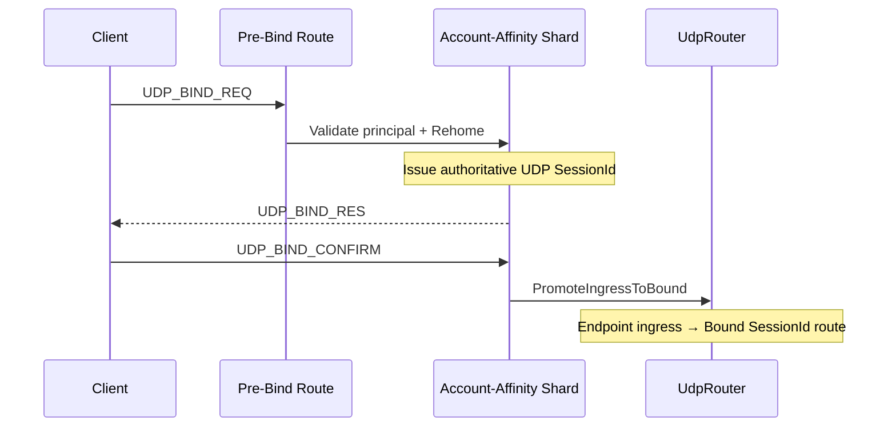

## Session and Socket Separation

Jam은 transport endpoint와 logical session을 분리합니다. Socket이 연결되었다는 사실만으로는 principal, owner shard, TCP/UDP association을 신뢰할 수 없기 때문입니다.

### Identity Vocabulary

**Principal은 인증된 사용자 identity를 의미하며, `SessionId`는 그 principal에 연결된 개별 transport session의 runtime identity입니다.** 현재 코드에서 principal은 다음 식별자의 관계로 표현됩니다.

| 용어 | 코드 타입 | 의미 |
| --- | --- | --- |
| Account identity | `AccountId` | 인증을 통해 확인하는 지속적인 사용자 식별자 |
| User runtime identity | `UserId` (`RuntimeId`) | `UserContext`를 owner shard에서 찾기 위한 실행 중 사용자 식별자 |
| Transport session identity | `SessionId` | 한 TCP 또는 UDP session을 owner shard에서 찾기 위한 실행 중 식별자 |

하나의 principal은 하나의 `UserContext`에 연결되고, 그 context는 TCP와 UDP `SessionId`를 각각 보관할 수 있습니다. 따라서 `UserId`와 `SessionId`는 같은 사용자를 가리키는 동의어가 아니며, UDP endpoint 역시 principal identity가 아닙니다.

### Lifecycle Model



## Session Ownership Establishment

### Lifecycle States and Ownership



Session은 authentication 전에도 owner가 없는 객체가 아닙니다. 다만 **provisional transport owner**와 **principal-derived authoritative owner**가 구분됩니다.

| State / phase | 의미 | Session storage / 실행 owner | Lookup identity | Mailbox / entity |
| --- | --- | --- | --- | --- |
| `Connected` / accepted | transport는 연결됐지만 application identity는 미확정 | endpoint에서 만든 route key의 shard에 있는 `preboundSessions` | `EndpointHandle(routeKey, endpointId)` | 없음 |
| `Authenticating` | credential/ticket 검증 진행 중 | 같은 provisional shard | endpoint handle + auth attempt | 없음 |
| `Binding` / rehoming | principal route로 이동하고 identity를 결합하는 중 | old shard가 `unique_ptr`를 떼어 target shard로 이동 | old/new endpoint handle | 없음 |
| `Bound` / `Ready` | authoritative `SessionId`와 shard binding이 확정되며, `Ready`에서는 session entity와 application callback을 사용할 수 있음 | account affinity로 정한 owner shard의 `sessionsById` | authoritative `SessionId` | 생성됨 |
| `Closing` | 새 작업을 막고 teardown을 진행 | 현재 owner shard가 table detach와 mailbox drain 수행 | endpoint 또는 `SessionId` + expected object | drain 뒤 제거 |

Server TCP accept와 최초 UDP datagram은 remote endpoint로 `RouteKey`를 만들고 해당 shard의 `preboundSessions`가 `unique_ptr<Session>`을 소유합니다. 이 단계에는 `SessionId`, session mailbox, ECS entity가 없습니다. `Session::Post()`는 mailbox 대신 `m_shard->Submit()`을 사용하므로 connect, authentication callback, bind와 rehome도 provisional owner shard에서 직렬화됩니다.

인증 worker는 session을 소유하지 않습니다. 인증 결과에는 원래 `EndpointHandle`과 `authAttempt`를 캡처하고, 원래 shard로 job을 돌려보낸 뒤 아직 같은 pre-bound session과 attempt인지 다시 확인합니다.

### Bootstrap, Rehome, and SessionId Issuance

정확한 전환점은 **인증 성공 자체가 아니라 `Rehome(account affinity route)`가 target shard의 `preboundSessions`에 session을 삽입하고 callback을 실행한 시점**입니다. 이때부터 bind의 남은 단계는 principal의 account affinity shard에서 실행됩니다. `UserContext` 조회/생성, principal 설정과 `SessionId` 발급은 모두 이 shard에서 수행됩니다.

`SessionId`에는 shard index와 slot generation이 포함되므로 bound traffic은 endpoint hash가 아니라 `SessionId`에서 owner shard를 복원합니다. 즉 endpoint shard는 연결 초기의 임시 실행 위치이고, account affinity shard가 steady-state protocol owner입니다.

TCP가 session bootstrap의 기준선입니다.



Accept 시점에는 endpoint 기반 임시 route를 사용합니다. Principal이 확인된 뒤 account 기반 route로 옮겨 user state와 session state의 cross-shard dispatch를 줄입니다. 늦게 도착한 인증 결과에는 attempt token과 endpoint identity를 다시 확인합니다.

Server는 rehome 완료 후 다음 조건이 모두 성립할 때 `IssueSessionId()`를 호출합니다.

1. 인증된 `AccountId`로 target account-affinity shard에 도착했습니다.
2. 그 shard에서 `UserContext`를 조회하거나 만들고 `UserId`를 확정했습니다.
3. Session에 `AccountId`와 `UserId`를 기록했습니다.

`IssueSessionId()`는 현재 shard의 ID table에서 ID를 할당하고, session ownership을 `preboundSessions`에서 `sessionsById`로 원자적인 shard-local 단계 안에서 승격합니다. 성공한 뒤 mailbox와 ECS entity를 만들고 state를 `Bound`, 준비 조건이 충족되면 `Ready`로 전환합니다. Client는 server의 bind response를 받은 뒤 같은 authoritative ID를 `AdoptAuthoritativeSessionId()`로 채택합니다.

UDP도 endpoint pre-bind session을 account affinity shard로 rehome하고 TCP가 만든 principal을 검증한 뒤 별도의 UDP `SessionId`를 발급합니다. 따라서 TCP와 UDP가 하나의 `SessionId`를 공유하는 구조가 아닙니다.

### UDP Pre-bind Promotion

UDP는 연결이 없으므로 첫 datagram의 remote endpoint로 pre-bind `UdpSession`을 만듭니다. TCP에서 확정된 account/user와 transaction을 검증한 뒤 bound route로 승격합니다.



Bind response/confirm은 UDP에서 유실될 수 있어 transaction ID와 retry를 사용합니다. Confirm 뒤 `UdpRouter::PromoteIngressToBound()`가 endpoint ingress를 bound session으로 연결합니다.

## TCP and UDP Principal Association

### UserContext Association

Server의 `UserContext`는 같은 principal에 대한 TCP와 UDP `SessionId`를 별도로 보관합니다. UDP bind는 account/user가 일치하고 살아 있는 TCP link가 있는지 검증합니다. 따라서 IP/port가 같다는 이유만으로 두 transport를 같은 사용자로 취급하지 않습니다.

### Transport Authority

**Principal establishment에는 TCP가 authority입니다.** TCP bind가 credential을 인증하고 `AccountId`와 `UserId`를 확정하며 `UserContext::tcp`를 연결합니다. UDP는 client가 보낸 account/user pair를 독립적으로 인증하지 않습니다. Target account shard로 이동한 뒤 기존 `UserContext`의 account가 일치하고 live TCP session이 존재하는지 검증해야만 `UserContext::udp`에 연결됩니다.

이는 TCP가 UDP packet 처리나 lifetime 전체를 소유한다는 뜻은 아닙니다. Binding 후 TCP와 UDP는 각각 독립적인 `SessionId`, mailbox, protocol state와 disconnect lifecycle을 갖습니다. TCP는 **principal association의 trust anchor**, `UserContext`는 두 transport link를 연결하는 logical authority입니다.

## Safe Session Teardown

### Keepalive and Inactivity Timeout

`SystemSessionTimeout`은 마지막 수신 시각을 기준으로 inactive session을 종료하고, ping/pong은 control path와 RTT 관측을 유지합니다. 종료는 socket close만으로 끝나지 않습니다.

```text
teardown(session):
    stop accepting new transport work
    invalidate bind / retry state

    perform protocol unbind or disconnect handshake
    reject late shard dispatch
    wait until pending dispatch is drained

    if session is bound:
        close and drain mailbox
        remove ECS entity and RPC state
        release SessionId

    detach from current shard-owned table
    release transport ownership
    notify disconnect once
```

Client service는 UDP unbind에 필요한 control path를 보존하기 위해 UDP, TCP, transport 순으로 닫습니다. Timeout fallback은 peer response가 없어도 teardown이 무한 대기하지 않게 하며 disconnect observer는 한 번만 호출됩니다.

### Authentication and Binding Disconnects

Disconnect가 어느 bind 단계에서 발생해도 transport callback이나 인증 worker가 직접 owner storage를 제거하지 않습니다.

1. Transport는 `MarkClosing()`으로 새 작업 등록을 막고 bind retry token/상태를 무효화합니다.
2. Outstanding IOCP의 pending-dispatch count가 0이 될 때까지 session object를 유지합니다.
3. Release job이 현재 owner shard에서 실행되어, 아직 pre-bind이면 `EndpointHandle`과 expected pointer로 `preboundSessions`에서 떼고, 이미 bound이면 `SessionId`와 expected pointer로 `sessionsById`에서 뗍니다.
4. Bound session은 mailbox를 drain한 뒤 ECS entity, RPC state, mailbox reference와 `SessionId` slot을 정리합니다. Pre-bound session에는 mailbox/entity가 없으므로 table detach 뒤 바로 finalize합니다.
5. `NotifyDisconnectedOnce()`와 closing flags가 중복 teardown과 application notification을 막습니다.

Rehome 도중 close가 시작되면 target callback은 `IsClosing()`을 확인하고 bind를 성공시키지 않습니다. Authentication 결과는 session lookup 또는 `authAttempt`가 맞지 않으면 폐기됩니다. 따라서 cleanup responsibility는 항상 session이 현재 들어 있는 shard-owned table에 남습니다.

### Late Completion Invalidation

IOCP completion은 raw session pointer를 domain 처리까지 그대로 신뢰하지 않습니다. Completion에서 shard job을 만들 때 endpoint handle, 현재 `SessionId`, 필요한 경우 service generation을 캡처하고, job 실행 시 `FindOwnedSession()`으로 다시 조회합니다.

- **Client TCP/UDP 교체:** attach 시 session에 `m_tcpGeneration` 또는 `m_udpGeneration`을 기록합니다. Destroy 시 counter를 증가시키므로 이전 completion/job이 캡처한 generation은 새 client session과 일치하지 않습니다.
- **UDP pre-bind ingress:** route table은 endpoint와 함께 pre-bind route generation을 보관합니다. Session 제거나 rehome은 route kind/key/generation이 모두 맞을 때만 이전 route를 지우며, queued ingress는 실행 직전에 route ownership을 다시 확인합니다.
- **Bound session:** `SessionId` 자체의 slot generation과 expected session lookup이 재사용된 slot을 구분합니다. Lookup 실패 시 packet/job을 폐기합니다.
- **Server pre-bind TCP/general lookup:** 현재 server `Service::FindOwnedSession()`은 별도 generation 인자를 사용하지 않습니다. 이 경로는 `EndpointHandle`/expected pointer 재조회, auth attempt token, closing flag와 pending-dispatch drain으로 보호됩니다.

마지막 항목은 중요한 구현 경계입니다. “모든 late IOCP가 하나의 generation으로 무효화된다”고 설명하면 현재 코드보다 강한 보장을 문서화하게 됩니다.

### Rejected and Late Operations

- 인증 결과가 돌아왔을 때 endpoint session이 없거나 auth attempt token이 다르면 결과를 폐기합니다.
- 다른 live session이 같은 user의 TCP/UDP slot을 점유하면 binding을 거부합니다.
- UDP transaction 또는 `SessionId`가 맞지 않으면 confirm/unbind를 적용하지 않습니다.
- Binding retry가 소진되거나 reliable delivery timeout이 발생하면 session을 종료합니다.
- 늦은 IOCP completion과 shard job은 endpoint/session validation에서 제거됩니다.


## Trade-offs

Pre-bind와 rehome은 단순 socket-session 결합보다 lifecycle을 복잡하게 만듭니다. 대신 network identity를 인증된 principal과 owner route에 연결하고, steady-state session state를 owner-local로 처리합니다.


---

### Implementation References

- [`Session` state, rehome, SessionId lifecycle](https://github.com/akxotjr/Jam/blob/master/JamNet/include/jamnet/core/net/Session.h)
- [TCP binding protocol](https://github.com/akxotjr/Jam/blob/master/JamNet/src/core/net/TcpSession.cpp)
- [UDP bind/confirm/unbind protocol](https://github.com/akxotjr/Jam/blob/master/JamNet/src/core/net/UdpSession.cpp)
- [Pre-bound and bound session storage](https://github.com/akxotjr/Jam/blob/master/JamNet/src/core/net/SessionShardState.cpp)
- [UDP ingress route promotion](https://github.com/akxotjr/Jam/blob/master/JamNet/src/core/net/UdpRouter.cpp)
- [Runtime principal association](https://github.com/akxotjr/Jam/blob/master/JamNet/src/runtime/session/ServerSession.cpp)
- [Client shutdown ordering](https://github.com/akxotjr/Jam/blob/master/JamNet/src/core/net/Service.cpp)

### Related

- [[Projects/Jam/Networking/03. Packet Processing Pipeline|Packet Processing Pipeline]]
- [[Projects/Jam/Execution Model/01. State Ownership & Task Routing|State Ownership & Task Routing]]
