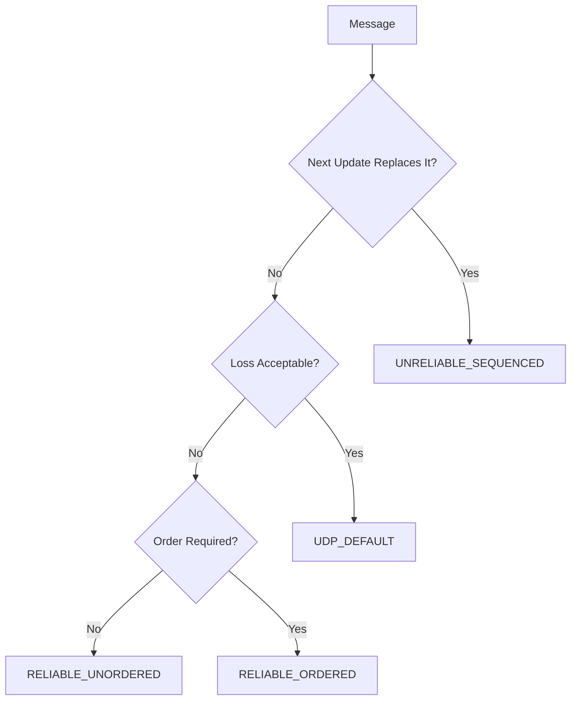

## Delivery Contract Selection

게임 데이터는 동일한 전달 특성을 요구하지 않습니다. 이 문서의 핵심 질문은 **“이 message(packet)에는 어떤 delivery contract를 선택해야 하는가?”** 입니다. Jam은 message가 요구하는 delivery contract를 eChannel로 명시합니다. Contract는 transport의 구현 편의가 아니라 유실 허용 여부, 대체 가능성, 처리 순서 의존성을 기준으로 선택합니다.

이 문서는 contract의 의미와 선택 기준을 다룹니다. Reliable contract를 UDP 위에서 ACK, retransmission, congestion control로 구현하는 방법은 [[Projects/Jam/Networking/04. Reliable Datagram Delivery|Reliable Datagram Delivery]]에서 설명합니다.

### Delivery Contract Diversity

- 로그인과 binding은 안정적인 ordered stream이 적합합니다.
- Snapshot은 다음 값이 이전 값을 대체하므로 재전송보다 최신성이 중요합니다.
- 독립 event는 모두 도착해야 하지만 서로를 기다릴 필요가 없습니다.
- 순서 의존 command는 유실 복구와 ordered dispatch가 모두 필요합니다.

모든 traffic을 TCP에 두면 stream-level head-of-line blocking이 최신 update까지 지연시킬 수 있습니다. 모든 UDP packet을 reliable ordered로 만들면 오래된 traffic, pending memory, retransmission 비용이 증가합니다.

### Delivery Dimensions

| Dimension | 선택할 때 묻는 질문 | Contract의 의미 |
| --- | --- | --- |
| Recency | 이전 message가 늦게 도착해도 아직 가치가 있는가? | 최신 message가 이전 값을 대체하면 오래된 delivery를 허용하지 않음 |
| Reliability | 이 message 하나가 유실되어도 application이 정상적으로 진행되는가? | 유실을 허용하지 않으며 전달될 때까지 복구를 시도함 |
| Ordering | 같은 흐름의 앞선 message보다 먼저 처리되어도 의미가 보존되는가? | Sender가 정한 순서를 application dispatch에서도 유지함 |

세 차원은 독립적입니다. “반드시 도착해야 한다”가 곧 “도착 순서를 기다려야 한다”는 뜻은 아니며, “최신 값만 중요하다”면 과거 값을 복구하는 reliability가 오히려 지연과 부하를 늘릴 수 있습니다.

### Available Contracts

| Channel | Transport | 보장 | 적합한 데이터 |
| --- | --- | --- | --- |
| `TCP_DEFAULT` | TCP | reliable ordered byte stream | 인증, binding, TCP application message |
| `UDP_DEFAULT` | UDP | best effort | 유실 가능한 독립 packet |
| `UNRELIABLE_SEQUENCED` | UDP | 오래된 packet 제거, 재전송 없음 | snapshot, transform 등 최신 상태 |
| `RELIABLE_UNORDERED` | UDP | 전달 복구, 도착 즉시 dispatch | 서로 독립적인 중요 event |
| `RELIABLE_ORDERED` | UDP | 전달 복구 + application order | 순서 의존 command, 기본 RPC |

> **Delivery contract != transaction success**  
> Reliable delivery는 wire packet 도착을 복구하는 contract입니다. Handler 성공이나 domain commit이 필요하면 RPC result 또는 application-level acknowledgement를 별도로 설계해야 합니다.

## Contract Selection from Message Semantics

### Selection Order

1. 다음 update가 이전 값을 대체하면 `UNRELIABLE_SEQUENCED`를 우선합니다.
2. 유실되면 안 되지만 서로 독립적이면 `RELIABLE_UNORDERED`를 사용합니다.
3. 앞선 message가 처리되어야 의미가 있으면 `RELIABLE_ORDERED`를 사용합니다.
4. Bootstrap/control이 TCP lifecycle에 의존하면 `TCP_DEFAULT`를 사용합니다.
5. 큰 payload는 schema/batching 단계에서 먼저 줄입니다.

### Current Usage Examples

현재 replication snapshot은 “다음 snapshot이 이전 상태를 대체한다”는 의미 때문에 `UNRELIABLE_SEQUENCED`를 사용합니다. Lifecycle delivery와 baseline ACK는 중간 application message의 유실과 순서 역전이 state transition을 깨뜨릴 수 있어 `RELIABLE_ORDERED`를 사용합니다.

### Contract Review Rule

Channel은 transport 구현 세부사항이 아니라 message schema와 handler가 기대하는 contract의 일부입니다. 새 message를 추가할 때는 “중요해 보이는가?”가 아니라 유실, 대체 가능성, 순서 의존성을 각각 검토해야 합니다. 더 강한 contract는 안전한 기본값이 아닙니다. 불필요한 reliability는 stale retransmission을, 불필요한 ordering은 head-of-line blocking을 만듭니다.

---

### Implementation References

- [`eChannel`과 channel predicates](https://github.com/akxotjr/Jam/blob/master/JamNet/include/jamnet/core/net/PacketStructure.h)
- [Sequence, ordering, reliability state](https://github.com/akxotjr/Jam/blob/master/JamNet/include/jamnet/core/net/SessionComponents.h)
- [RPC의 기본 reliable ordered channel](https://github.com/akxotjr/Jam/blob/master/JamNet/include/jamnet/core/net/RPC.h)
- [Snapshot/lifecycle channel 선택](https://github.com/akxotjr/Jam/blob/master/JamNet/src/runtime/world/simulation/server/ServerReplicationSystem.cpp)

### Related

- [[Projects/Jam/Networking/04. Reliable Datagram Delivery|Reliable Datagram Delivery]]
- [[Projects/Jam/Networking/05. Packet Framing and Fragmentation|Packet Framing and Fragmentation]]
