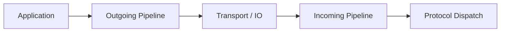
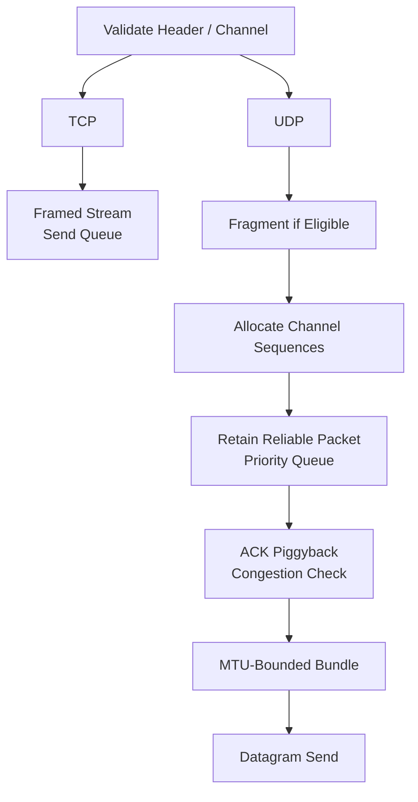
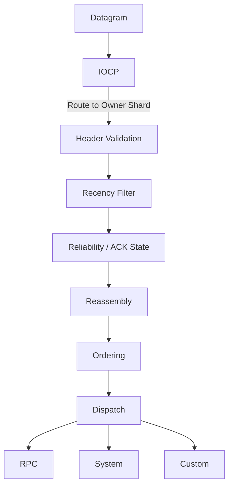

## Common Message Processing Pipeline

Jam은 application handler마다 wire rule을 반복하지 않고 session-owned 공통 pipeline에서 일정한 순서로 처리합니다. 직접 함수 호출 chain을 사용해 hot path의 stage 순서와 비용을 명시적으로 유지합니다.

### End-to-End Flow




### Outgoing Pipeline



`Session::Send()`는 session owner shard에서 entity의 outgoing system으로 진입합니다. UDP queue는 control, retransmit, ACK-only, normal priority를 구분합니다. 짧은 flush 주기에 packet을 모아 syscall과 작은 datagram 수를 줄이며, pipeline entity가 아직 없는 bind packet은 immediate control path를 사용합니다.

### Incoming Pipeline

UDP normal packet의 현재 처리 순서는 다음과 같습니다.




- Recency filter는 stale packet을 앞에서 제거합니다.
- Reliability는 fragment 단위 sequence와 duplicate를 먼저 기록합니다.
- Ordering은 완성된 logical packet을 기준으로 하므로 reassembly 뒤에 적용합니다.
- TCP는 stream assembly와 header validation 뒤 dispatch합니다.

### Incoming Ordering Invariant

Incoming stage 순서는 단순 구현 순서가 아니라 다음 invariant를 보존합니다.

```text
wire packet validity
    -> fragment-level delivery state 확정
    -> logical packet 완성
    -> logical-packet order 확정
    -> domain dispatch
```

**Reliability가 reassembly보다 앞에 있는 이유**는 fragment 각각이 loss detection, ACK와 retransmission의 단위이기 때문입니다. 모든 fragment가 모일 때까지 reliability 처리를 미루면 수신한 fragment를 ACK할 수 없고, 빠진 fragment만 선택적으로 재전송할 수도 없습니다. Duplicate fragment 역시 reassembly buffer에 의미 없는 작업을 만들기 전에 reliability stage에서 식별합니다.

**Ordering이 reassembly 뒤에 있는 이유**는 application ordering의 대상이 fragment가 아니라 완성된 logical packet이기 때문입니다. 먼저 도착한 일부 fragment를 ordered queue에 노출하면 incomplete payload가 순서 slot을 점유하거나, 같은 logical packet의 fragment들이 별도 packet처럼 취급될 수 있습니다. Reassembly는 fragment group을 하나의 logical packet으로 복원하고, ordered channel에서는 그 packet이 차지한 연속 order span을 함께 전달합니다.

**Dispatch가 마지막인 이유**는 wire-level validity와 delivery contract가 해결되지 않은 packet을 domain logic에 노출하면 안 되기 때문입니다. Domain handler는 header가 유효하고, duplicate/stale이 아니며, fragmentation이 끝났고, application order상 실행 가능한 logical packet만 받습니다. 이 invariant 덕분에 world/RPC handler는 transport ACK, fragment 또는 out-of-order 복구 상태를 자체적으로 다루지 않습니다.

Piggyback ACK 처리는 reassembly 뒤, ordering 앞에서 sender-side reliability state를 갱신합니다. ACK는 현재 logical payload의 dispatch 가능 여부와 독립적이지만, domain handler가 실행되기 전에 wire control state를 소비한다는 공통 원칙을 따릅니다.

## Wire and Domain Processing Boundary

### Protocol Dispatch

| Type | 책임 | 처리 위치 |
| --- | --- | --- |
| `SYSTEM` | bind, unbind, ping/pong, session control | session protocol handler |
| `ACK` | UDP pending/congestion 갱신 | reliability layer |
| `RPC` | request/response와 registered handler 연결 | RPC subsystem |
| `CUSTOM` | world, replication, content protocol | concrete session handler/codec |

Packet layer는 payload 의미를 해석하지 않습니다. Concrete handler는 필요하면 session shard에서 world/user owner로 다시 dispatch합니다. Network session shard와 world shard가 같다는 가정은 없습니다.

### Execution Boundary

TCP receive completion과 UDP router completion은 IOCP worker에서 발생합니다. Worker는 endpoint handle 또는 `SessionId`로 target shard를 결정하고 job을 제출합니다. Sequence, ACK, fragment, RPC state는 shard-local ECS component이며 periodic work도 같은 owner context에서 실행합니다.

### Periodic Protocol Work

Periodic systems는 session timeout, RPC timeout, queue flush, retransmission, fragment cleanup, metrics 집계를 수행합니다. Queue latency를 추가하지만 worker 수가 늘어도 protocol state의 global lock 범위를 키우지 않습니다.

## Pipeline Bounds and Predictability

### Validation and Capacity Limits

- Header size/channel/flags가 유효하지 않으면 domain codec 전에 폐기합니다.
- Session entity가 사라졌거나 캡처한 endpoint/`SessionId`/해당 경로의 generation으로 같은 owner를 재조회할 수 없으면 queued work를 적용하지 않습니다.
- MTU를 넘는 non-fragmentable packet은 전송하지 않습니다.
- Ordered buffer와 reliable pending limit은 한 session의 손실이 memory를 무한 점유하지 않게 합니다.

### Trade-offs

고정 pipeline은 처리 순서와 hot-path 비용을 예측하기 쉽습니다. 새 wire feature를 추가할 때는 기존 stage 중 어디에 위치해야 하는지 명시적으로 검토해야 합니다.


---

### Implementation References

- [Incoming/outgoing/periodic session systems](https://github.com/akxotjr/Jam/blob/master/JamNet/src/core/net/SessionSystems.cpp)
- [Session send and ownership lifecycle](https://github.com/akxotjr/Jam/blob/master/JamNet/src/core/net/Session.cpp)
- [TCP receive dispatch](https://github.com/akxotjr/Jam/blob/master/JamNet/src/core/net/TcpSession.cpp)
- [UDP ingress routing](https://github.com/akxotjr/Jam/blob/master/JamNet/src/core/net/UdpRouter.cpp)
- [Runtime session-to-owner routing](https://github.com/akxotjr/Jam/blob/master/JamNet/src/runtime/session/RuntimeShardRouting.cpp)
- [Packet construction and validation](https://github.com/akxotjr/Jam/blob/master/JamNet/include/jamnet/core/net/PacketBuilder.h)

### Related

- [[01. Connection and Session Lifecycle|Connection and Session Lifecycle]]
- [[../Execution Model/03. Owner-Local Serial Execution|Owner-Local Serial Execution]]
- [[05. Packet Framing and Fragmentation|Packet Framing and Fragmentation]]
