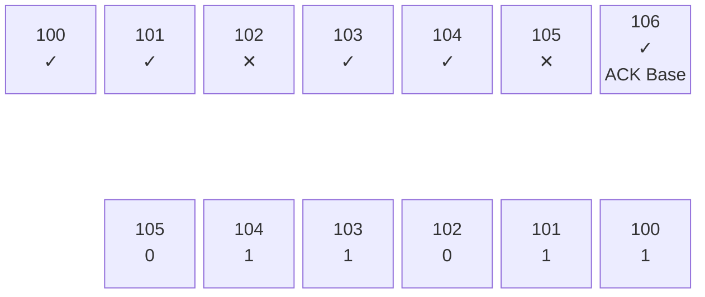
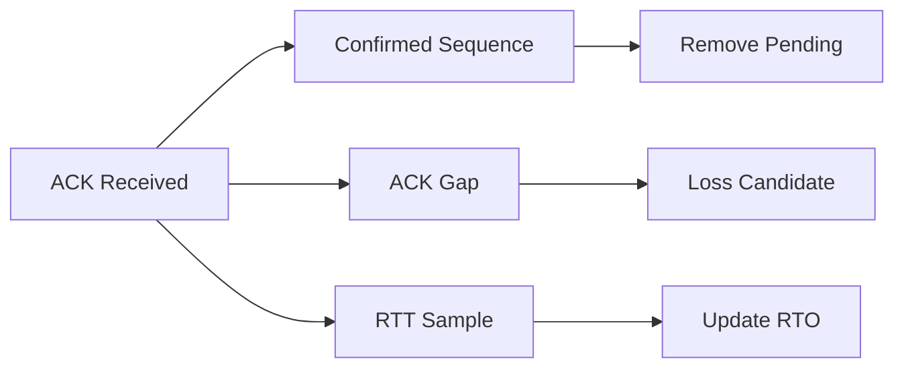
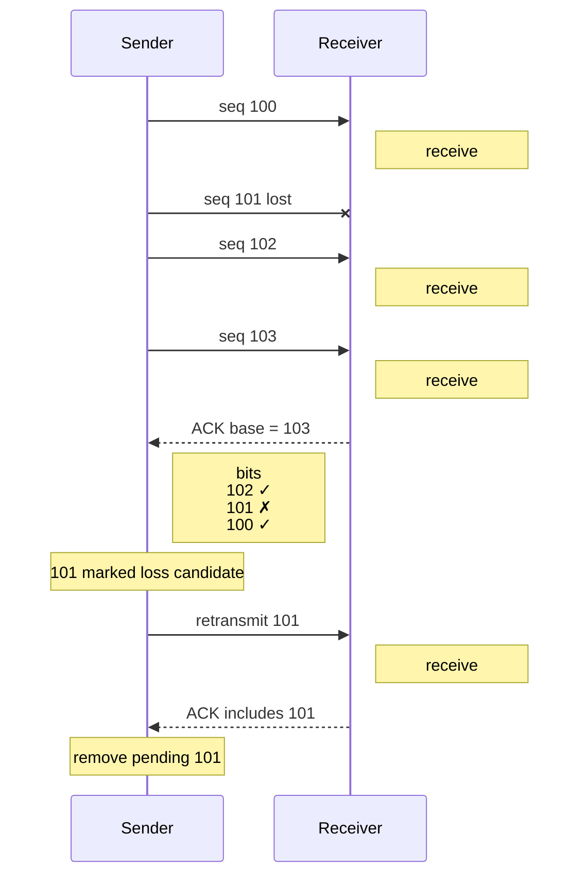

## Reliable Contract Implementation over UDP

이 문서의 핵심 질문은 **“선택된 reliable delivery contract를 UDP 위에서 어떻게 구현하는가?”** 입니다. 어떤 application message가 reliable해야 하는지는 [[Projects/Jam/Networking/02. Transport and Delivery Semantics|Transport and Delivery Semantics]]에서 결정합니다. 여기서는 그 contract를 실현하는 sender/receiver state와 복구 메커니즘만 다룹니다.

Jam은 UDP 전체를 stream으로 바꾸지 않고 `RELIABLE_UNORDERED`와 `RELIABLE_ORDERED` packet만 추적합니다. Sender pending state, receiver ACK window, retransmission, congestion window는 session owner shard에 함께 위치합니다.

**Design Goals**

- 유실된 reliable packet만 다시 보냅니다.
- Ordering이 필요 없는 packet은 gap 뒤에서 기다리지 않습니다.
- ACK packet 수와 ACK latency를 함께 제한합니다.
- 손실이 지속될 때 queue와 memory가 무한 증가하지 않게 합니다.
- Sequence wrap-around에서도 bounded window 안의 비교를 유지합니다.

## Sequence Model

### Recency, Reliability, and Ordering

하나의 sequence number로 세 의미를 표현하면 수신 여부, 최신성, application dispatch 순서가 불필요하게 결합됩니다. Jam은 각 sequence가 하나의 질문에만 답하도록 분리합니다.

| Sequence | 답하는 질문 | 소비하는 메커니즘 |
| --- | --- | --- |
| Recency sequence | 이 update가 지금까지 본 update보다 최신인가? | stale filter |
| Reliability sequence | 이 wire packet을 받았고 ACK했는가? | receive track, ACK, retransmission |
| Order sequence | 이 logical packet을 application handler에 전달할 차례인가? | ordered pending buffer |

### Reliability and Ordering Independence

`RELIABLE_UNORDERED`는 빠진 packet을 복구하되 이미 도착한 독립 event를 dispatch할 수 있어야 합니다. 하나의 sequence가 ACK gap과 dispatch gap을 동시에 뜻하면 reliability만 필요한 message도 앞선 loss를 기다리게 됩니다. 독립 sequence는 loss recovery와 application head-of-line blocking을 분리합니다.

`UNRELIABLE_SEQUENCED`에서 오래된 snapshot은 도착 자체보다 폐기가 올바른 결과입니다. Reliability sequence와 recency를 합치면 ACK/retransmission state가 필요 없는 freshness-only traffic까지 pending delivery에 참여하게 됩니다.

### Fragment Delivery and Logical Packet Order

Fragment는 각각 유실되고 재전송되므로 각자 reliability sequence가 필요합니다. 반면 application ordering은 완성된 logical packet 사이의 관계입니다. `RELIABLE_ORDERED` fragment들은 연속된 order sequence 범위를 차지하고, reassembly가 완료된 뒤 그 전체 span을 한 번에 소비합니다. Sequence 분리는 wire recovery 단위와 application dispatch 단위가 다른 점을 보존합니다.

비용은 header에 channel별 optional sequence가 추가되고 송수신 state가 세 종류로 나뉜다는 것입니다. 대신 각 channel은 필요하지 않은 의미와 처리 비용을 지불하지 않습니다.

## Reliability and Recovery

### Sender Pending State

```text
allocate reliability sequence -> store original packet in pending map
    -> original send: normal queue -> congestion window check -> send / bytes-in-flight
    -> ACK: erase pending, update RTT + cwnd
       loss: retransmit priority queue -> congestion check bypass -> resend
```

Pending entry는 원본 packet, 최초/최근 전송 시각, retry count와 fast-retransmit request를 보관합니다. RTO는 smoothed RTT와 variance에서 계산하고 bounded exponential backoff를 적용합니다.

### Receiver Tracking and ACK

Receiver는 최근 reliability sequence를 bounded receive track에 기록합니다. ACK payload는 base sequence와 이전 64개 packet의 수신 여부를 나타내는 64-bit window입니다.






Receiver는 최근 reliability sequence를 bounded receive track에 기록합니다. ACK는 가장 최근에 관측한 sequence를 base로 두고, 그 이전 64개 sequence의 수신 여부를 bit window로 함께 전달합니다. 따라서 sender는 하나의 ACK에서 여러 pending packet의 도착 여부를 확인할 수 있습니다.

base 또는 bit window에서 수신이 확인된 packet은 pending state에서 제거하고 bytes-in-flight를 감소시킵니다. 반대로 더 새로운 sequence들이 확인됐는데 window 안의 특정 sequence만 비어 있다면 해당 packet을 loss candidate로 볼 수 있습니다. Jam은 이 gap을 fast retransmit 판단에 사용하고, ACK되지 않은 packet이 RTO를 넘으면 timeout retransmission을 수행합니다.

ACK 자체의 유실이 곧 reliable packet의 유실을 의미하지는 않습니다. 이후 ACK의 bit window가 이전 수신 기록을 다시 전달할 수 있기 때문입니다. 다만 sender가 확인하지 못한 packet은 pending state에 남으므로, ACK 정보가 충분히 회복되지 않으면 최종적으로 RTO 기반 retransmission이 복구 경로가 됩니다.

```text
ACK base + bit window -> newly acknowledged pending 제거
    -> RTT sample과 bytes-in-flight 갱신
    -> ACK gap에서 loss 후보 탐지
```

Normal packet을 곧 보낼 수 있으면 ACK를 piggyback합니다. Packet이 fragmented 상태이거나 ACK를 붙이면 MTU를 넘는 경우 piggyback하지 않습니다. Pending ACK 수 또는 짧은 delay threshold를 넘으면 standalone ACK를 enqueue합니다.

### Loss Detection and Retransmission




Loss recovery에는 두 경로가 있습니다. ACK window가 이후 packet의 도착을 보여주면 gap을 조기에 loss 후보로 판단해 fast retransmit을 요청하고, 충분한 후속 ACK가 없더라도 RTO가 만료되면 timeout retransmission으로 복구합니다. 전자는 reorder와 loss를 빠르게 구분하기 위한 경로이고, 후자는 ACK 자체가 유실되거나 traffic이 멈춘 경우에도 복구가 진행되도록 하는 fallback입니다.

- **Fast retransmit:** ACK window에서 더 새로운 packet이 충분히 확인되면 gap packet을 재전송 후보로 표시합니다.
- **Timeout:** 최근 전송 뒤 계산된 RTO가 지나면 packet을 재전송 후보로 enqueue하고 timeout metric을 기록합니다.

Retransmission은 normal traffic보다 높은 priority를 사용하며 현재 transmission flush에서는 congestion window 검사를 우회합니다. 기존 전송에서 계산된 bytes-in-flight는 ACK 전까지 유지되지만, retransmission 자체를 `CanSend()`로 다시 제한하거나 `OnSend()`에 중복 반영하지는 않습니다. ACK된 entry만 pending store에서 제거합니다.

### Congestion Response

ACK 처리에서는 acknowledged bytes와 현재 in-flight 상태를 반영해 congestion window와 전송 여유를 갱신합니다. 이 제한은 현재 **신규 reliable normal 전송**에 적용됩니다. `CongestionState`에는 loss와 timeout에 대응해 window를 줄이는 API가 정의되어 있지만, 현재 retransmission 경로는 이를 호출하지 않으며 retransmission도 congestion 검사를 우회합니다.

따라서 현재 congestion 제어는 신규 reliable traffic의 유입을 제한하는 역할에 가깝고, 지속적인 loss에서 retransmission rate까지 줄이는 완전한 loss response는 제공하지 않습니다. Queue와 memory의 최종 상한은 pending capacity, retry count와 delivery timeout 뒤 session disconnect 정책이 담당합니다.

## Delivery Order

### Reliable Unordered

`RELIABLE_UNORDERED`는 duplicate 처리 뒤 즉시 dispatch합니다.

### Reliable Ordered

`RELIABLE_ORDERED`는 expected order sequence보다 앞선 완성 packet을 bounded buffer에 두고, gap이 채워지면 연속 범위를 drain합니다. Fragmented ordered packet은 전체 fragment가 재조립된 뒤 차지한 order span만큼 expected sequence를 전진시킵니다.

## Failure Policy and Bounds

- Reliable delivery가 30초 안에 끝나지 않으면 session을 disconnect합니다.
- Receive tracking 범위를 크게 벗어난 오래된 packet은 폐기합니다.
- Pending store 또는 ordered buffer capacity를 넘는 packet은 수용하지 않습니다.
- ACK는 transport delivery만 확인하며 handler 성공을 대신하지 않습니다.

## Observability

`NetworkMetrics`는 original reliable transmit, retransmit, standalone/piggyback ACK, ACK된 bytes, retransmit recovery, timeout을 shard snapshot에 기록합니다.


## Trade-offs

Selective reliability는 UDP game traffic 경로를 유지하면서 필요한 packet만 복구합니다. 대신 per-session pending memory, ACK traffic, timer work와 신규 reliable traffic에 대한 congestion state가 필요합니다. 현재 retransmission은 congestion window를 우회하므로 지속적인 loss에서는 retry와 delivery-timeout bounds가 부하의 주된 안전장치입니다. Reliable ordered channel은 손실 시 application-level head-of-line blocking도 감수합니다.

---

### Implementation References

- [`ReliabilityState`, `OrderingState`, `CongestionState`](https://github.com/akxotjr/Jam/blob/master/JamNet/include/jamnet/core/net/SessionComponents.h)
- [ACK processing, retransmission and transmission flush](https://github.com/akxotjr/Jam/blob/master/JamNet/src/core/net/SessionSystems.cpp)
- [RTO, ACK window and congestion algorithms](https://github.com/akxotjr/Jam/blob/master/JamNet/src/core/net/SessionComponents.cpp)
- [Reliability metrics](https://github.com/akxotjr/Jam/blob/master/JamNet/include/jamnet/core/net/NetworkMetrics.h)

### Related

- [[Projects/Jam/Networking/02. Transport and Delivery Semantics|Transport and Delivery Semantics]]
- [[Projects/Jam/Networking/05. Packet Framing and Fragmentation|Packet Framing and Fragmentation]]
