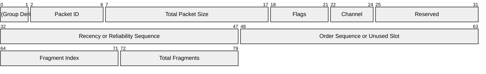
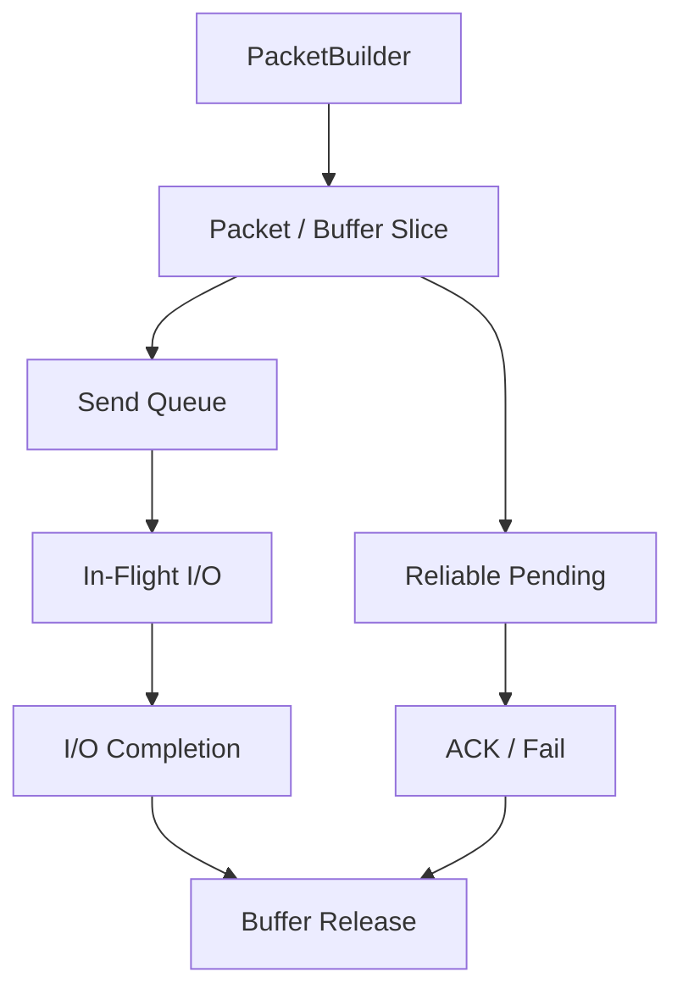
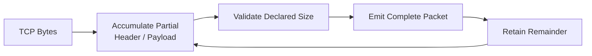
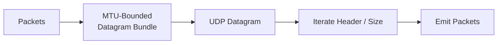
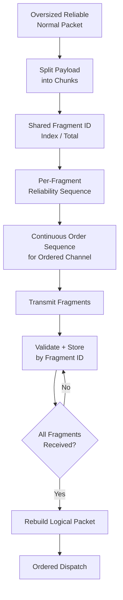

## Packet

TCP는 byte stream이고 UDP는 datagram이므로 packet boundary 복원 방식이 다릅니다. 두 transport는 같은 logical packet header를 사용하지만, UDP만 1400-byte `JAMNET_MTU`와 reliable normal packet fragmentation 정책을 적용합니다.

### Packet Header

Common header는 group/type과 packet ID, logical packet size, flags, delivery channel, channel/flag별 sequence 및 fragment metadata를 표현합니다. 필요한 optional field만 직렬화하는 가변 wire layout입니다. `PacketHeaderView`가 실제 header size 계산, validation과 field access를 중앙화합니다.

Wire header는 packed `PacketHeader`의 앞부분만 channel과 flag에 맞춰 직렬화하며 4, 6, 8 또는 10 byte가 됩니다. 첫 4 byte는 모든 packet에 존재하고, 이후 field는 아래 순서로 이어집니다.

| Header form | 적용 조건 | 크기 |
| --- | --- | ---: |
| Base | `UNRELIABLE` 등 sequence가 없는 channel | 4 bytes |
| Sequenced / reliable unordered | `UNRELIABLE_SEQUENCED` 또는 `RELIABLE_UNORDERED` | 6 bytes |
| Reliable ordered | `RELIABLE_ORDERED` | 8 bytes |
| Fragmented reliable | `FRAGMENTED` flag가 있는 reliable channel | 10 bytes |

Diagram은 최대 10-byte wire layout을 나타냅니다. 실제 직렬화는 channel과 flag에 따라 뒤쪽 field를 생략하고 위 표의 크기에서 끝납니다. Byte 4–5는 union slot으로, `UNRELIABLE_SEQUENCED`에서는 recency sequence로, reliable channel에서는 reliability sequence로 해석합니다. Fragment metadata는 packed layout의 byte 8–9에 고정되어 있어 fragmented `RELIABLE_UNORDERED`도 사용하지 않는 order slot 2 byte를 포함합니다. `size`는 header만이 아니라 payload까지 포함한 logical packet 전체 크기입니다.

### Packet Buffer

`Packet`은 reference-counted network buffer slice를 소유하며 queue와 pending retransmission state 사이의 payload 복사를 피합니다. Buffer pool은 TCP/UDP I/O와 piggyback ACK 등 용도별 storage를 제공합니다. Reliable sender는 ACK될 때까지 원본 `Packet`을 pending state에 유지합니다.

비동기 send 호출이 반환되어도 해당 buffer의 lifetime은 끝나지 않습니다. Transport가 참조하는 storage는 IOCP send completion까지 살아 있어야 하고, reliable packet은 그보다 더 길게 ACK 또는 delivery failure가 확정될 때까지 원본을 유지해야 합니다. Reference-counted slice는 send queue, pending reliability state와 in-flight I/O가 같은 payload storage를 안전하게 공유하게 합니다.

## Packet Boundary Recovery by Transport

TCP와 UDP는 같은 logical packet header를 사용하지만 transport가 제공하는 boundary 특성이 다르므로 packet 복원 방식도 다릅니다.

| Transport | Boundary 특성                             | Receiver 처리                                              |
| --------- | --------------------------------------- | -------------------------------------------------------- |
| **TCP**   | byte stream이므로 packet boundary가 보존되지 않음 | bytes를 누적하고 declared size를 기준으로 complete `Packet`을 반복 추출 |
| **UDP**   | datagram boundary가 보존됨                  | datagram 내부의 header/size를 순회하며 bundled packet을 분리        |
### TCP

TCP receive completion에는 packet 일부 또는 여러 packet이 함께 올 수 있습니다. `TcpRecvAssembler`는 stream bytes를 누적해 header가 선언한 size만큼 완성된 `Packet`을 반복해서 꺼냅니다.

  
잘못된 size는 이후 boundary 전체를 오염시킬 수 있으므로 application codec보다 먼저 거부합니다.
### UDP

UDP는 datagram boundary를 보존합니다. Sender는 MTU 이하의 여러 packet을 하나의 datagram에 bundle하되 bundle의 전체 wire size가 `JAMNET_MTU`를 넘지 않게 합니다. 이미 MTU를 넘은 packet은 다른 packet과 묶지 않고 단독 send chain으로 전달합니다. Receiver는 datagram 안의 각 header/size를 순회합니다.

현재 explicit outgoing fragmentation 대상은 **UDP의 reliable normal packet**입니다. Oversized control/ACK, unreliable packet처럼 fragmentable 조건을 충족하지 않는 packet을 packet processing 단계에서 명시적으로 거부하지는 않습니다. 이들은 단독 UDP send로 전달되므로 OS/IP fragmentation이나 socket error의 영향을 받을 수 있으며, `JAMNET_MTU` 안으로 payload를 제한하는 것은 caller와 schema의 계약입니다.
## UDP MTU Oversize Packet Handling

### Fragmentation

Oversized reliable normal packet은 logical payload를 여러 fragment로 나누고, receiver가 모든 조각을 모은 뒤 다시 하나의 logical packet으로 복원합니다.

각 fragment가 독립 reliability sequence를 가지므로 빠진 조각만 재전송할 수 있습니다. `uint8` index/total 표현 때문에 한 logical packet은 최대 255 fragments로 제한됩니다. Reassembly state는 마지막 수신 후 5초가 지나면 정리됩니다.
### Validation

- Fragment index가 total 범위를 벗어나거나 total이 기존 group과 다르면 수용하지 않습니다.
- Duplicate fragment는 같은 slot을 다시 늘리지 않습니다.
- Reassembly timeout 뒤 partial payload는 폐기됩니다.
- Piggyback ACK가 MTU를 넘기거나 fragmented packet이면 standalone ACK를 사용합니다.
- Reliable normal이 아닌 oversized packet에는 explicit fragmentation이나 사전 실패 처리가 적용되지 않습니다.
- Fragmentation은 application transaction 성공을 보장하지 않습니다.
## Trade-offs

가변 header와 pooled slice는 bandwidth와 hot-path allocation을 줄이지만 parsing 규칙이 복잡해집니다. Fragmentation은 large reliable payload를 지원하지만 packet 수, loss surface와 reassembly memory를 늘리므로 예외 경로로 취급합니다. Fragmentation 대상이 아닌 oversized packet은 현재 send 경로에서 차단되지 않으므로 IP fragmentation, 수신 buffer 한계와 환경별 socket 동작에 의존할 수 있습니다.

---

### Implementation References

- [Wire constants, packet IDs and channels](https://github.com/akxotjr/Jam/blob/master/JamNet/include/jamnet/core/net/PacketStructure.h)
- [Header layout, `PacketHeaderView`, packet construction](https://github.com/akxotjr/Jam/blob/master/JamNet/include/jamnet/core/net/PacketBuilder.h)
- [TCP stream assembly](https://github.com/akxotjr/Jam/blob/master/JamNet/src/core/net/TcpRecvAssembler.cpp)
- [Fragment state and limits](https://github.com/akxotjr/Jam/blob/master/JamNet/include/jamnet/core/net/SessionComponents.h)
- [Fragmentation/reassembly and UDP bundling](https://github.com/akxotjr/Jam/blob/master/JamNet/src/core/net/SessionSystems.cpp)
- [Pooled network buffers](https://github.com/akxotjr/Jam/blob/master/JamNet/include/jamnet/core/net/Buffer.h)

### Related

- [[03. Packet Processing Pipeline|Packet Processing Pipeline]]
- [[04. Reliable Datagram Delivery|Reliable Datagram Delivery]]
