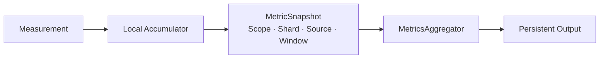

## Runtime Ownership and Metric Scope

Jam의 상태와 작업은 Shard와 World에 분산되어 있다. 이 구조에서 Process 전체 합계만 기록하면 한 Shard의 병목이 다른 Shard의 여유에 가려지고, World 단위 값만 보면 실제 실행기 포화와 게임 로직 비용을 구분하기 어렵다.

그래서 metrics도 runtime의 소유권 경계를 따른다. 측정값은 이름뿐 아니라 `scope`, `shardIndex`, `sourceId`를 함께 가진다. `sourceId`는 world metrics에서 `WorldId`를 나타내며, 같은 shard 안에 여러 world가 존재하더라도 원래 소유 대상을 유지한다.

출력되는 scope와 metric key의 전체 목록은 [[Projects/Jam/Observability/03. Metric Catalog|Metric Catalog]]에서 확인한다.

## Windowed Metrics Submission

모든 Runtime Metric은 일정 Window의 로컬 누적값을 `MetricSnapshot`으로 만들고 `MetricsAggregator`에 제출한다.

| 경로 | 특성 | 용도 |
| --- | --- | --- |
| Windowed Metrics | Process, Executor, Network, World의 구간 값을 Aggregator에 제출 | 부하 실험 기록과 구간·실행 간 비교 |

`GlobalExecutor`와 `ShardExecutor`는 loop, job 실행, idle/wait, mailbox, scheduler, tick catch-up 등을 로컬로 누적한다. `GlobalExecutor`는 누적 metrics snapshot의 baseline 대비 변화량을, `ShardExecutor`는 metrics window 누적값을 제출한 뒤 다음 metrics window를 위해 초기화한다. Fiber metrics는 별도 실행 domain을 뜻하는 것이 아니라 global 및 shard 실행 안에서 continuation이 얼마나 poll·resume·sleep되었는지 보여준다.

기본적으로 모든 subsystem이 동일한 metrics window에 맞춰 제출되므로 executor, process, network, world의 변화 시점을 함께 비교할 수 있다.

## Metric Semantics

Metric 값은 의미에 따라 집계 방식을 명시한다.

- `Sum`은 metrics window 동안 발생한 packet, byte, event, overrun 횟수에 사용한다.
- `Maximum`은 Pending Peak나 Participant Peak처럼 구간 내 최악의 압력을 보존한다.
- `Latest`는 active session, current pending, memory처럼 metrics window 종료 시 상태를 나타낸다.

이 구분 없이 모두 더하면 Gauge가 부하량처럼 보이고, 모두 마지막 값만 남기면 순간 Spike가 사라진다. 집계 방식은 출력 형식의 문제가 아니라 Metric이 답할 수 있는 질문을 결정한다.

Duration과 Cardinality는 HDR Histogram으로 기록한다. 평균값만 기록할 경우 드물게 발생하는 긴 Tick이나 큰 AOI가 숨겨질 수 있기 때문이다. Histogram은 설정한 측정 범위와 유효 자릿수 안에서 분포를 보존하고, 범위를 벗어난 값은 Overflow Counter로 별도 노출한다. Overflow가 발생한 결과는 단순히 큰 값이 있었다는 뜻뿐 아니라 현재 Histogram 범위가 실험에 적합하지 않을 수 있다는 신호이기도 하다.

## Subsystem Signals

### Process and Executor

Process metrics는 metrics window별 process CPU, logical core별 CPU, working set과 private bytes를 기록한다. Executor metrics는 같은 metrics window에서 그 자원이 실제로 어떤 작업에 사용되었는지를 보완한다.

- Global Worker의 Job 실행 횟수와 비용
- Idle Loop와 Wait Cost
- Fiber Poll, Empty Poll, Ready Run
- Shard Ingress와 Mailbox 이동량
- Scheduler Poll과 Tick Catch-up

CPU가 높더라도 Job 실행 비용이 아니라 Empty Poll이 증가했다면 계산 부하와 다른 문제다. 반대로 Process CPU가 아직 여유로워도 특정 Shard의 Mailbox와 Tick Catch-up이 증가하면 소유권 편중이나 단일 Shard 병목을 의심할 수 있다.

### Network

Network metrics는 shard별 값과 process 합계를 모두 만든다. 송수신 byte와 packet뿐 아니라 reliable 전송이 만드는 내부 압력을 관측한다.

- Reliable Original, Acked 및 Retransmit Packet
- Timeout과 Give-up
- Out-of-order와 Duplicate
- Pending Reliable Current/Peak
- Active Session

Throughput만 보면 같은 양의 데이터를 정상적으로 보낸 경우와 반복 재전송한 경우를 구분할 수 없다. Pending, Retransmit, Recovery를 함께 둔 이유는 전송량 증가의 원인을 분리하기 위해서다.

### World Simulation

World metrics는 하나의 tick을 input, physics, AOI, replication, finalize 단계로 나눈다. 전체 tick duration만 측정하면 초과 사실은 알 수 있지만 어느 system이 budget을 소비했는지는 알 수 없기 때문이다.

AOI는 사용자별 Visible Actor 분포와 Enter/Leave 횟수를, Replication은 Snapshot 크기와 Actor 수, Lifecycle Pending, Packet Split, Baseline 복구를 기록한다. 이를 통해 Simulation 비용 증가가 관심 영역 확장에서 시작해 Replication 및 Network 압력으로 이어졌는지를 추적할 수 있다.

## Aggregation and Output

`MetricsAggregator`는 제출된 metrics snapshot을 window index와 metric key로 병합한다. Key는 scope, shard, source, metric name으로 구성되므로 서로 다른 소유 범위의 값이 섞이지 않는다.

완료된 Window는 두 형식으로 출력한다.

- CSV에는 metrics window 시간, 범위, 집계 방식과 scalar 값을 기록한다.
- HDR HLOG에는 Duration과 Cardinality Histogram을 기록하여 사후에 percentile을 계산할 수 있게 한다.

파일 기록은 기능 플래그로 켜고 끌 수 있다. 계측 코드는 subsystem에 남아 있지만 `MetricsAggregator`가 비활성화된 경우 metrics snapshot 제출과 출력은 중단된다. 다만 hot path의 counter 갱신 자체도 비용이 전혀 없는 것은 아니므로, 더 높은 부하를 대상으로 확장할 때는 metric별 sampling이나 계측 수준을 추가할 필요가 있다.

## Trade-offs and Current Scope

현재 방식은 별도 telemetry server 없이 결과 파일만으로 반복 실험을 분석할 수 있고, subsystem이 외부 관측 제품에 종속되지 않는다. 반면 실시간 alert, request trace, 여러 프로세스에 걸친 correlation은 제공하지 않는다. `MetricsAggregator`의 중앙 병합과 파일 출력도 수집 규모가 커지면 별도의 비동기 export 경로가 필요할 수 있다.

이 구조는 완성된 운영 플랫폼이라기보다, Jam의 실행 모델이 실제 부하에서 어떤 비용을 만드는지 검증하기 위한 기반이다. 다음 문서에서는 이 Metric을 단순 그래프가 아니라 설계 가설을 검증하는 증거로 사용하는 방법을 설명한다.
