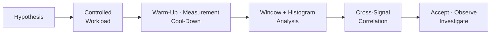

## Measurement and Validation

성능 수치를 수집하는 것만으로 설계가 검증되지는 않는다. 한 번의 실행에서 좋은 평균값이 나와도 초기화 구간이 섞였거나, 일부 Shard의 Spike가 Process 합계에 가려졌거나, Tick은 유지했지만 Reliable Pending이 계속 증가했을 수 있다.

Jam의 성능 검증은 먼저 확인하려는 설계 가설을 정하고, 부하 구간을 통제한 뒤, 서로 다른 범위의 Metric이 같은 결론을 지지하는지 확인하는 방식으로 진행한다.

## Experiment Definition

실험은 Server 설정, Shard 수, World 수, Client 수, Tick Rate와 실행 환경을 고정해야 한다. 결과 파일만 남기면 이후 비교에서 코드 변화와 환경 차이를 구분할 수 없으므로 실행 조건도 함께 기록한다.

측정 구간은 세 단계로 나눈다.

| 구간 | 목적 | 해석 시 주의점 |
| --- | --- | --- |
| Warm-up | 연결, World 참가, 초기 Baseline 형성 | 생성·동기화 비용을 정상 상태와 분리 |
| Measurement | 목표 부하가 안정된 구간 | 주요 성능 판단의 기준 |
| Cool-down | 연결 해제와 backlog 해소 | Pending이 정상적으로 감소하는지 확인 |

Warm-up을 제외하는 것은 느린 구간을 숨기기 위해서가 아니다. 초기 동기화 비용과 지속 운용 비용이 다른 경로에서 발생하므로 각각 별도로 판단하기 위해서다. 초기화 자체가 검증 대상이라면 Warm-up Metric도 독립된 Acceptance 기준을 가져야 한다.

## Outside-In Analysis

성능 문제는 넓은 범위에서 좁은 범위로 확인한다.

### Process Capacity

Process CPU와 Core별 사용률, Working Set, Private Bytes를 확인한다. 전체 CPU가 낮더라도 특정 Core만 포화되면 Shard Affinity나 단일 실행 경로가 한계를 만들 수 있다. Memory는 한 시점의 크기보다 Measurement 동안 지속적으로 증가하는지와 Cool-down 후 회복되는지가 중요하다.

### Executor Balance

Shard별 Ingress, Mailbox, Job 실행, Idle, Scheduler와 Tick Catch-up을 비교한다. 특정 Shard만 작업량과 Catch-up이 높으면 전역 CPU 증설보다 Routing이나 World 배치가 먼저 검토 대상이다. Fiber Ready Run과 Poll Cost는 Continuation 대기열이 실행 Budget을 소비하는지 판단하는 보조 신호다.

### World Tick Budget

Tick Duration의 p50만 보지 않고 p95, p99와 최댓값을 확인한다. Spike가 있다면 같은 Window에서 Physics, AOI, Replication, Finalize Histogram을 비교해 원인이 된 Phase를 찾는다. `tick_overrun_count`는 Tick Budget을 실제로 넘긴 횟수를 별도로 보여준다.

### Network and Replication Pressure

Snapshot Actor/Byte 증가가 Pending Reliable, Retransmit, Timeout과 함께 발생하는지 본다. Lifecycle Pending이나 Baseline Resync가 계속 증가하면 단순 처리량 문제가 아니라 상태 수렴이 지연되고 있을 가능성이 있다.

## Signal Correlation

단일 Metric의 높고 낮음보다 여러 Metric의 관계가 더 많은 정보를 준다.

| 관측 조합 | 가능한 해석 | 다음 확인 지점 |
| --- | --- | --- |
| CPU 상승 + 모든 Shard Job Cost 상승 | Process 전체 계산 포화 | Tick Phase별 비용 |
| CPU 여유 + 한 Shard Catch-up 증가 | 소유권 또는 작업 편중 | 해당 Shard의 World와 Mailbox |
| AOI Neighbors 상승 + Replication Actor/Bytes 상승 | 관심 영역 확장에 따른 전송 비용 | Pending Reliable과 Tick Replication Phase |
| Pending Reliable 상승 + Retransmit 상승 | 손실 또는 송신 처리 압력 | Timeout, Recovery, Process/Shard 부하 |
| Tick p99 상승 + 평균 안정 | 간헐적 Tail Latency | Spike Window의 Phase Histogram |
| Lifecycle Pending 지속 + Baseline Resync 증가 | 증분 상태 수렴 실패 가능성 | Packet Split, Network loss 신호 |

이 표는 자동 진단 규칙이 아니라 가설을 좁히기 위한 출발점이다. 같은 패턴도 실험 부하와 구간에 따라 다른 원인을 가질 수 있으므로 원시 Window와 Histogram을 다시 확인해야 한다.

## Percentiles, Windows, and Shard Comparison

Duration은 평균만으로 Acceptance를 정하지 않는다. 평균은 안정적이어도 일부 사용자가 긴 지연을 경험할 수 있다. HDR Histogram을 구간별로 병합해 p50, p95, p99를 비교하고, 측정 범위를 벗어난 Overflow가 없는지도 함께 확인한다.

Metrics window 단위 분석은 spike 시점을 다른 metric과 맞추는 데 사용한다. 전체 실행의 histogram은 전반적인 분포를 설명하지만 어떤 시점에 왜 느려졌는지는 알려주지 않는다. 반대로 metrics window 최댓값만 보면 반복 빈도를 알 수 없다. 두 관점을 함께 유지해야 한다.

Shard 비교에서는 총량이 아니라 부하 대비 비용을 본다. World Participant와 AOI Neighbors가 다른 Shard를 원시 Duration만으로 비교하면 자연스러운 작업량 차이를 불균형으로 오해할 수 있다. Participant, Actor, Packet 같은 부하 지표와 Phase Duration을 함께 해석한다.

## Validation Output

분석 결과는 원본 CSV/HLOG 외에도 다음처럼 재검토 가능한 산출물로 남긴다.

- 실행 환경과 실험 조건
- Warm-up, Measurement, Cool-down 구간 정의
- Scope·Shard·World별 Scalar 요약
- 구간별 Histogram percentile
- Spike Window와 관련 신호
- Acceptance 또는 관찰이 필요한 항목

현재 저장소의 분석 결과도 원본 파일, Phase 요약, Shard 비교, Spike Window와 Plot을 분리해 보관한다. 중요한 점은 그래프 자체보다 어떤 구간과 Metric을 사용해 결론을 냈는지 추적 가능하게 만드는 것이다.

## Trade-offs and Next Direction

파일 기반 검증은 실험을 재현하고 분석 로직을 반복 적용하기 쉽지만, 실행 중 즉시 장애를 탐지하지는 못한다. 현재 Acceptance도 모든 환경에 적용되는 절대 기준이라기보다 특정 부하와 하드웨어에서 비교 가능한 Baseline에 가깝다.

다음 단계에서는 같은 시나리오를 코드 변경 전후에 반복하여 regression 기준을 만들고, client 수나 world 밀도를 단계적으로 높여 saturation point를 찾는 것이 우선이다. 실시간 운영이 필요해질 때 CSV/HLOG를 버리기보다 기존 scope와 metrics window 계약을 유지한 exporter를 추가하는 방향이 현재 구조와 가장 잘 맞는다.
