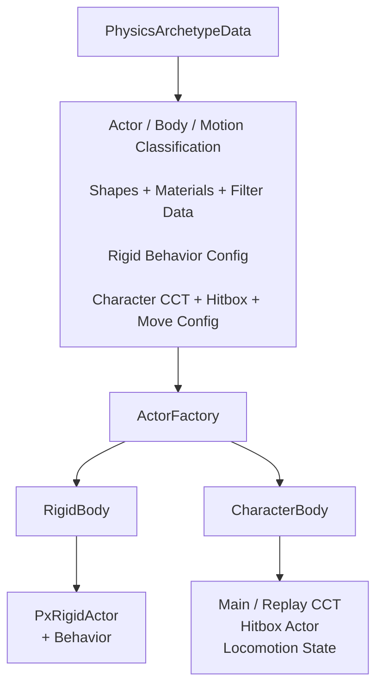
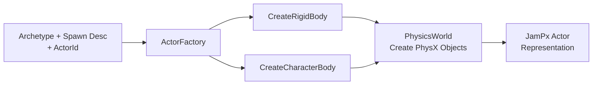

JamPx는 PhysX object를 직접 gameplay actor로 취급하지 않습니다. **data-driven physics archetype을 runtime actor representation으로 구체화하고, 그 내부에서 필요한 PhysX object와 state를 소유하는 계층**을 둡니다.

이 경계 덕분에 Game World는 `physx::PxRigidDynamic`, `physx::PxCapsuleController` 같은 PhysX 타입보다 `ActorId`, physics archetype과 character/rigid state를 기준으로 physics를 다룰 수 있습니다.



## Physics Archetype Model

`PhysicsDatabase`는 material, mesh, shape, dynamic body, CCT body, movement/behavior config와 최종 `PhysicsArchetypeData`를 분리해 저장합니다. Archetype은 runtime actor가 어떤 body representation과 motion policy를 사용할지를 결정하는 조합 단위입니다.

`PhysicsArchetypeData`의 핵심 분류는 다음과 같습니다.

| 분류 | 의미 |
| --- | --- |
| `actorType` | generic actor, projectile 등 gameplay-facing physics role |
| `bodyType` | rigid body 또는 character body representation |
| `motionType` | static / dynamic / kinematic 등 simulation motion policy |
| `motionFlags` | motion에 추가되는 runtime policy |
| `body` | `RigidBodyData` 또는 `CharacterBodyData` |

Shape 역시 geometry만 정의하지 않습니다. `ShapeData`는 geometry/material과 함께 `eShapeFlag`, simulation filter data(`SimFD`)와 query filter data(`QueryFD`)를 보유합니다. 따라서 **형상, simulation participation, query visibility가 동일한 archetype definition에서 조합되지만 서로 다른 정책으로 표현**됩니다.

## Actor Construction

`ActorFactory`는 physics archetype과 spawn descriptor를 결합해 `RigidBody` 또는 `CharacterBody`를 생성합니다. PhysX object 생성 자체는 `PhysicsWorld`가 담당하고, factory는 archetype에 정의된 body/shape/filter/behavior를 runtime representation으로 조립합니다.



`ActorId`는 이 과정에서 PhysX object와 상위 runtime actor를 연결하는 identity로 사용됩니다. Game World는 이 identity를 통해 simulation result와 event를 다시 ECS actor로 resolve할 수 있습니다.

## Rigid Body Representation

`RigidBody`는 Main scene의 `PxRigidActor`와 선택적인 Replay actor를 함께 보관하고, `RigidState`를 scene별로 유지합니다. Raw rigid actor 위에 `IRigidBehavior`를 결합해 actor의 물리 표현과 runtime behavior를 분리합니다.

```text
RigidBody
    ├─ Main PxRigidActor
    ├─ Replay PxRigidActor (optional)
    ├─ Main / Replay RigidState
    └─ IRigidBehavior
```

이 구조에서 static/dynamic/kinematic 같은 PhysX motion type과 projectile/driver 같은 Jam runtime behavior는 동일한 개념으로 취급되지 않습니다. PhysX actor는 물리 계산의 representation이고, behavior는 tick 전후에 필요한 JamPx 정책을 담당합니다.

## Character Body Representation

Character는 rigid body와 다른 runtime model을 사용합니다. `CharacterBody`는 Main/Replay `PxCapsuleController`, 별도의 hitbox actor, locomotion component와 controller(brain)를 하나의 body로 묶습니다.

```text
CharacterBody
    ├─ Main CCT
    ├─ Replay CCT
    ├─ Hitbox PxRigidActor
    ├─ Main / Replay CharacterState
    ├─ Main / Replay LocomotionComponent
    └─ ICharacterController
```

CCT는 이동 collision과 step/slope 처리를 담당하지만 gameplay hit/query representation 전체를 대신하지 않습니다. 별도 hitbox를 둘 수 있기 때문에 character locomotion shape와 공격·query 대상 shape를 독립적으로 구성할 수 있습니다.

`CharacterBodyData`는 CCT body, hitbox shape 목록, controller type과 movement config를 조합합니다. 따라서 WASD나 point-to-move 같은 상위 control intent가 최종 `CharacterMotorInput`으로 resolve된 뒤에는 JamPx가 동일한 character locomotion model을 사용해 simulation을 수행할 수 있습니다.

## Physics World and Scene Slots

`PhysicsWorld`는 PhysX scene과 controller manager를 scene slot 단위로 소유합니다. 현재 구조는 Main과 Replay 두 slot을 지원하며 rigid actor와 character controller 생성/제거, simulation begin/end, simulation event와 active actor 수집을 한 경계에 둡니다.

| Scene | 역할 |
| --- | --- |
| `Main` | server authoritative simulation 또는 client live prediction |
| `Replay` | client reconciliation을 위한 replay simulation |

JamPx actor가 Main/Replay representation을 함께 가질 수 있는 이유도 이 scene model과 연결됩니다. Replay가 필요하지 않은 actor는 replay object를 갖지 않아도 되며, 필요한 actor만 두 scene의 state를 동기화합니다.

## Runtime Boundary

JamPx의 actor abstraction은 gameplay domain을 다시 구현하려는 계층이 아닙니다. 역할은 **PhysX object graph와 gameplay-facing physics state 사이에 안정적인 runtime boundary를 제공하는 것**입니다.

- Game World는 actor lifetime과 authoritative state를 소유합니다.
- JamPx는 해당 actor의 physics representation과 movement/behavior state를 관리합니다.
- PhysX는 scene 내부의 low-level collision과 solver state를 계산합니다.
- simulation 결과는 `ActorId`를 통해 다시 owner world로 전달됩니다.

## Trade-offs

- PhysX object를 직접 사용하는 것보다 abstraction과 state synchronization 비용이 추가됩니다.
- Main/Replay representation은 reconciliation을 단순화하지만 일부 actor에 추가 object/state가 필요합니다.
- physics archetype은 일관된 구성을 제공하지만 runtime override와 asset validation 규칙이 필요합니다.
- CharacterBody처럼 여러 PhysX object를 하나의 logical actor로 묶으면 lifetime 관리가 중요해집니다.

이 비용 대신 Game World가 PhysX object layout에 직접 의존하지 않고 actor identity와 state contract를 중심으로 physics를 사용할 수 있습니다.

## Implementation References

- [Physics archetype database와 actor 생성 진입점](https://github.com/akxotjr/Jam/blob/master/JamPx/include/jampx/PhysicsDatabase.h)
- [PhysX scene ownership과 simulation API](https://github.com/akxotjr/Jam/blob/master/JamPx/include/jampx/PhysicsWorld.h)
- [Physics actor materialization](https://github.com/akxotjr/Jam/blob/master/JamPx/include/jampx/actor/ActorFactory.h)
- [Rigid actor representation](https://github.com/akxotjr/Jam/blob/master/JamPx/include/jampx/actor/rigid/RigidBody.h)
- [Character physics representation](https://github.com/akxotjr/Jam/blob/master/JamPx/include/jampx/actor/character/CharacterBody.h)
- [Character locomotion 상태와 동작](https://github.com/akxotjr/Jam/blob/master/JamPx/include/jampx/actor/character/locomotion/LocomotionComponent.h)
