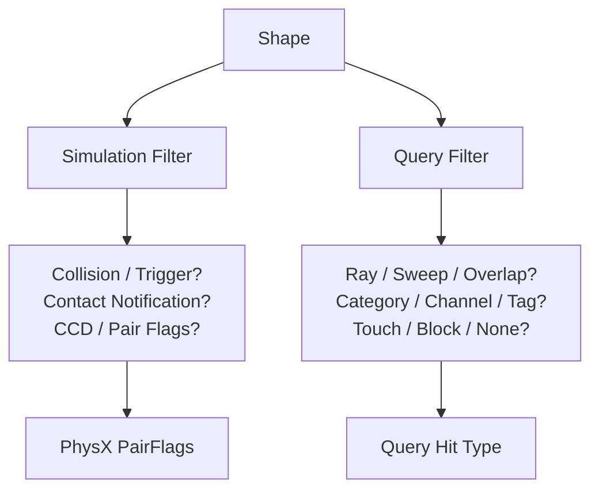

JamPx는 **simulation collision policy와 scene query policy를 분리**합니다. 두 경로 모두 PhysX shape를 대상으로 하지만 질문이 다르기 때문입니다.

- Simulation filter: 두 shape가 실제 simulation pair를 만들고 contact/trigger event를 생성할 것인가?
- Query filter: raycast, sweep, overlap 요청에서 어떤 shape를 후보로 보고 `NONE / TOUCH / BLOCK` 중 무엇으로 해석할 것인가?



이 분리를 통해 “서로 충돌하는가”와 “query에서 보이는가”를 동일한 collision layer 하나로 억지로 표현하지 않습니다.

## Shape Participation

`eShapeFlag`는 shape가 simulation과 scene query 중 어느 경로에 참여하는지를 먼저 결정합니다.

| Flag | Simulation | Query | Trigger |
| --- | ---: | ---: | ---: |
| `Simulation` | O | O | X |
| `SimulationOnly` | O | X | X |
| `Trigger` | X | O | O |
| `TriggerOnly` | X | X | O |
| `QueryOnly` | X | O | X |

`SetupShapeFlags()`는 이 정책을 PhysX의 `eSIMULATION_SHAPE`, `eSCENE_QUERY_SHAPE`, `eTRIGGER_SHAPE`로 변환합니다. 이후 simulation과 query는 각자의 filter data를 독립적으로 사용합니다.

## Simulation Filtering

Simulation category는 `WORLD_STATIC`, `WORLD_DYNAMIC`, `CHARACTER`, `PROJECTILE`, `SENSOR`로 구성됩니다. Pair 생성 여부는 양쪽의 category/mask가 서로를 허용하는지 확인하는 대칭 조건으로 결정됩니다.

```text
A.category intersects B.mask
            AND
B.category intersects A.mask
            │
            ▼
      simulation pair
```

category/mask가 pair 자체의 존재 여부를 정한다면 `SimUser` flag는 **그 pair에서 어떤 추가 동작과 report를 요구하는가**를 표현합니다. touch found/lost/persist, CCD notification, contact modification, contact points, threshold force와 solver velocity/pose report 등을 필요한 pair에만 요청할 수 있습니다.

`PairFlagsBuilder`는 trigger/contact 여부와 user flag를 결합해 최종 `PxPairFlags`를 만듭니다. Trigger에서 의미가 없는 contact-only flag는 제거하고, contact point나 report extra가 실제 callback을 발생시키기 위해 필요한 notify flag도 보정합니다.

이 구조의 목적은 모든 collision pair에 비싼 notification을 켜는 것이 아니라, **collision 허용 여부와 event/report 요구를 별도의 정책으로 표현해 필요한 pair에만 비용을 지불하는 것**입니다.

## Query Filtering

Scene query는 simulation category와 별도의 `QueryCategory`를 사용합니다.

| Category | 대표 의미 |
| --- | --- |
| `WORLD` | world geometry |
| `CHARACTER` | character query representation |
| `HITBOX` | gameplay hit target |
| `TRIGGER` | trigger volume |

Shape의 `QueryFD`는 category뿐 아니라 `QueryMeta(channel, sublayer, tag)`, `userData`, `ShapeQueryFlag`를 보유합니다. Query 요청의 `RequestQueryFD`는 category mask와 동일한 meta 구조, request flag를 전달합니다.

```mermaid
flowchart TD

    subgraph Request["RequestQueryFD"]
        direction TB
        Category["Category Mask"]
        Channel["Channel / Sublayer / Tag"]
        UserData["UserData"]
        Flags["Request Flags"]
    end

    Prefilter["Query Prefilter"]

    subgraph Policy["Filter Evaluation"]
        direction TB
        CategoryMatch["Category Match"]
        ChannelPolicy["Channel / Sublayer Policy"]
        Ignore["Ignore Trigger / Self"]
        ShapeFlags["Shape-Specific Flags"]
    end

    Result{"Query Hit Type"}

    None["NONE"]
    Touch["TOUCH"]
    Block["BLOCK"]

    Request --> Prefilter
    Prefilter --> Policy
    Policy --> Result

    Result --> None
    Result --> Touch
    Result --> Block
```



이를 통해 동일한 shape라도 query 목적에 따라 다르게 해석할 수 있습니다. 예를 들어 LOS query는 world만 block 대상으로 보고 character/hitbox/trigger를 제외할 수 있고, projectile query는 world·character·hitbox를 block 대상으로 취급할 수 있습니다.

## Query Metadata and Shape Flags

`QueryMeta`는 channel, sublayer, tag를 하나의 32-bit value로 pack합니다. Category가 “어떤 종류의 대상인가”를 표현한다면 meta는 같은 category 안에서 query context를 더 세분화합니다.

`ShapeQueryFlag`에는 head/penetrable/LOS 정책뿐 아니라 world static/dynamic/kinematic, rideable 같은 physics attribute도 포함됩니다. 반대로 `RequestQueryFlag`는 trigger/self 무시, penetrable 허용과 hit mapping mode처럼 **이번 query가 어떤 결과를 원하는가**를 표현합니다.

따라서 filter data는 다음처럼 역할이 나뉩니다.

| | `QueryFD` | `RequestQueryFD` |
|---|---|---|
| **관점** | Shape-side policy | Request-side policy |
| **역할** | Shape이 무엇인지 정의 | Query가 무엇을 찾는지 정의 |
| **필터 기준** | Category, channel, sublayer, tag 등 대상의 속성 | 허용/제외 조건과 request flags |
| **판정 의미** | 어떤 query context에 속하는지 표현 | Hit를 `NONE` / `TOUCH` / `BLOCK`으로 결정 |

## Character-Specific Filtering

Character locomotion은 일반 scene query와 별도로 CCT 이동 과정의 filtering이 필요합니다. JamPx의 character filter 계층은 controller 간 충돌 정책과 CCT sweep/filter 동작을 character movement context에 맞게 구성합니다.

이 경계는 일반 gameplay raycast 정책을 CCT movement에 그대로 재사용하지 않기 위한 것입니다. Character locomotion에서 필요한 collision 후보와 gameplay hit/LOS query에서 필요한 후보는 서로 다를 수 있습니다.

## Filter Policy Boundary

JamPx filtering은 gameplay rule 전체를 PhysX filter shader에 넣지 않습니다. Filter 단계는 **물리적으로 pair/query 후보를 제한하고 필요한 report semantics를 선택하는 역할**에 집중합니다. 실제 damage, portal transition, projectile gameplay effect 같은 domain decision은 simulation/query 결과가 owner world로 돌아온 뒤 처리합니다.

이 경계 덕분에 filter shader와 callback이 ECS/gameplay ownership을 직접 침범하지 않습니다.

## Trade-offs

- simulation/query filter data를 별도로 유지하므로 archetype 정의가 단순 collision layer 하나보다 복잡합니다.
- category, meta, flag가 늘어날수록 정책 조합의 validation이 중요해집니다.
- 대신 collision, trigger notification, LOS, projectile query, hitbox selection처럼 성격이 다른 요구를 하나의 mask에 과도하게 결합하지 않아도 됩니다.
- callback/report flag를 필요한 pair에만 요청할 수 있어 simulation event 비용을 명시적으로 제어할 수 있습니다.

## Implementation References

- `JamPx/include/jampx/PhysicsFilter.h`
- `JamPx/include/jampx/PhysicsSimFilter.h`
- `JamPx/include/jampx/PhysicsQueryFilter.h`
- `JamPx/include/jampx/actor/character/locomotion/CharacterFilter.h`
- `JamPx/include/jampx/PhysicsDatabase.h`
