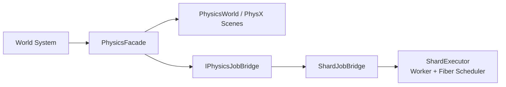
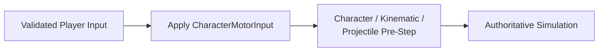
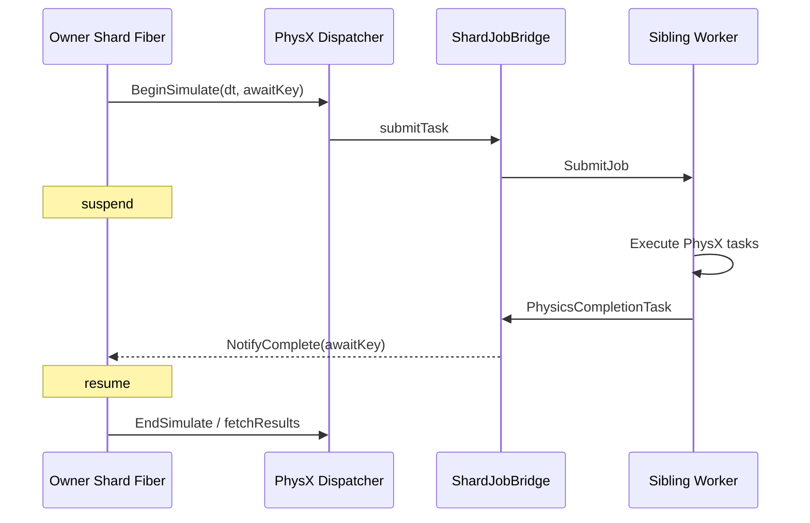
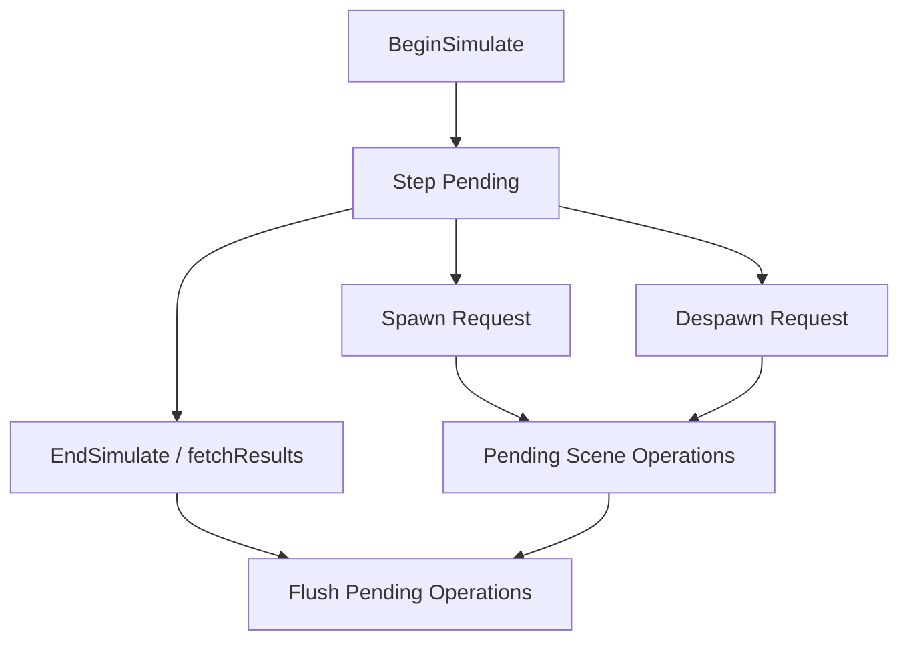
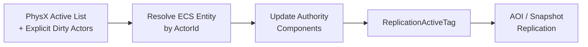

## Facade and Execution Bridge

PhysX API를 world system이 직접 호출하도록 만들면 처음에는 단순하지만, 곧 두 가지 경계가 흐려집니다.

- ECS actor의 identity와 PhysX object의 lifetime을 누가 관리하는가
- PhysX task가 어느 thread에서 실행되고 완료 후 어디로 돌아오는가

Jam은 `PhysicsFacade`로 gameplay-facing 물리 API를 모으고, `IPhysicsJobBridge`로 JamPx와 executor의 연결을 분리했습니다. JamPx는 shard나 fiber의 구체적인 구현을 알지 않고 task 제출과 completion notification만 요청합니다. JamNet의 `ShardJobBridge`가 이를 현재 `ShardExecutor`에 연결합니다.



이 구조는 wrapper 계층을 하나 추가하지만 physics library와 runtime execution model이 직접 결합되는 것을 막습니다. 특히 synchronous fallback과 shard worker path를 같은 facade API로 유지할 수 있습니다.

## World and Scene Ownership

각 physical world는 자신의 `PhysicsFacade`를 통해 PhysX scene과 actor map을 관리합니다. ECS entity와 PhysX actor는 공통 `ActorId`로 연결되며, facade는 rigid body, kinematic, projectile, character controller를 종류별로 보관합니다.

world owner shard가 다음 작업을 수행합니다.

- physics asset registry와 scene 초기화·종료
- actor spawn/despawn과 `ActorId` 연결
- character input과 authoritative state 적용
- simulation 결과 readback
- active actor와 physics event를 ECS 및 gameplay로 반영

scene이 내부적으로 worker task를 실행하더라도 scene lifecycle의 owner가 worker로 이동하는 것은 아닙니다. 이 규칙 덕분에 ECS와 PhysX object 사이에 별도 global lock을 두지 않고도 lifetime을 맞출 수 있습니다.

## Main and Replay Scenes

`PhysicsWorld`는 두 개의 scene slot을 만듭니다.

| Scene | 역할 |
| --- | --- |
| `Main` | server authoritative simulation 또는 client live prediction |
| `Replay` | client reconciliation에서 과거 authoritative state부터 입력을 재실행 |

client correction을 main scene 하나에서 수행하면 live predicted state를 되감고 다시 복구해야 하며, presentation과 query state도 함께 흔들릴 수 있습니다. 별도의 Replay scene은 correction 계산을 live state와 분리합니다.

대신 replay 대상 actor의 state와 resource를 두 scene에 유지해야 하므로 memory와 synchronization 비용이 늘어납니다. Jam은 모든 actor를 무조건 replay 대상으로 보기보다 character와 상호작용 가능성이 있는 archetype을 candidate로 판별하고, Main scene의 gameplay event만 외부로 전달합니다.

## Tick Preparation

PhysX step 이전에는 world state를 scene에 반영합니다.

### Server



server는 physics 결과의 authoritative owner입니다. step 이후 active actor만 읽어 `CharAuthorityState` 또는 `RigidAuthorityState`를 갱신하고 `ReplicationActiveTag`를 표시합니다. 모든 actor를 매 tick 순회하지 않고 PhysX active list와 facade의 dirty set을 결합해 replication 후보를 좁힙니다.

### Client

```text
prepare client physics:
    push remote authoritative states
    simulate local input in Main scene

    if reconciliation is required:
        replay inputAck-confirmed correction context in Replay scene
        produce correction state

    pull Main scene proxy states
```

client는 remote actor의 authoritative state를 scene에 적용하는 동시에 local controlled actor를 예측합니다. server correction이 임계값을 넘으면 `inputAck` 이후의 명령을 Replay scene에서 다시 실행하고 correction state를 만든 뒤 live state에 반영합니다.

이 차이는 PhysX integration이 단순히 server simulation을 client에서 복제하는 구조가 아니라, server authority와 client responsiveness를 서로 다른 state flow로 연결한다는 점을 보여줍니다.

## Asynchronous Simulation Step

world tick이 fiber context에서 실행 중이면 physics system은 await key를 만들고 `BeginSimulate()`에 전달합니다.



`ShardPxCpuDispatcher`는 worker count를 1로 노출하고 PhysX task를 해당 shard의 worker queue에 보냅니다. shard main thread는 fiber를 suspend한 뒤 다른 mailbox, job 또는 system을 처리할 수 있습니다. completion task는 결과를 소비하지 않고 `ResumeFiber()`만 요청합니다.

이 선택의 목적은 하나의 world step을 여러 arbitrary worker에 넓게 분산하는 것이 아니라, shard의 ownership과 core locality를 유지하면서 main execution lane의 대기 시간을 줄이는 것입니다. 병렬성의 폭은 제한되지만 thread placement와 lifecycle을 예측하기 쉽습니다.

## Synchronous Fallback

fiber context가 아니거나 유효한 await key가 없으면 PhysX task는 inline으로 실행되고 `fetchResults(true)`까지 동기적으로 완료됩니다.

- fiber path : worker task + suspend/resume
- non-fiber path : inline task + blocking fetchResults

fallback을 유지한 이유는 초기화, 단순 runtime 또는 fiber 밖의 domain system에서도 동일한 physics API를 사용할 수 있게 하기 위해서입니다. 다만 이 경로에서는 shard thread가 simulation 동안 점유되므로 일반적인 world tick은 fiber path를 사용하는 것이 의도된 실행 형태입니다.

## Safe-Point Scene Mutation

PhysX step이 pending인 동안 scene에 actor를 즉시 추가하거나 제거하면 simulation task와 scene mutation이 경쟁할 수 있습니다. `PhysicsFacade`는 이 구간의 spawn/despawn을 pending operation으로 보관하고 `EndSimulate()` 이후 flush합니다.



server actor lifecycle은 world pipeline의 safe point에서만 수행된다는 assertion을 둡니다. client는 network update와 prediction 흐름 때문에 step 중 요청이 발생할 수 있어 pending actor operation을 함께 기록하고, flush 후 `PhysicsSpawnedTag` 등의 ECS 상태를 commit합니다.

즉 비동기 physics를 도입하면서 actor mutation까지 자유롭게 concurrent하게 만들지 않았습니다. mutation 시점을 제한하는 쪽이 lock이나 scene-level synchronization을 곳곳에 추가하는 것보다 ownership을 이해하기 쉽기 때문입니다.

## Result Readback and Gameplay Handoff

`EndSimulate()`는 `fetchResults(true)`로 step 완료를 확정하고, deferred scene operation과 kinematic/projectile state를 정리합니다. 이후 system이 facade를 통해 결과를 읽습니다.

### Server Result Flow



projectile hit와 lifetime expiry 같은 physics event도 owner shard에서 소비합니다. actor despawn과 gameplay event dispatch는 PhysX callback thread에서 직접 수행하지 않습니다.

### Client Result Flow

| Scene result | State flow | 소비 목적 |
|---|---|---|
| **Main** | local predicted state/history + remote proxy component update | presentation sampling |
| **Replay** | correction state | prediction reconciliation |

계산 완료와 gameplay 반영을 분리함으로써 PhysX callback의 thread context가 ECS ownership을 침범하지 않습니다. 반면 readback 시점을 놓치면 한 tick의 state가 불일치할 수 있으므로, `BeginSimulate → suspend → EndSimulate → readback` 순서를 world pipeline의 고정 계약으로 유지해야 합니다.

## Constraints and Trade-offs

- shard worker가 하나이므로 한 world의 PhysX task를 무제한 병렬화하는 구조는 아닙니다.
- 같은 shard의 여러 world가 worker 시간을 공유하므로 긴 step은 worker queue와 world tick latency에 영향을 줍니다.
- Main/Replay scene은 client reconciliation을 단순하게 하지만 추가 memory와 state synchronization을 요구합니다.
- simulation pending 중 scene mutation은 즉시 반영되지 않으므로 caller가 deferred completion을 고려해야 합니다.
- fiber timeout은 hang을 감지하는 경계일 뿐, 이미 실행 중인 PhysX task를 안전하게 취소하는 기능은 아닙니다.

이 제약들은 physics throughput만 최대화하기보다 Jam의 owner-local execution과 actor lifetime을 유지하기 위해 선택한 비용입니다. worker와 fiber의 기반 동작은 [[../Execution Model/03. Owner-Local Serial Execution|Owner-Local Serial Execution]]과 [[../Execution Model/05. Fiber-Based Async Scheduling|Fiber-Based Async Scheduling]]에서 설명합니다.


## Implementation References

- `JamPx/include/jampx/PhysicsFacade.h`
- `JamPx/include/jampx/PhysicsWorld.h`
- `JamPx/include/jampx/IPhysicsJobBridge.h`
- `JamPx/include/jampx/ShardPxCpuDispatcher.h`
- `JamPx/include/jampx/PhysicsCompletionTask.h`
