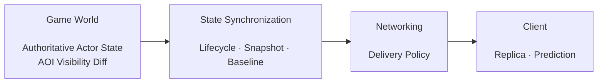
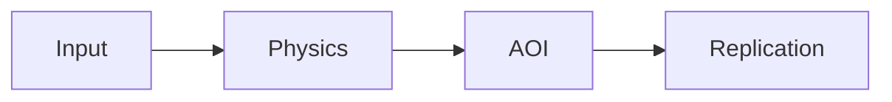

## Replication Boundary

Game World는 authoritative state와 visibility membership을 만듭니다. 하지만 그 state를 모든 client에 같은 방식으로 보내면 actor lifetime, 최신성, bandwidth와 recovery 요구가 충돌합니다.

Jam은 world simulation과 state synchronization을 다음 경계로 나눕니다.

world가 "무엇이 사실인가"를 결정하고, synchronization은 "그 사실을 client가 어떤 형태로 재구성해야 하는가"를 결정합니다.

## Server-side Inputs

`ServerReplicationSystem`이 소비하는 핵심 입력은 다음 세 종류로 볼 수 있습니다.

- authoritative actor state
- user별 AOI membership과 entered/left 변화
- controlled user에게 실제 적용된 input sequence

이 입력을 바탕으로 user별 lifecycle과 snapshot 후보를 만들고, baseline 상태와 packet budget을 고려해 전송합니다.

## Per-User Replication State

visibility가 user마다 다르므로 replication state도 전역 하나로 둘 수 없습니다. 어떤 user는 actor를 오래 보고 있어 delta state를 해석할 수 있지만, 다른 user는 방금 AOI에 들어와 full state가 필요할 수 있습니다.

따라서 Jam은 user별로 known actor와 baseline 진행 상태를 관리합니다. 이 구조는 memory를 더 사용하지만 AOI 진입/이탈과 delta state를 자연스럽게 연결합니다.

## Replication in the Server Tick

server world pipeline에서는 physics와 AOI가 먼저 authoritative state와 visibility를 확정한 뒤 replication이 실행됩니다.

이 순서 때문에 같은 tick의 physics 결과가 같은 tick의 visibility와 snapshot candidate에 반영될 수 있습니다. world tick 자체의 계약은 [[Projects/Jam/Game World/03. Authoritative Simulation|Authoritative Simulation]]에서 설명합니다.

## Client-side Reconstruction

client는 lifecycle과 snapshot을 같은 의미로 처리하지 않습니다.

- Lifecycle : actor identity / archetype / lifetime
- Snapshot : transform / velocity / continuous state

remote actor는 authoritative snapshot을 proxy/presentation flow로 소비하고, local controlled actor는 snapshot의 `inputAck`와 authoritative state를 prediction history에 결합합니다.

## Trade-offs

- user별 state는 bandwidth를 줄이지만 per-user memory와 bookkeeping을 증가시킵니다.
- lifecycle/snapshot 분리는 delivery semantics를 명확하게 하지만 protocol path가 늘어납니다.
- AOI와 replication 분리는 subsystem 독립성을 높이지만 경계 event를 명시적으로 관리해야 합니다.

## Implementation References

- [Per-user replication state 모델](https://github.com/akxotjr/Jam/blob/master/JamNet/include/jamnet/runtime/world/simulation/server/ServerReplicationSystem.h)
- [AOI 기반 replication 후보와 packet 생성](https://github.com/akxotjr/Jam/blob/master/JamNet/src/runtime/world/simulation/server/ServerReplicationSystem.cpp)
- [World state와 replication phase 연결](https://github.com/akxotjr/Jam/blob/master/JamNet/src/runtime/world/simulation/server/ServerWorld.cpp)
