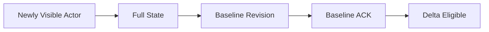
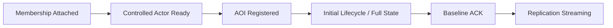

## Per-User Baseline Model

Delta state는 sender와 receiver가 같은 baseline state를 공유할 때만 해석할 수 있습니다. 하지만 AOI가 user별로 다르기 때문에 "현재 알고 있는 actor state"도 user마다 다릅니다.

어떤 user는 actor A를 계속 보고 있어 delta state를 받을 수 있지만, 다른 user는 방금 AOI에 들어와 full state부터 받아야 합니다. Jam은 이 차이를 user별 baseline state로 관리합니다.

## Full and Delta State

full state는 독립적으로 actor state를 구성할 수 있는 기준이고, delta state는 현재 baseline과 달라진 부분만 전달합니다.

- no baseline / revision mismatch → full state
- baseline ACK confirmed → delta state

Delta state 생성이나 decode 전제조건이 만족되지 않으면 full state로 fallback할 수 있어야 합니다. bandwidth 효율보다 recoverability를 우선하는 경계입니다.

## Baseline ACK

server는 client의 baseline ACK를 받아 user별 replication state를 갱신합니다. 실제 `ServerWorld`도 `BASELINE_ACK` packet을 `ServerReplicationSystem::HandleBaselineFeedback()`으로 전달합니다.

Baseline ACK는 "packet이 도착했다"가 아니라 **해당 baseline revision을 client가 state decode 기준으로 사용할 수 있다**는 synchronization feedback입니다. 따라서 transport ACK와 baseline ACK는 다른 책임을 가집니다.

## Initial Sync

새 user가 world에 attach되었다고 바로 replication `Streaming` phase가 되는 것은 아닙니다. controlled actor와 initial visibility가 구성되고 필요한 full state의 baseline ACK가 확인되어야 delta streaming으로 넘어갈 수 있습니다.

이 때문에 initial sync는 world entry와 state synchronization 사이의 명시적 경계입니다. membership transaction 자체는 [[Projects/Jam/Game World/01. World Entry and Transition|World Entry and Transition]]에서 설명합니다.

## Budget and Priority

visible actor 수가 많아도 한 tick에 무제한 state를 만들 수는 없습니다. replication은 full state가 필요한 actor, active/important actor, 일반 visible actor처럼 urgency가 다른 후보를 budget 안에서 선택할 수 있습니다.

핵심 원칙은 **decode 가능성을 유지하는 state를 먼저 보내고, 나머지 freshness를 budget 안에서 조정하는 것**입니다. 낮은 priority actor는 update가 늦어질 수 있지만, baseline이 없는 actor에 delta state만 보내는 식으로 protocol correctness를 깨지는 않습니다.

## Recovery

baseline ACK가 장기간 오지 않거나 revision이 맞지 않으면 full state 재전송 또는 resync가 필요합니다. 이 경로는 정상 delta streaming보다 비싸지만 잘못된 기준으로 delta state를 계속 적용하는 것보다 안전합니다.

## Trade-offs

- per-user baseline은 bandwidth를 줄이지만 `user × visible actor`에 비례한 state 비용이 생깁니다.
- full state fallback은 recoverability를 높이지만 순간 bandwidth가 증가할 수 있습니다.
- baseline ACK는 transport reliability와 별도의 protocol state를 추가합니다.
- budget은 overload를 bounded degradation으로 바꾸지만 낮은 priority actor의 freshness가 떨어질 수 있습니다.

## Implementation References

- [Per-user baseline과 ACK 상태](https://github.com/akxotjr/Jam/blob/master/JamNet/include/jamnet/runtime/world/simulation/server/ServerReplicationSystem.h)
- [Baseline, delta, resync 구현](https://github.com/akxotjr/Jam/blob/master/JamNet/src/runtime/world/simulation/server/ServerReplicationSystem.cpp)
- [Initial sync와 world pipeline 연결](https://github.com/akxotjr/Jam/blob/master/JamNet/src/runtime/world/simulation/server/ServerWorld.cpp)
