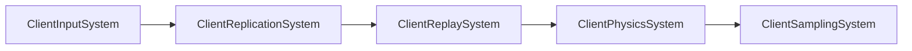
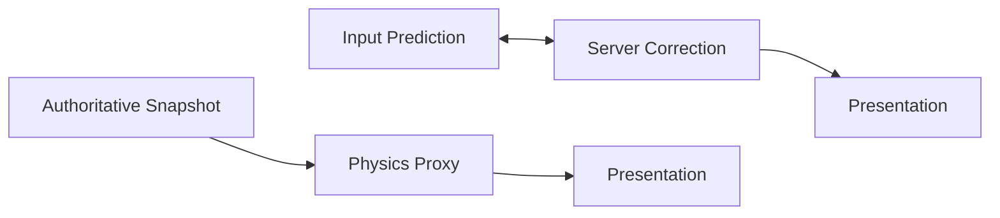

## Client-Side Prediction

server response를 기다린 뒤 local controlled actor를 움직이면 입력 지연에 왕복 시간이 그대로 더해집니다. 하지만 client 결과를 authority로 인정하면 변조와 simulation divergence를 제어하기 어렵습니다.

Jam은 local input을 즉시 simulation하면서 같은 input을 server에 보내고, authoritative snapshot이 도착하면 과거 prediction과 비교해 필요한 경우만 다시 실행합니다.

```text

on local input:
    send command(sequence) to server
    simulate immediately
    store predicted state by sequence

on authoritative snapshot(state, inputAck):
    predicted = history[inputAck]

    if predicted is within reconciliation threshold:
        accept inputAck
        prune inputAck-confirmed history
    else:
        rewind to authoritative state
        replay commands after inputAck

```

prediction은 별도의 authority가 아니라 server 결과가 도착하기 전까지 사용하는 임시 추정값입니다.


## Client Synchronization Tick

client world에서는 input 생성, replication apply, replay 준비, physics prediction/correction, sampling을 순서대로 연결합니다.



이 순서의 핵심은 authoritative snapshot이 먼저 prediction context를 갱신하고, 필요한 replay state를 준비한 뒤 live physics correction과 current-input prediction을 수행한다는 점입니다. presentation sampling은 마지막에 simulation state를 소비하며 authority를 다시 변경하지 않습니다.

## Input History

client는 매 tick `CharacterControlIntent`를 resolve해 sequence가 포함된 command를 만듭니다. command에는 이동 방식, view orientation, continuous/edge action과 control revision이 포함됩니다.

같은 command를 network로 보내고 local physics에 적용한 뒤 결과를 `PredictedHistoryBuffer`에 저장합니다.

| History            | Sequence에 저장하는 값      | 역할                                     |
| ------------------ | --------------------- | -------------------------------------- |
| `InputHistory`     | resolved command      | `inputAck` 이후 replay할 입력 보존            |
| `PredictedHistory` | resulting local state | authoritative state와 같은 sequence 시점 비교 |

server는 user별 input queue에서 tick에 사용할 command를 선택하고 실제 적용한 sequence를 snapshot의 `inputAck`로 보냅니다. client는 이 값을 기준으로 server가 처리한 입력과 아직 처리하지 않은 입력을 구분합니다.

## Snapshot Application and Reconcile Signal

client replication은 lifecycle과 snapshot chunk를 server tick 순서로 조립합니다. local controlled actor의 authoritative state를 적용할 때 `serverTick`, `inputAck`와 input epoch를 검증하고 reconciliation signal을 갱신합니다.

baseline이 없는 delta state는 적용하지 않습니다. full state를 먼저 받고 baseline revision을 baseline ACK로 확인한 뒤에만 같은 revision의 delta state를 해석합니다. 잘못된 baseline에 correction을 수행하면 prediction 문제가 아니라 decode 기준 자체가 틀리기 때문입니다.

## Reconciliation Threshold

authoritative state와 `inputAck` 시점의 predicted state를 비교합니다. 위치 오차가 설정된 threshold 이내라면 current live state를 유지하고 `inputAck`까지의 history만 제거합니다.

모든 작은 floating-point 차이에 replay를 실행하지 않는 이유는 correction 비용과 visual jitter가 실제 오차보다 커질 수 있기 때문입니다. threshold는 server convergence와 local stability 사이의 절충입니다.

predicted history에 비교할 state가 없으면 안전하게 큰 오차로 취급해 replay path를 선택합니다. history 손실을 묵시적으로 정상 상태로 간주하지 않기 위한 결정입니다.

## Rewind and Replay

오차가 threshold를 넘으면 다음 과정을 수행합니다.

```text
replay(authoritativeState, inputAck):
    set Replay scene to authoritativeState

    for command in InputHistory after inputAck:
        simulate one fixed step
        record replayed predicted state

    commit correction result
    prune history through inputAck
```

Replay scene을 Main scene과 분리해 live physics state를 직접 되감지 않습니다. 주변 actor 중 local controlled actor의 replay 결과에 영향을 줄 수 있는 candidate state도 replay scene에 준비합니다.

replay input 수에는 상한을 둡니다. 긴 network stall 뒤 모든 history를 한 frame에 재실행하면 correction 자체가 frame hitch를 만들 수 있기 때문입니다. 상한을 넘으면 완전한 시간 복원보다 bounded client cost를 선택하며 관련 통계를 남깁니다.

## Local and Remote Actor Synchronization

remote actor는 snapshot에서 받은 authoritative state를 Main scene에 push하고 simulation 결과를 proxy component로 pull합니다. local controlled actor는 current input으로 live prediction을 수행하고 별도의 predicted/correction state를 유지합니다.



ownership에 따라 state flow를 나눈 이유는 모든 actor를 예측할 필요가 없기 때문입니다. remote actor까지 동일하게 replay하면 history와 physics 비용이 actor 수에 비례해 증가합니다.

## Sampling and Presentation

simulation correction을 transform에 즉시 그대로 노출하면 큰 오차가 한 frame의 teleport로 보일 수 있습니다. client sampling 단계는 authoritative/proxy/predicted state를 presentation이 소비할 흐름으로 분리합니다.

network smoothing은 authoritative simulation을 변경하는 단계가 아닙니다. presentation은 보간될 수 있지만 다음 prediction과 input history는 simulation state를 기준으로 유지해야 feedback error가 생기지 않습니다.

## Failure and Boundary Conditions

- control revision이 바뀐 이전 input은 새 controlled actor에 적용하지 않습니다.
- input epoch가 맞지 않는 snapshot의 `inputAck`는 현재 history 확인에 사용하지 않습니다.
- baseline revision이 없거나 불일치하면 delta state를 보류하고 full state를 요청합니다.
- lifecycle보다 먼저 온 snapshot은 actor가 생성될 때까지 deferred baseline으로 보관할 수 있습니다.
- replay 대상 actor가 사라지거나 identity가 바뀌면 stale state를 적용하지 않습니다.

이 검증은 packet이 reliable하게 도착하는 것과 state가 현재 prediction context에 유효한지를 별개의 문제로 다룹니다.

## Trade-offs

- input과 predicted state history가 추가 memory를 사용합니다.
- Replay scene은 correction isolation을 제공하지만 physics object와 synchronization 비용이 늘어납니다.
- threshold가 작으면 잦은 correction, 크면 server state로의 수렴 지연이 발생합니다.
- replay budget은 frame cost를 제한하지만 긴 divergence를 한 번에 완전히 복구하지 못할 수 있습니다.
- local responsiveness는 좋아지지만 server와 동일한 movement resolution과 fixed-step 규칙을 client에도 유지해야 합니다.

이 비용은 server authority를 유지하면서 local input의 체감 latency를 줄이기 위해 선택한 것입니다. physics replay의 실행 방식은 [[../Physics/03. PhysX Integration and Scheduling|PhysX Integration and Scheduling]]에서 이어집니다.


## Implementation References

- `JamNet/include/jamnet/runtime/world/simulation/client/ClientReplaySystem.h`
- `JamNet/src/runtime/world/simulation/client/ClientReplaySystem.cpp`
- `JamNet/src/runtime/world/simulation/client/ClientWorld.cpp`
- `JamNet/include/jamnet/runtime/world/simulation/client/ClientPhysicsSystem.h`
- `JamNet/include/jamnet/runtime/world/simulation/client/ClientReplicationSystem.h`
