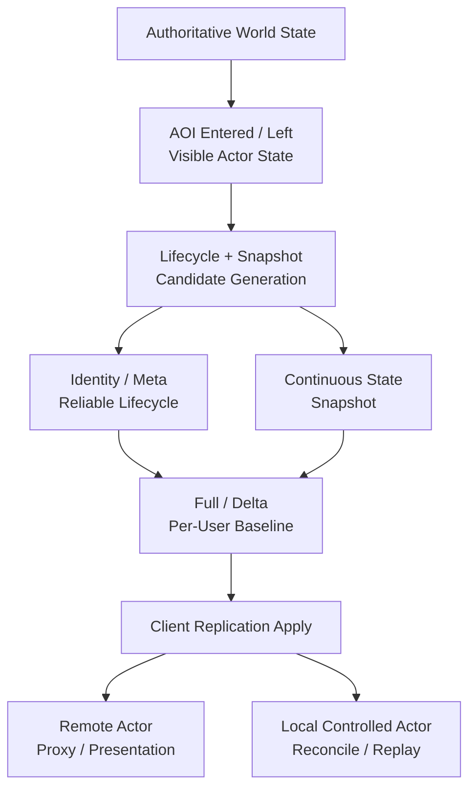

## Core Idea

Jam의 State Synchronization은 **server world가 만든 authoritative state와 visibility 변화를 client가 일관되게 재구성하도록 연결하는 경계**입니다.

이 계층은 단순히 ECS component를 복사하지 않습니다. actor가 client에 언제 존재해야 하는지, 어떤 state는 reliable lifecycle로 보내고 어떤 state는 최신 snapshot으로 보낼지, delta의 기준 baseline을 어떻게 공유할지, local prediction이 authoritative result에 어떻게 수렴할지를 함께 다룹니다.

> Visibility decides *who matters*; synchronization decides *what state means and how it converges*.

- AOI 결과를 lifecycle과 snapshot 후보로 변환합니다.
- actor identity/meta와 continuous state update의 delivery semantics를 분리합니다.
- user별 baseline을 유지해 full/delta state를 해석 가능하게 만듭니다.
- server가 실제 적용한 input sequence를 `inputAck`로 전달해 client prediction history와 연결합니다.
- local controlled actor는 prediction/reconciliation/replay를 사용하고 remote actor는 authoritative/proxy flow를 사용합니다.

이 문서군에서 `snapshot`은 한 tick의 state update를 운반하는 전송 묶음을 뜻합니다. 그 안의 actor state 표현은 독립적으로 decode할 수 있으면 **full state**, 공유 baseline에 의존하면 **delta state**라고 부릅니다. Transport 수신 확인은 **transport ACK**, baseline 사용 가능 확인은 **baseline ACK**, server가 처리한 input sequence는 코드 필드명인 **`inputAck`**로 구분합니다.

## End-to-End Flow

## Responsibility Map

| 경계 | 책임 | 보호하는 것 |
| --- | --- | --- |
| Replication model | authoritative state를 client representation으로 분해 | identity/state 의미 분리 |
| Lifecycle delivery | create/meta/remove 전달 | actor interpretation과 lifetime order |
| Snapshot delivery | continuous state update | 최신 authoritative state |
| Baseline state | full/delta state decode 기준 | delta recoverability |
| Prediction/replay | local input과 server correction 결합 | responsiveness + server convergence |

## Document Map

1. [[Projects/Jam/State Synchronization/01. Replication Model|Replication Model]] — AOI/world state에서 client sync 후보를 만드는 전체 구조
2. [[Projects/Jam/State Synchronization/02. Lifecycle and Snapshot Delivery|Lifecycle and Snapshot Delivery]] — actor lifetime/meta와 continuous state 전송을 분리하는 이유
3. [[Projects/Jam/State Synchronization/03. Baseline and Delta State|Baseline and Delta State]] — per-user baseline, baseline ACK, resync, initial sync
4. [[Projects/Jam/State Synchronization/04. Prediction, Reconciliation and Replay|Prediction, Reconciliation and Replay]] — input history와 authoritative correction을 연결하는 과정

## Implementation References

- [Server replication 상태와 전송 계약](https://github.com/akxotjr/Jam/blob/master/JamNet/include/jamnet/runtime/world/simulation/server/ServerReplicationSystem.h)
- [Replication streaming 전체 구현](https://github.com/akxotjr/Jam/blob/master/JamNet/src/runtime/world/simulation/server/ServerReplicationSystem.cpp)
- [Client authoritative state 소비](https://github.com/akxotjr/Jam/blob/master/JamNet/src/runtime/world/simulation/client/ClientWorld.cpp)
- [Prediction history와 replay 계약](https://github.com/akxotjr/Jam/blob/master/JamNet/include/jamnet/runtime/world/simulation/client/ClientReplaySystem.h)
