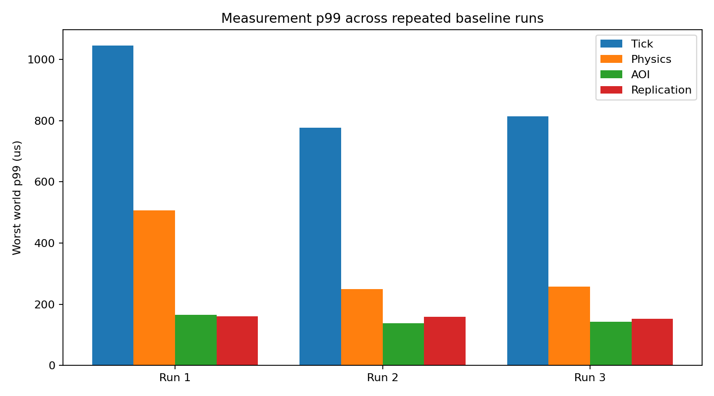
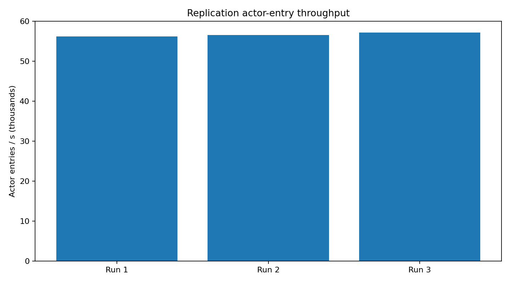
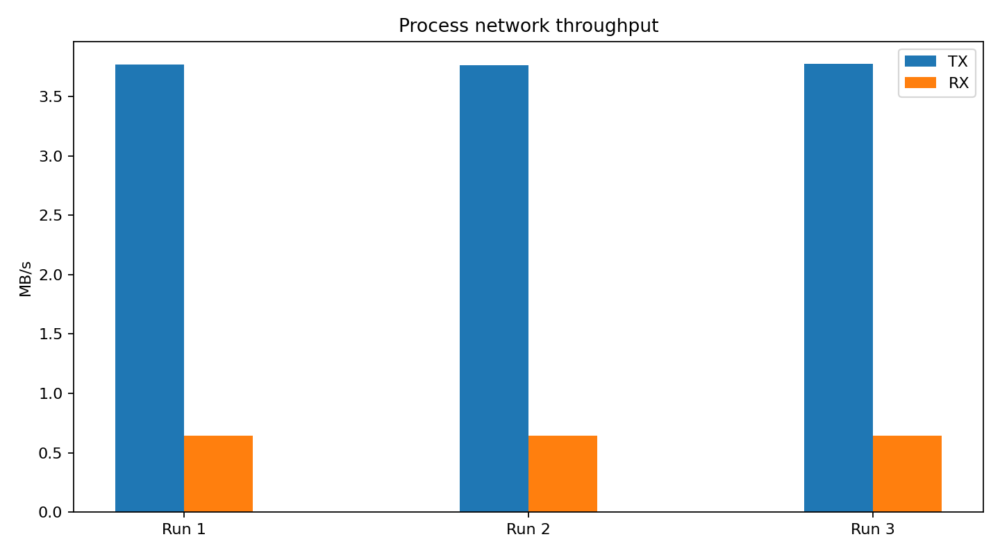
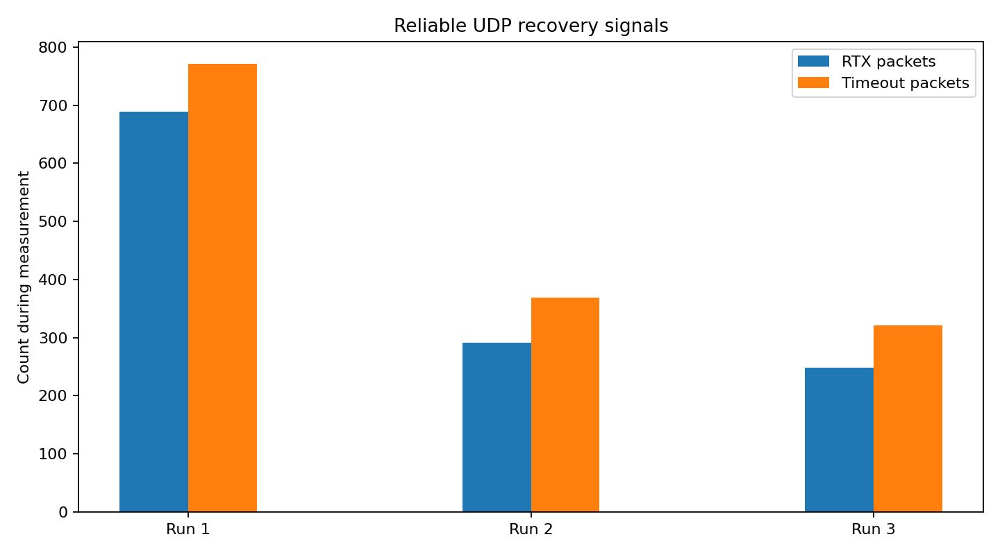

이 문서는 M1의 **300 Bot baseline workload를 동일한 조건으로 3회 반복 측정한 결과**를 정리합니다. 목적은 300 CCU 자체를 capacity로 주장하는 것이 아니라, 실제 gameplay path가 동시에 동작하는 상태에서 측정 결과의 반복성을 확인하고 이후 1,000 CCU Target 검증과 비교할 기준선을 만드는 것입니다.

M1 Bot은 connection만 유지하지 않습니다. World에 입장한 뒤 movement, AOI 변화, replication, chat과 portal/world transition을 지속적으로 발생시킵니다. 따라서 아래 결과는 이러한 workload가 함께 실행되는 상태의 server runtime을 대상으로 합니다.

> [!note] Current Boundary
> 현재 account와 character 데이터는 **in-memory store**를 사용하며 실제 DB는 아직 연결되어 있지 않습니다. 따라서 아래 결과에는 DB query, transaction, connection pool 비용이 포함되지 않습니다.
>

## Test Environment

| Item    | Server PC                    | Bot PC             |
| ------- | ---------------------------- | ------------------ |
| CPU     | AMD Ryzen 7 7800X3D (8-Core) | AMD Ryzen 7 8845HS |
| Memory  | 64 GB DDR5                   | 32 GB LPDDR5       |
| OS      | Windows 11                   | Windows 11         |
| Build   | Release / x64                | Release / x64      |
| Role    | M1 Server                    | 300 M1 Bots        |
| Network | Wi-Fi                        | Wi-Fi              |

Server와 Bot은 별도의 PC에서 실행했으며 Wi-Fi 환경에서 통신했습니다. 별도의 network impairment는 적용하지 않았으며, 세 baseline run은 동일한 hardware/build 구성에서 측정했습니다.

## Measurement Configuration

| 항목 | 설정 |
| --- | --- |
| Profile | Baseline |
| Bots | 300 |
| Connection rate | 100/s |
| Server simulation | 30 Hz |
| Warm-up | 약 60 s |
| Measurement | 약 180 s |
| Metric window | 5 s |
| Repetition | 3 runs |

각 run은 ramp-up 이후 warm-up을 거친 뒤 약 180초의 measurement window만 결과 집계에 사용했습니다. 세 run 모두 measurement 구간에서 300개의 active session을 유지했습니다.


## Repeated Baseline Summary

세 번의 측정에서 핵심 workload와 latency는 비슷한 범위로 재현되었습니다.

| Metric | Run 1 | Run 2 | Run 3 |
| --- | ---: | ---: | ---: |
| Worst world tick p99 | 1046 us | 777 us | 814 us |
| Tick max | 32.17 ms | 32.34 ms | 29.49 ms |
| Worst world physics p99 | 507 us | 249 us | 257 us |
| Physics max | 31.82 ms | 32.02 ms | 29.09 ms |
| Process TX | 3.77 MB/s | 3.76 MB/s | 3.78 MB/s |
| Process RX | 0.64 MB/s | 0.64 MB/s | 0.64 MB/s |
| Snapshot actor entries | 56.24k/s | 56.54k/s | 57.18k/s |
| Lifecycle events | 343.5/s | 348.2/s | 355.6/s |
| Tick overruns | 0 | 0 | 0 |
| Reliable give-up | 0 | 0 | 0 |

세 run의 process TX는 약 **3.76–3.78 MB/s**, RX는 약 **0.64 MB/s**였고 snapshot actor entry도 약 **56.2k–57.2k/s** 범위에 머물렀습니다. 즉 각 run에서 server가 처리한 replication/network workload 자체가 크게 달라지지 않았습니다.

## Simulation Latency

30 Hz simulation의 tick budget은 약 **33.33 ms**입니다. 세 run 모두 measurement 구간에서 `tick_overrun_count = 0`이었습니다.

Worst-world tick p99는 **777–1046 us** 범위였고, physics p99 역시 **249–507 us** 범위였습니다. 평상시 tail은 tick budget에 비해 충분한 여유를 유지했습니다.



> **Figure 1 — Repeated baseline p99 comparison**  


다만 max sample에서는 세 run 모두 physics가 긴 tail의 주요 원인이었습니다. Tick max는 각각 **32.17 ms, 32.34 ms, 29.49 ms**, physics max는 **31.82 ms, 32.02 ms, 29.09 ms**였습니다.

즉 baseline의 일반적인 p99 latency는 안정적이지만 **드물게 발생하는 physics scheduling/simulation tail은 별도의 관찰 대상**입니다. 세 run 모두 budget 초과로 이어지지는 않았으므로 현재 단계에서는 failure가 아니라 Target 단계에서 증가 여부를 추적할 signal로 분류합니다.

## AOI and Replication

세 run의 user당 AOI neighbor 평균은 world별로 대략 10명 수준이었고, worst p99는 21–22 actor 범위였습니다. 동일한 visibility density가 유지된 상태에서 snapshot actor entry는 세 run 모두 약 56–57k/s로 재현되었습니다.


> **Figure 2 — Replication workload**  


Lifecycle event도 **343.5–355.6/s** 범위로 지속적으로 발생했습니다. 따라서 이 baseline은 actor가 정지된 synthetic connection test가 아니라 movement에 의해 visibility set이 계속 변경되는 workload입니다.

Baseline recovery는 Run 2에서 `baseline_resends = 1`이 한 차례 기록되었고 Run 1/3에서는 0이었습니다. 세 run 모두 `baseline_full_requests = 0`, `baseline_resyncs = 0`이었습니다. 한 번의 resend 자체를 failure로 해석하지 않으며, full request/resync로 확대되지 않았다는 점을 함께 봅니다.

## Network and Reliable Delivery

Process-level network throughput도 세 run에서 거의 동일했습니다.


> **Figure 3 — Network throughput**  

Reliable UDP에서는 retransmission/recovery signal이 매 run 발생했지만 `rtx_giveup_packets`는 세 번 모두 **0**이었습니다. Measurement 동안 process-level `pending_reliable_peak`는 각각 **83, 61, 66**이었습니다.


> **Figure 4 — Reliable recovery**  


Run별 retransmission count가 동일하지 않은 것은 자연스러운 network/runtime 변동으로 볼 수 있지만, 세 run 모두 give-up이나 baseline resync 같은 상위 failure로 이어지지 않았습니다. `rtx_packets`와 `rtx_timeout_packets`는 서로 다른 metric이므로 두 값을 합산해 하나의 “총 retransmission” 값으로 사용하지 않습니다.

## Result Interpretation

세 번의 baseline을 함께 보면 단일 실행의 우연한 결과보다 다음 사실을 더 명확하게 확인할 수 있습니다.

- 동일한 300 Bot gameplay workload에서 **network와 replication throughput이 세 run 모두 비슷하게 재현**되었습니다.
- 모든 run에서 **30 Hz tick overrun은 0회**였습니다.
- Worst-world tick p99는 1 ms 안팎으로 유지되어 평상시 simulation latency에는 충분한 budget margin이 있었습니다.
- AOI neighbor density와 lifecycle churn이 유지되는 상태에서도 baseline full request/resync는 발생하지 않았습니다.
- Reliable UDP recovery는 실제로 발생했지만 **give-up은 0회**였습니다.
- 반복 측정에서도 가장 긴 tick tail은 physics와 함께 나타났으므로, 이 항목은 1,000 CCU에서도 별도로 추적해야 합니다.

따라서 이 결과는 **300 CCU에서 최대 성능을 증명하는 자료가 아니라, workload와 계측이 반복 가능한 상태에서 안정적으로 동작한다는 baseline**으로 사용합니다.

## Acceptance and Limitations

이번 단계에서 사전에 정의할 수 있는 핵심 acceptance는 30 Hz tick budget입니다. 세 run의 measurement에서 p95/p99 budget criterion은 모두 PASS였고 tick overrun도 없었습니다.

반면 평균 latency나 retransmission 수처럼 workload와 환경에 따라 달라지는 값은 baseline 자체를 임의의 합격선으로 사용하지 않습니다. 이 값들은 다음 Target test와 비교할 reference distribution으로 사용합니다.

현재 결과의 한계도 명확합니다. **실제 DB I/O가 포함되지 않았고**, 이 measurement bundle만으로는 process CPU/memory headroom까지 평가하지 않습니다. 또한 300 CCU는 목표 규모인 1,000 CCU보다 낮으므로 capacity에 대한 결론을 내리지 않습니다.

## Next: 1,000 CCU Target

다음 단계에서는 동일한 scenario definition과 measurement 방식으로 1,000 CCU를 측정하고 300 Bot baseline과 비교합니다.

```text
300 Bot × 3 Baseline Runs
            │
            ▼
      1,000 CCU Target
            │
            ├─ Tick p95 / p99 / max
            ├─ Physics tail
            ├─ AOI neighbor density
            ├─ Lifecycle churn
            ├─ Snapshot fan-out / bandwidth
            ├─ Reliable pending / recovery
            ├─ Executor queue / catch-up
            └─ Process CPU / memory
```

핵심 질문은 “1,000명이 접속되었는가”가 아니라 **CCU와 visibility workload가 증가할 때 어느 subsystem의 비용이 먼저 증가하고, latency·queue·bandwidth가 어느 지점부터 비선형적으로 변하는가**입니다.

