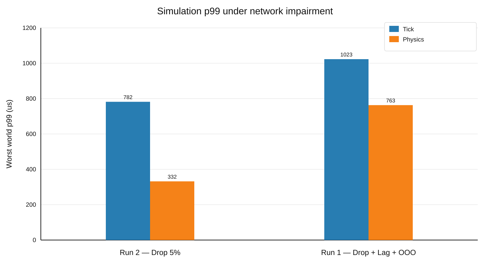
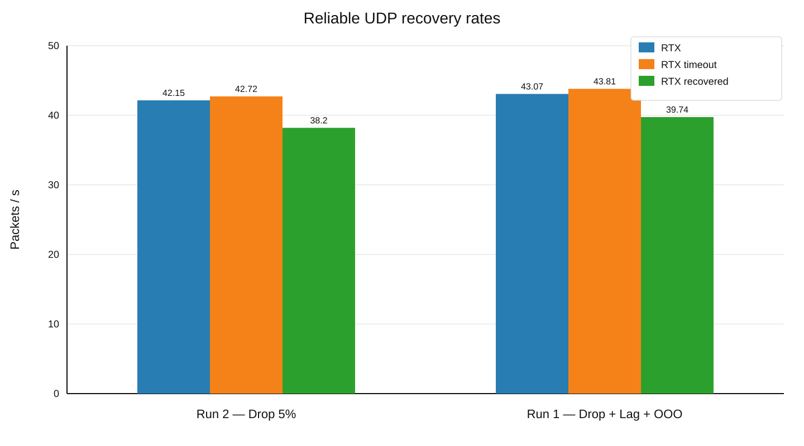
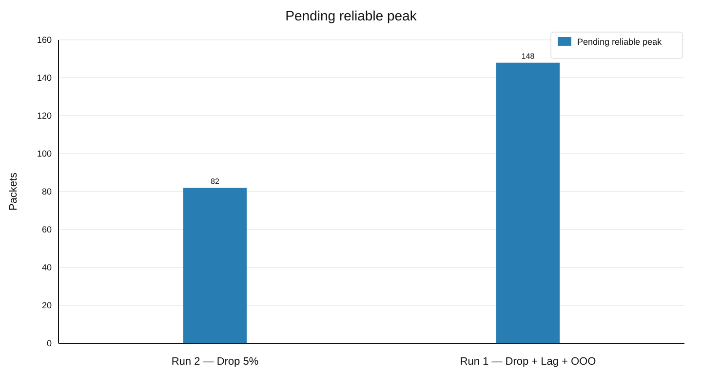
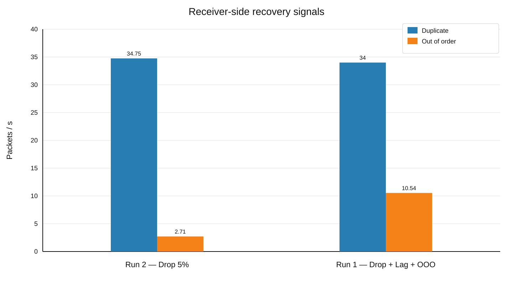

이 문서는 M1의 300 Bot gameplay workload에 의도적인 UDP network impairment를 적용해 reliable delivery와 replication recovery가 어떻게 동작하는지 확인한 결과를 정리합니다. 

run1 과 run2는 [[Projects/M1/04. Baseline Measurement|Baseline Measurement]]와 동일한 Server PC, Bot PC, Release/x64 build, Wi-Fi 환경과 shard affinity를 사용했습니다. 차이는 Server PC에서 Clumsy를 실행해 UDP traffic에만 inbound/outbound impairment를 적용했다는 점입니다.

> [!note] Interpretation Boundary
> 이 결과는 실제 인터넷 회선 전체를 재현한 것이 아니라, 지정한 loss·lag·reordering 조건에서 M1의 reliable UDP와 replication recovery를 검증한 synthetic impairment test입니다. Clumsy 설정값은 실제 packet capture로 재측정한 loss rate나 RTT가 아닙니다.

## Test Environment

| Item | Configuration |
| --- | --- |
| Server PC | AMD Ryzen 7 7800X3D, 64 GB DDR5, Windows 11 |
| Bot PC | AMD Ryzen 7 8845HS, 32 GB LPDDR5, Windows 11 |
| Build | Release / x64 |
| Network | Separate PCs over Wi-Fi |
| Bots | 300 |
| Bot profile | Baseline gameplay scenario |
| Connection rate | 30/s |
| Server simulation | 30 Hz |
| Warm-up | 약 60 s |
| Measurement | 약 600 s |
| Metric window | 5 s |
| Shard 1 affinity | `0x10`, `0x20` |
| Impairment host | Server PC |
| Impairment protocol | UDP only |

Server metric의 `active_sessions = 600`은 300 Bot이 사용하는 TCP와 UDP transport session의 합계입니다. 두 Bot log 모두 measurement 종료 시 `running=300`, `failed=0`을 기록했습니다.

## Impairment Profiles

| Run | Drop | Lag | Out of Order |
| --- | --- | --- | --- |
| Run 2 | Inbound 5%, Outbound 5% | Off | Off |
| Run 1 | Inbound 5%, Outbound 5% | Inbound 50 ms, Outbound 50 ms | Inbound 10%, Outbound 10% |

Run 1은 Run 2의 bidirectional 5% drop을 유지하면서 양방향 lag와 packet reordering을 추가한 더 강한 조건입니다. Lag 50 ms가 inbound와 outbound에 각각 설정되었지만, 이 문서에서는 이를 측정된 RTT 100 ms로 간주하지 않습니다.

## Measurement Summary

| Metric | Run 2 — Drop 5% | Run 1 — Drop + Lag + OOO |
| --- | ---: | ---: |
| Measurement duration | 600.57 s | 600.77 s |
| Running Bots at end | 300 | 300 |
| Bot failures | 0 | 0 |
| Portal timeouts | 0 | 0 |
| Unexpected world | 0 | 0 |
| Worst world tick p99 | 782 us | 1023 us |
| Tick max | 4.27 ms | 7.69 ms |
| Worst world physics p99 | 332 us | 763 us |
| Physics max | 3.99 ms | 7.45 ms |
| Tick overruns | 0 | 0 |
| Process TX | 3.788 MB/s | 3.730 MB/s |
| Process RX | 0.608 MB/s | 0.608 MB/s |
| Snapshot actor entries | 56.84k/s | 55.29k/s |
| Lifecycle events | 355.78/s | 355.80/s |

두 run 모두 10분 measurement 동안 300 Bot gameplay flow를 유지했고 connection failure, portal timeout, unexpected world, tick overrun이 발생하지 않았습니다. 더 강한 Run 1에서 worst-world tick과 physics tail이 증가했지만 tick p99는 **1.023 ms**, max는 **7.69 ms**로 33.33 ms budget 안에 머물렀습니다.

> **Figure 1 — Simulation p99 under network impairment**

## Reliable UDP Recovery

두 run의 measurement 길이가 기존 baseline보다 길기 때문에 retransmission counter는 누적값이 아니라 초당 rate로 비교합니다.

| Reliable metric | Run 2 — Drop 5% | Run 1 — Drop + Lag + OOO |
| --- | ---: | ---: |
| Reliable originals | 296.70 packets/s | 296.37 packets/s |
| RTX packets | 42.15/s | 43.07/s |
| RTX timeout packets | 42.72/s | 43.81/s |
| RTX recovered packets | 38.20/s | 39.74/s |
| Pending reliable peak | 82 packets | 148 packets |
| Max RTX per packet | 5 | 4 |
| RTX give-up | 0 | 0 |

> **Figure 2 — Reliable UDP recovery rates**

Bidirectional 5% drop에서 두 run 모두 약 **42–44 retransmission/timeout packets per second**를 처리했습니다. Run 1은 rate 자체보다 pending pressure가 더 크게 나타났으며, `pending_reliable_peak`가 Run 2의 82에서 **148 packets**로 증가했습니다. 이는 loss에 lag와 reordering이 더해지면서 ACK 도착과 reliable completion이 지연된 결과로 해석할 수 있습니다.

> **Figure 3 — Pending reliable peak**

두 조건 모두 실제 recovery가 지속적으로 발생했지만 `rtx_giveup_packets = 0`이었습니다. 따라서 이번 10분 구간에서는 synthetic impairment가 reliable recovery activity와 pending pressure를 증가시켰지만 delivery failure로 확대되지는 않았습니다.

## Reordering and Replication Recovery

| Recovery signal | Run 2 — Drop 5% | Run 1 — Drop + Lag + OOO |
| --- | ---: | ---: |
| Duplicate packets | 34.75/s | 34.00/s |
| Out-of-order packets | 2.71/s | 10.54/s |
| Baseline resends | 32.45/s | 36.48/s |
| Baseline full requests | 0 | 0 |
| Baseline resyncs | 0 | 0 |

> **Figure 4 — Receiver-side duplicate and out-of-order signals**

Out-of-Order 10%를 추가한 Run 1에서 server가 관측한 out-of-order rate는 Run 2의 **2.71/s에서 10.54/s로 약 3.9배 증가**했습니다. 이 값은 Clumsy의 설정 비율과 같은 개념이 아니라, server reliability layer가 실제로 분류한 packet rate입니다.

Replication baseline resend도 두 run에서 지속적으로 발생했지만 `baseline_full_requests = 0`, `baseline_resyncs = 0`을 유지했습니다. 즉 snapshot baseline 확인 지연은 resend 경로에서 복구되었고 full-state recovery로 확대되지 않았습니다.

## Result Interpretation

- 300 Bot은 두 조건 모두 10분 동안 `running=300`, `failed=0`을 유지했습니다.
- Bidirectional UDP drop 5%에서 reliable retransmission과 recovery path가 지속적으로 실행되었으며 give-up은 발생하지 않았습니다.
- Lag와 reordering을 추가하면 retransmission rate보다 **pending reliable peak와 out-of-order signal**이 더 뚜렷하게 증가했습니다.
- Replication baseline resend는 크게 증가했지만 full request와 resync는 발생하지 않았습니다.
- 더 강한 조건에서도 30 Hz tick overrun은 0이었고 simulation p99는 budget보다 충분히 낮았습니다.

따라서 Run 2는 **packet-loss 상태의 reliable recovery 검증**, Run 1은 **loss에 delayed/reordered delivery가 결합됐을 때 pending pressure와 ordering recovery를 확인하는 검증**으로 사용하는 것이 적절합니다.

## Limitations and Next Step

이번 결과는 각 impairment profile을 한 번씩 측정했으므로 run-to-run variance와 인과관계를 분리할 수 없습니다. 또한 Clumsy 설정을 packet capture로 검증하지 않았고 process CPU/memory headroom도 포함하지 않습니다.

다음 단계에서는 각 조건을 동일한 600초 measurement로 반복하고, impairment가 없는 600초 control run도 함께 측정하는 것이 좋습니다. 그러면 retransmission rate, pending peak, out-of-order rate와 simulation tail의 분포를 같은 duration에서 직접 비교할 수 있습니다.
