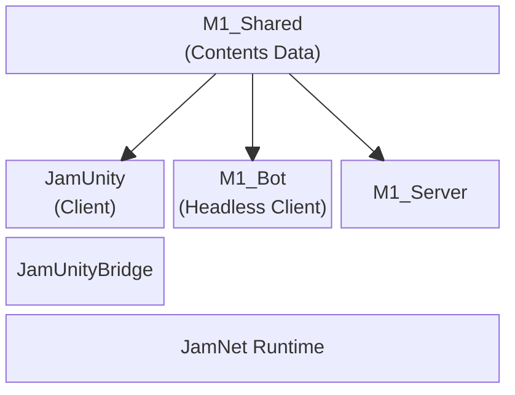

M1은 Jam 런타임을 실제 MMORPG형 사용자 흐름으로 검증하는 샘플 프로젝트다. 서버 권위의 월드 진입·이동·포탈 전환·채팅을 제공하고, Unity client와 headless Bot을 함께 둔다.

## Implemented Scope

| 영역 | 현재 구현 |
| --- | --- |
| Authentication | in-memory account의 password credential 검증 |
| Character | account별 character 목록 조회와 선택 |
| World | 선택한 character의 월드 archetype으로 입장, Player actor 생성 |
| Movement | client intent를 서버가 처리하고 actor state를 복제 |
| Portal | physics trigger로 인접 Field instance 전환 |
| Social | Global, 현재 main world의 Group, character-name Direct text chat |
| Validation | Bot profile 기반 connect, character select, entry, movement, portal, chat 부하 |

## Project Layout

`M1_Shared/Data/World/world_contents.json`은 player spawn, portal route, Bot traverse lane과 hotspot을 한 곳에서 정의한다. Server와 Bot은 이 데이터를 읽고, Unity는 같은 shared-data manifest를 native runtime에 전달한다.

## Documents

- [[Projects/M1/01. Server Content and World Lifecycle|Server Content and World Lifecycle]] — authentication, character session, world materialization, portal과 social route
- [[Projects/M1/02. Unity Client Flow|Unity Client Flow]] — login부터 character select, world presentation, input·chat UI까지의 흐름
- [[Projects/M1/03. Bot Scenarios and Validation|Bot Scenarios and Validation]] — headless scenario, profile, 실행 phase와 관측 결과

## Current Boundaries

M1의 account와 character store는 process memory에 있다. 서버 시작 시 일반 account `1001`–`1016`과 Bot account `6000`–`9999`를 등록하며, database persistence나 character creation은 이 프로젝트의 현재 구현 범위가 아니다.

현재 world content는 `Field` archetype을 사용하는 정적 `field-01`부터 `field-10`까지이며, left/right portal이 인접 instance를 연결하는 순환 구조다. 동적 dungeon instance, inventory, trade, market은 구현되어 있지 않다.

---

### Implementation References

- [M1 server bootstrap](https://github.com/akxotjr/Jam/blob/master/SampleApp/M1_Server/main.cpp)
- [Shared world contents](https://github.com/akxotjr/Jam/blob/master/SampleApp/M1_Shared/Data/World/world_contents.json)
- [Bot runner](https://github.com/akxotjr/Jam/blob/master/SampleApp/M1_Bot/BotRunner.cpp)
- [Unity client root](https://github.com/akxotjr/Jam/blob/master/JamUnity/Assets/M1/Runtime/Client/ClientRoot.cs)

### Related

- [[Projects/Jam/Networking/index|Networking]]
- [[Projects/Jam/Observability/index|Observability]]
